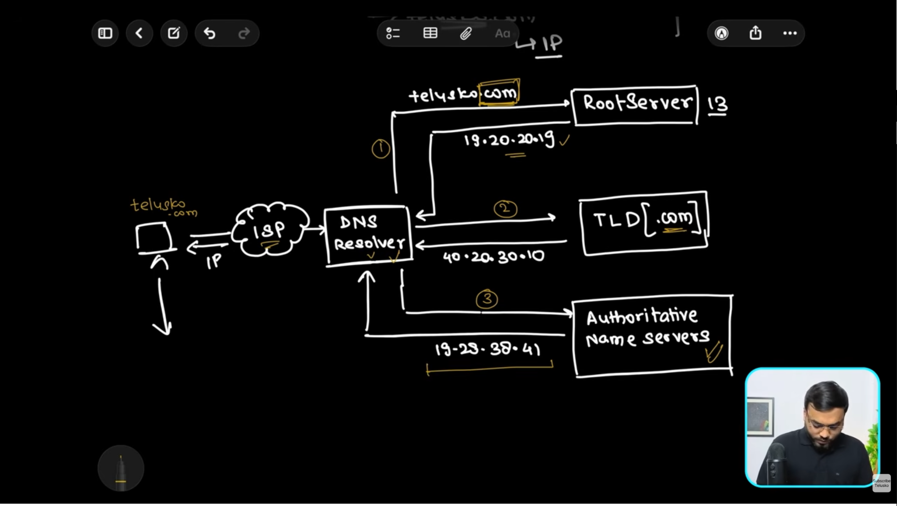

# DNS(Domain Name System)




# DNS (Domain Name System)

## What is DNS?

DNS (Domain Name System) is like the **phonebook of the Internet**.

Humans remember names like:

```
google.com
github.com
amazon.com
```

But computers communicate using **IP addresses** like:

```
142.250.193.46
20.207.73.82
205.251.242.103
```

DNS translates a **domain name** into its corresponding **IP address** so that your browser knows where to send the request.

---

# Why do we need DNS?

Imagine if every website had to be accessed using its IP address.

Instead of:

```
https://google.com
```

we would have to remember something like:

```
https://142.250.193.46
```

Since remembering IP addresses is difficult, DNS allows us to use human-readable domain names.

---

# DNS Resolution Process (First Time Visit)

Suppose you enter:

```
https://www.google.com
```

into your browser.

The browser needs Google's IP address before it can connect to Google's server.

The lookup happens in the following order.

---

## Step 1: Browser Cache

The browser first checks whether it has already resolved this domain recently.

```
Browser Cache
      │
      ▼
google.com → 142.250.xxx.xxx ?
```

If found, the browser immediately uses that IP.

No DNS lookup is required.

---

## Step 2: Operating System Cache

If the browser doesn't know the IP, it asks the operating system.

The OS also maintains a DNS cache.

```
Browser
    │
    ▼
Operating System Cache
```

If the IP exists here, it is returned immediately.

---

## Step 3: DNS Resolver (Usually your ISP)

If neither Browser nor OS has the IP address, the request goes to a **DNS Resolver**.

Usually this resolver belongs to:

- Your Internet Service Provider (ISP)
- Google DNS (8.8.8.8)
- Cloudflare DNS (1.1.1.1)
- OpenDNS

The resolver first checks its own cache.

```
User
  │
  ▼
ISP DNS Resolver
```

If it already knows:

```
google.com → 142.250.xxx.xxx
```

it immediately returns the IP.

This is called a **DNS Cache Hit**.

---

## Step 4: Root DNS Server

If the resolver does **not** know the IP, it starts asking the DNS hierarchy.

The first server contacted is a **Root Server**.

```
DNS Resolver
      │
      ▼
Root Server
```

There are **13 logical Root Server clusters** (named A to M), distributed globally using Anycast technology.

### What does the Root Server know?

The Root Server **does NOT know Google's IP address**.

Instead, it only knows:

> "Who manages the `.com` domain?"

So it replies with the address of the **.com Top-Level Domain (TLD) server**.

Think of it like:

> "I don't know where Google lives, but I know who manages all `.com` websites."

---

## Step 5: TLD (Top-Level Domain) Server

Now the resolver contacts the `.com` TLD server.

```
DNS Resolver
      │
      ▼
.com TLD Server
```

The TLD server also doesn't know Google's IP.

Instead, it knows:

> "Which Name Server is responsible for google.com?"

It replies with the address of Google's **Authoritative Name Server**.

Think of it like:

```
Root Server
      │
      ▼
.com TLD
      │
      ▼
Google's Authoritative Name Server
```

---

## Step 6: Authoritative Name Server

Finally, the resolver contacts Google's Authoritative Name Server.

```
DNS Resolver
      │
      ▼
Authoritative Name Server
```

This server contains the actual DNS records.

Example:

```
google.com
        │
        ▼
142.250.xxx.xxx
```

It returns the requested IP address.

---

## Step 7: Response Returns

The resolver now sends the IP back to your computer.

```
Authoritative Server
          │
          ▼
DNS Resolver
          │
          ▼
Browser
```

The browser can now establish a connection with Google's server.

```
Browser
    │
    ▼
142.250.xxx.xxx
```

The webpage loads.

---

# Complete DNS Flow

```
User
 │
 ▼
Browser Cache
 │
 ▼
OS Cache
 │
 ▼
DNS Resolver (ISP / Google DNS)
 │
 ▼
Root Server
 │
 ▼
TLD Server (.com)
 │
 ▼
Authoritative Name Server
 │
 ▼
Returns IP Address
 │
 ▼
Browser connects to Web Server
```

---

# What gets Cached?

DNS caching happens at multiple levels to reduce lookup time.

## Browser Cache

Stores recently visited domains.

Example:

```
google.com → 142.250.xxx.xxx
```

---

## Operating System Cache

Windows, Linux, and macOS all maintain DNS caches.

The browser checks here if it doesn't have the answer.

---

## DNS Resolver Cache

The ISP's DNS resolver caches millions of popular domains.

This is why Google loads very quickly for most users.

---

## CDN / Enterprise DNS Cache

Large organizations may also maintain internal DNS caches to reduce external lookups.

---

# What is TTL (Time To Live)?

Every DNS record has an expiry time called **TTL**.

Example:

```
TTL = 300 seconds
```

This means:

```
Store this IP for 5 minutes.
```

After the TTL expires, a fresh DNS lookup is performed.

TTL ensures:

- Faster lookups
- Reduced DNS traffic
- Updated IP addresses after changes

---

# What is an Authoritative Name Server?

An Authoritative Name Server is the **final source of truth** for a domain.

It contains the official DNS records.

Example:

```
google.com
```

Its authoritative server knows:

```
google.com
mail.google.com
docs.google.com
maps.google.com
```

along with their IP addresses.

Only this server provides the definitive answer for that domain.

---

# What are DNS Zones?

A **Zone** is a portion of the DNS namespace managed by an Authoritative Name Server.

Think of a zone as a **database of DNS records** for a domain.

Example:

```
google.com Zone
```

It may contain:

```
google.com
www.google.com
mail.google.com
docs.google.com
maps.google.com
api.google.com
```

along with records like:

- A Record
- AAAA Record
- CNAME
- MX
- TXT
- NS

The zone file stores all these mappings.

---

# Common DNS Record Types

## A Record

Maps a domain to an IPv4 address.

Example:

```
google.com
      │
      ▼
142.250.xxx.xxx
```

---

## AAAA Record

Maps a domain to an IPv6 address.

---

## CNAME Record

Maps one domain name to another.

Example:

```
www.example.com
        │
        ▼
example.com
```

---

## MX Record

Specifies the mail server responsible for receiving emails.

Example:

```
gmail.com
      │
      ▼
Google Mail Servers
```

---

## NS Record

Specifies which Authoritative Name Servers manage a domain.

Example:

```
google.com
       │
       ▼
ns1.google.com
ns2.google.com
```

---

## TXT Record

Stores arbitrary text data.

Commonly used for:

- SPF
- DKIM
- Domain verification
- Security policies

---

# Why are there only 13 Root Servers?

You'll often hear that there are **13 Root DNS Servers**.

This refers to **13 logical root server identifiers (A–M)**, not just 13 physical machines.

Each logical root server is replicated using **Anycast**, resulting in **hundreds of physical servers worldwide**.

This provides:

- High availability
- Low latency
- Fault tolerance
- Global scalability

---

# Summary

```
User enters domain
        │
        ▼
Browser Cache
        │
        ▼
OS Cache
        │
        ▼
DNS Resolver
        │
        ▼
Root Server
        │
        ▼
TLD Server
        │
        ▼
Authoritative Name Server
        │
        ▼
Returns IP Address
        │
        ▼
Browser connects to Web Server
```

---

# Interview Questions

### Q1. What is DNS?

DNS (Domain Name System) translates human-readable domain names into IP addresses.

---

### Q2. Why is DNS caching important?

It reduces lookup time, decreases network traffic, and improves website loading speed.

---

### Q3. Does the Root Server know Google's IP address?

No.

It only knows which TLD server is responsible for `.com`.

---

### Q4. What does the TLD server return?

The address of the Authoritative Name Server for the requested domain.

---

### Q5. What is an Authoritative Name Server?

It stores the official DNS records for a domain and returns the actual IP address.

---

### Q6. What is a DNS Zone?

A DNS Zone is a collection of DNS records for a domain managed by an Authoritative Name Server.

---

### Q7. What is TTL?

TTL (Time To Live) defines how long a DNS record can remain cached before a fresh lookup is required.
