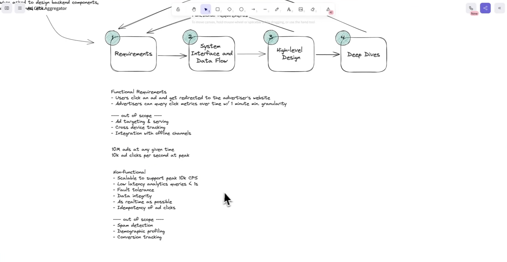
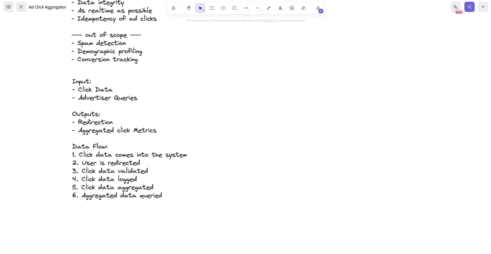
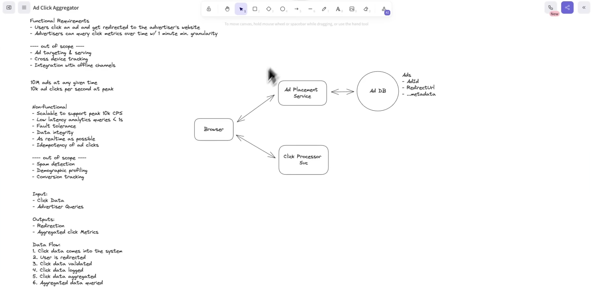
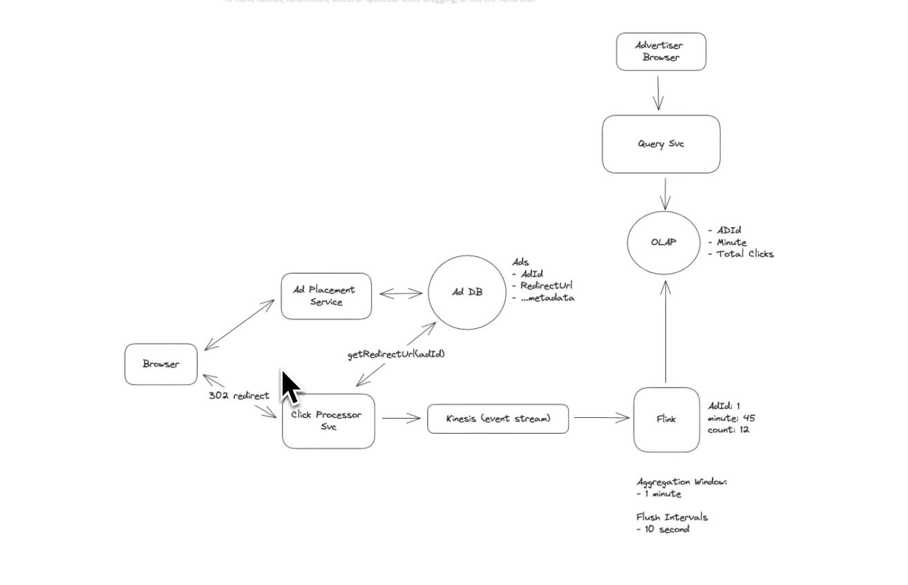
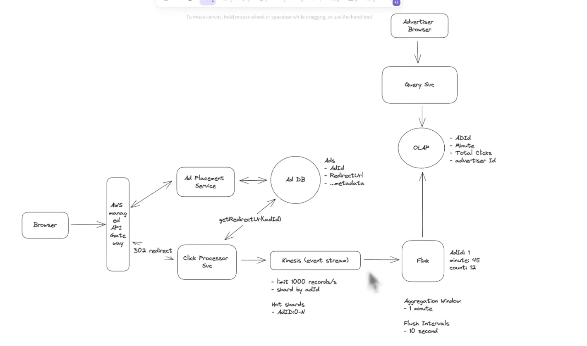
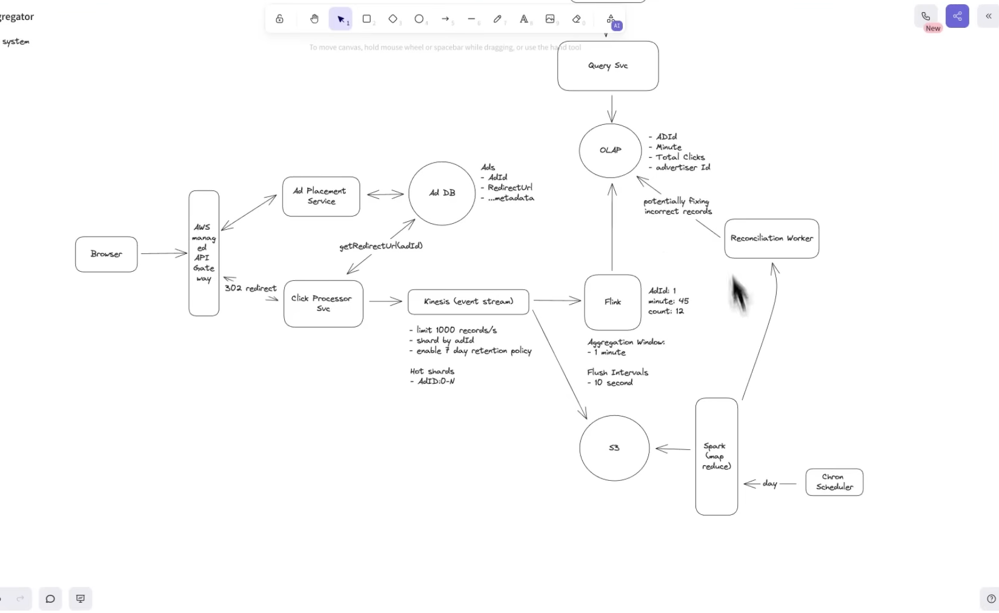
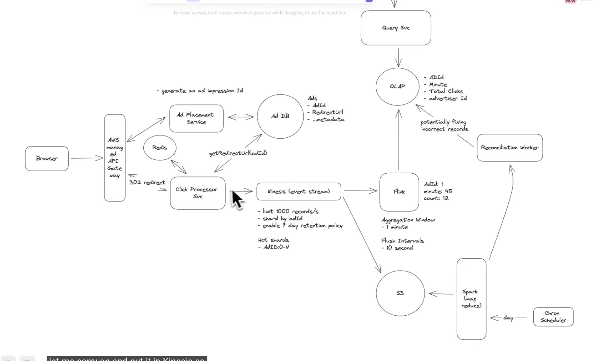

## Read about Lambda and Campa architecture



- see meaning of fault tolerance and data integrity here is we should not miss click right.




# Why Not Expose Redirect URL?

## Problem
Do **not** send the advertiser's `redirectUrl` to the browser.

**Why?**
- Users can inspect the **Network/DOM**.
- Copy the redirect URL.
- Access the advertiser's website directly.
- Bypass the Click Service.

**Consequences**
- ❌ No click tracking
- ❌ No billing
- ❌ No analytics
- ❌ No fraud detection

---

# Recommended Flow

### 1. Ad Service → Browser

```json
{
  "adId": 123,
  "clickUrl": "/click/123"
}
```

### 2. User Clicks the Ad

```
Browser
    │
    ▼
GET /click/123
```

### 3. Click Service

- Validate request
- Log click
- Publish event to Kinesis
- Fetch `redirectUrl` (preferably from Redis/In-Memory Cache)
- Return **HTTP 302 Redirect**

### 4. Browser

Automatically follows the redirect to the advertiser's website.

---

# Production Best Practices

- Cache `adId → redirectUrl` in **Redis/In-Memory Cache**.
- Avoid calling the Ad Service on every click.
- Use **opaque click tokens** instead of sequential IDs.

Example:

```
/click/c_8f9K2mQaLxP
```

Instead of:

```
/click/123
```

This prevents ID enumeration attacks.

---

# Key Takeaway

> **Never expose the advertiser's `redirectUrl` to the browser.**
>
> The browser should only know the **Click URL**. Every click must pass through the **Click Service**, which logs the click, publishes the event, and finally redirects the user using an **HTTP 302 Redirect**.

 

 # Why Not Use a Single PostgreSQL Database?

## Problem 1: Mixed Read and Write Workloads

If we use a single PostgreSQL database, it has to handle:

- Millions of click event inserts (write-heavy)
- Thousands of advertiser analytics queries (read-heavy)
- Aggregations
- Index maintenance
- Backups/Vacuuming

As traffic grows, reads and writes start competing for the same database resources, increasing latency for both.

### Solution

Separate the workloads:

- **Cassandra** → Store raw click events (write-optimized)
- **OLAP Database (ClickHouse/Druid/Pinot, etc.)** → Store aggregated metrics (read-optimized)

This allows each database to do what it is designed for.

---

# Problem 2: High Write Throughput

An ad platform may receive:

- 10,000+
- 100,000+
- Millions of clicks per second

Every click generates an INSERT.

Traditional relational databases eventually become a bottleneck because they must maintain indexes, locks, and transactional guarantees.

### Solution

Use **Cassandra** because it is optimized for:

- Extremely high write throughput
- Horizontal scaling
- Distributed storage
- Append-heavy workloads

Adding more nodes increases write capacity.

---

# Problem 3: Analytics Queries Are Expensive on Raw Data

Suppose Cassandra stores billions of raw click events.

An advertiser asks:

> "How many clicks did Ad 101 receive between 10:00 and 11:00?"

Running aggregation queries directly on billions of raw records is slow and expensive.

### Solution

Do not query raw click events directly.

Instead:

1. Store raw events in Cassandra.
2. Use Spark to aggregate them.
3. Store only summarized data in an OLAP database.

Example:

Raw Events

| Timestamp | AdId |
|-----------|------|
|10:00:01|101|
|10:00:05|101|
|10:00:18|101|
|10:01:07|101|

↓

Aggregated Data

| AdId | Minute | Total Clicks |
|------|---------|--------------|
|101|10:00|3|
|101|10:01|1|

---

# Problem 4: Fast Analytics Queries

Advertisers expect dashboards to respond in milliseconds.

Scanning billions of raw events for every request is not feasible.

### Solution

Query only the aggregated OLAP database.

Example:

```sql
SELECT SUM(total_clicks)
FROM click_metrics
WHERE ad_id = 101
AND minute BETWEEN '10:00' AND '11:00';
```

Instead of scanning millions of events, the query reads only a small number of aggregated rows.

---

# Problem 5: Why Do We Need Spark?

Raw click events are not useful for dashboards.

Advertisers need:

- Clicks per minute
- Clicks per hour
- Clicks per day
- Total clicks
- Trends over time

### Solution

Use **Apache Spark** to process raw click events.

Spark:

- Reads raw click events
- Groups by `(AdId, Minute)`
- Counts clicks
- Writes aggregated results into the OLAP database

Spark is a distributed data processing engine capable of processing billions of records efficiently.

---

# Problem 6: Why Not Aggregate During Click Processing?

The Click Processor could update a counter on every click.

However:

- High contention on popular ads
- Frequent updates to the same row
- Difficult recovery if processing fails
- Hard to recompute metrics later

### Solution

Store immutable raw click events first.

Then let Spark perform aggregations asynchronously.

Benefits:

- Better scalability
- Easy reprocessing
- Fault tolerance
- Ability to generate new reports later

---

# Problem 7: Can We Use Only PostgreSQL?

Yes.

For small or medium-scale systems, PostgreSQL is often sufficient.

Suitable when:

- A few hundred to a few thousand clicks/sec
- Moderate analytics traffic
- Simpler architecture is preferred

### Solution

Architecture:

```
Click Service
      │
      ▼
 PostgreSQL
      │
      ▼
    Spark
      │
      ▼
 OLAP Database
```

Many companies start with this architecture and migrate to Cassandra only when write traffic becomes very large.

---

# Final Production Architecture

```
                User Click
                    │
                    ▼
            Click Processor Service
                    │
                    ▼
         Cassandra (Raw Click Events)
                    │
                    ▼
                 Apache Spark
        (Aggregate by AdId + Minute)
                    │
                    ▼
     OLAP Database (ClickHouse/Druid/Pinot)
                    │
                    ▼
             Query Service
                    │
                    ▼
         Advertiser Analytics Dashboard
```

---

# Interview Takeaway

- **Cassandra** stores raw click events because it is optimized for massive write throughput.
- **Spark** periodically aggregates raw events into summarized metrics (e.g., clicks per ad per minute).
- **OLAP Database** stores aggregated data and serves fast analytical queries.
- **Query Service** never reads raw click events; it queries the OLAP database.
- **PostgreSQL** is a valid choice for small to medium-scale systems, but separating write and read workloads provides much better scalability at large scale.



# Batch Processing (Spark + Cron) vs Streaming (Kinesis + Flink)

## Previous Design (Batch Processing)

```
Click Service
      │
      ▼
Cassandra (Raw Click Events)
      │
      ▼
Spark (Runs every 1 minute)
      │
      ▼
OLAP Database
      │
      ▼
Query Service
```

### Flow

1. Click arrives.
2. Store raw event in Cassandra.
3. Spark Cron Job runs every minute.
4. Reads all new events.
5. Aggregates them.
6. Writes aggregated data to OLAP.

---

## Problems with Batch Processing

### Problem 1: Analytics are delayed

Spark runs every minute.

If a click occurs at:

```
10:00:05
```

Spark may not process it until:

```
10:01:00
```

Dashboard becomes stale.

---

### Problem 2: Large Batch Scans

Every Spark execution scans thousands or millions of new records.

```
Spark
    │
Reads
500,000 events
```

As traffic grows, batches become larger and slower.

---

### Problem 3: High Database Load

Every aggregation job repeatedly reads Cassandra.

```
Spark
    │
Read Cassandra
```

This creates unnecessary database load.

---

### Problem 4: Slow Failure Recovery

If the Spark job fails,

```
10:00 → Failed

10:01 → Waiting...

10:02 → Retry
```

Analytics become outdated until the next successful run.

---

## New Design (Streaming Processing)

```
Click Service
      │
      ▼
Kinesis
      │
      ▼
Flink
      │
      ▼
OLAP Database
      │
      ▼
Query Service
```

### Flow

1. Click occurs.
2. Publish event to Kinesis immediately.
3. Flink consumes events continuously.
4. Aggregates clicks in real time.
5. Flushes results every few seconds.
6. Writes aggregated metrics into OLAP.

---

## Advantages of Streaming

### Advantage 1: Near Real-Time Analytics

Instead of waiting one minute,

Flink continuously processes events.

Dashboard latency becomes:

```
2–10 seconds
```

instead of

```
1 minute+
```

---

### Advantage 2: No Large Batch Jobs

Flink processes each event as it arrives.

Instead of reading:

```
500,000 rows
```

every minute,

it simply consumes the next event from Kinesis.

---

### Advantage 3: Reduced Database Load

Spark repeatedly reads Cassandra.

Streaming avoids this.

```
Click Service
      │
      ▼
Kinesis
      │
      ▼
Flink
```

Events are processed directly from the stream.

---

### Advantage 4: Better Scalability

If traffic increases from

```
10k clicks/sec
```

to

```
100k clicks/sec
```

simply increase the number of Kinesis shards and Flink workers.

No massive batch jobs are required.

---

### Advantage 5: Better Fault Tolerance

Kinesis retains events.

If Flink crashes,

```
Checkpoint

↓

Restart

↓

Resume from last processed offset
```

No events are lost.

---

### Advantage 6: Lower Latency

Advertisers see updated metrics almost immediately.

Suitable for:

- Live dashboards
- Real-time monitoring
- Fraud detection
- Alerting

---

# Why Remove Cassandra?

In this upgraded design, Cassandra is no longer required because raw click events are not being stored for long-term analytics.

Instead:

```
Click Service
      │
      ▼
Kinesis
      │
      ▼
Flink
      │
      ▼
OLAP
```

The stream itself becomes the input for aggregation.

However, if business requirements include:

- Audit logs
- Historical replay
- Machine Learning
- Debugging
- Long-term click retention

then raw events should still be persisted (e.g., Cassandra, S3, or a Data Lake).

Many production systems do both:

```
               Click Service
                 │
      ┌──────────┴──────────┐
      ▼                     ▼
   Kinesis             Cassandra/S3
      │
      ▼
    Flink
      │
      ▼
     OLAP
```

This provides:

- Real-time analytics
- Durable raw event storage
- Ability to replay history
- Better disaster recovery

---

# Interview Takeaway

- **Spark + Cron** is a **batch processing** solution. It introduces higher latency and repeatedly scans stored events.
- **Kinesis + Flink** is a **stream processing** solution. It processes events continuously, provides near real-time analytics, reduces database load, and scales better.
- For production systems, it is common to use **both** a streaming pipeline (for real-time dashboards) and durable raw event storage (for replay, auditing, and offline analytics).



# Scaling Kinesis + Flink

## Problem 1: How Should We Shard the Kinesis Stream?

Each click event looks like:

```json
{
  "adId": 123,
  "userId": 456,
  "timestamp": "...",
  "advertiserId": 99
}
```

Since Flink aggregates clicks by **AdId**, the simplest shard key is:

```
Shard Key = adId
```

### Why?

All click events for the same ad go to the same shard.

```
Ad123
   │
   ▼
Same Kinesis Shard
   │
   ▼
Same Flink Task
   │
   ▼
Aggregate Clicks
```

This makes aggregation simple and efficient.

---

# Problem 2: Hot Shards (Hot Partitions)

Suppose one advertisement goes viral.

```
Ad1  → 10M clicks
Ad2  → 500 clicks
Ad3  → 200 clicks
```

If we shard only by `adId`:

```
Shard 1 → Ad1 (10M clicks) 🔥
Shard 2 → Ad2 (500 clicks)
Shard 3 → Ad3 (200 clicks)
```

One shard becomes overloaded while others remain mostly idle.

This is called a **Hot Shard (Hot Partition)**.

### Problems

- High latency
- Throughput throttling
- Backpressure
- Poor resource utilization

---

# Solution: Composite Shard Key

Instead of:

```
Shard Key = adId
```

Use:

```
Shard Key = adId + bucket
```

Example:

```
Ad123_0
Ad123_1
Ad123_2
Ad123_3
```

Now events are distributed across multiple shards.

```
Shard1 → Ad123_0
Shard2 → Ad123_1
Shard3 → Ad123_2
Shard4 → Ad123_3
```

Traffic becomes balanced.

---

# Problem 3: Aggregation Becomes Difficult

Since one ad is now spread across multiple shards:

```
Shard1 → Ad123 = 200 clicks
Shard2 → Ad123 = 300 clicks
Shard3 → Ad123 = 500 clicks
```

How do we calculate the total?

---

# Solution: Two-Stage Aggregation

### Stage 1 (Local Aggregation)

Each Flink worker aggregates events from its own shard.

```
Shard1 → Ad123 = 200
Shard2 → Ad123 = 300
Shard3 → Ad123 = 500
```

### Stage 2 (Global Aggregation)

Flink merges the partial counts.

```
200
+
300
+
500
------
1000
```

Final Result:

```
Ad123
Minute = 45
Clicks = 1000
```

This is then written to the OLAP database.

---

# Problem 4: Traffic Keeps Growing

Suppose traffic increases:

```
10K clicks/sec
      ↓
100K clicks/sec
      ↓
1M clicks/sec
```

Existing shards become insufficient.

---

# Solution: Dynamic Resharding

Increase the number of Kinesis shards.

```
10 Shards
    ↓
20 Shards
    ↓
40 Shards
    ↓
80 Shards
```

More shards allow:

- Higher throughput
- More Flink consumers
- Better parallelism

---

# Problem 5: Why Not Shard by UserId?

Example:

```
Shard Key = userId
```

Events for the same ad are now scattered.

```
Ad123

User1 → Shard1
User2 → Shard2
User3 → Shard3
User4 → Shard4
```

To compute:

```
Total Clicks for Ad123
```

Flink must collect data from every shard.

This increases aggregation complexity and latency.

---

# Solution

Shard using **AdId** (or **AdId + Bucket**) because the aggregation key is **AdId**.

Always choose a shard key that matches your primary aggregation key whenever possible.

---

# Recommended Production Strategy

```
Shard Key = hash(adId + bucket)
```

Where:

```
bucket = hash(userId) % 16
```

Example:

```
Ad123_0
Ad123_1
Ad123_2
...
Ad123_15
```

Benefits:

- Prevents hot shards
- Evenly distributes traffic
- Supports horizontal scaling
- Still allows Flink to aggregate efficiently using two-stage aggregation

---

# Final Architecture

```
Browser
    │
    ▼
Click Processor
    │
    ▼
Kinesis (Shard by adId + bucket)
    │
    ▼
Flink

Stage 1:
Aggregate within each shard

        │
        ▼

Stage 2:
Merge partial aggregates

        │
        ▼

OLAP Database

(adId, minute, totalClicks)
```

---

# Interview Takeaway

- Shard Kinesis by **AdId** because aggregation is performed per ad.
- Sharding only by **AdId** can create **hot shards** for viral ads.
- Use **AdId + Bucket** (or `hash(adId + bucket)`) to distribute traffic.
- Flink performs **two-stage aggregation**:
  - Local aggregation within each shard.
  - Global merge across shards.
- Dynamically increase Kinesis shards as traffic grows.
- Avoid sharding by **UserId**, since aggregation is based on **AdId**, not users.
```
# What If Flink Is Unavailable?

## Problem

Flink crashes or becomes unavailable while click events continue to arrive.

```
Click Processor
      │
      ▼
   Kinesis
      │
      ✖
    Flink (Down)
```

Will click events be lost?

---

## Solution

No.

The Click Processor continues publishing events to **Kinesis**.

Kinesis acts as a **durable event buffer**, storing events until consumers process them.

---

## How Recovery Works

Flink periodically stores **checkpoints** containing the last successfully processed offset.

Example:

```
Events:
1 2 3 4 5 6 7 8 9 10
```

Checkpoint:

```
Last Processed Offset = 5
```

If Flink crashes,

events `6, 7, 8, 9, 10...` continue accumulating in Kinesis.

When Flink restarts, it resumes reading from **Offset 6**.

---

## Benefits

- No event loss
- Automatic replay of unprocessed events
- Dashboard eventually becomes consistent
- Supports fault tolerance

---

## Production Best Practices

- Enable Flink checkpointing.
- Deploy multiple Flink TaskManagers for high availability.
- Monitor consumer lag.
- Configure sufficient Kinesis retention.
- Use idempotent or transactional writes to the OLAP database when possible.

---

## Interview Takeaway

Kinesis acts as a durable buffer between producers and consumers.

If Flink is unavailable, events continue accumulating in Kinesis. Once Flink recovers, it resumes processing from the last checkpoint, ensuring no events are lost as long as they remain within Kinesis's retention period.



# Adding S3 for Reconciliation

## Problem

Streaming systems can produce incorrect analytics due to:

- Flink failures
- Software bugs
- Failed OLAP writes
- Incorrect aggregations
- Accidental deployments

Without raw click data, incorrect metrics cannot be repaired.

---

## Solution

Store every raw click event in **Amazon S3**.

```
                Click Processor
                       │
                       ▼
                  Kinesis Stream
                 ┌───────────────┐
                 ▼               ▼
              Flink         Firehose
                 │               │
                 ▼               ▼
              OLAP             S3
```

S3 becomes the **source of truth** for all click events.

---

## Why S3?

- Low cost
- Highly durable
- Supports petabyte-scale storage
- Stores immutable historical events
- Enables replay and reconciliation

---

## Reconciliation Process

A scheduled Spark job:

1. Reads raw click events from S3.
2. Aggregates clicks by `(AdId, Minute)`.
3. Compares results with the OLAP database.
4. Detects missing or incorrect counts.
5. Updates OLAP or raises alerts.

Example:

```
S3

Ad101
10:00
1000 clicks

↓

OLAP

Ad101
10:00
995 clicks

↓

Spark

Difference = 5

↓

Update OLAP
```

---

## Replay Support

If Flink has a bug or incorrect aggregation logic:

1. Read historical events from S3.
2. Re-run the aggregation job.
3. Rebuild the OLAP database.

No click data is lost because S3 stores every raw event.

---

## Best Practice

Use **Kinesis Firehose** to automatically deliver events from Kinesis to S3.

```
Click Processor
      │
      ▼
Kinesis
   ├────────► Flink
   ▼
Firehose
   ▼
S3
```

This avoids dual writes from the Click Processor and guarantees that every streamed event is archived.

---

## Interview Takeaway

- **OLAP** is the serving layer for fast analytics.
- **S3** is the immutable source of truth.
- **Flink** provides near real-time aggregation.
- **Spark** (or another batch engine) periodically reconciles OLAP with S3 to detect and repair inconsistencies.
- Using **Kinesis + Firehose + S3 + Flink** combines low-latency analytics with long-term durability and recoverability.



# Idempotency in an Ad Click Aggregator

## Why Do We Need Idempotency?

A user clicking an ad is **not guaranteed** to generate only one HTTP request.

Duplicate requests can happen due to:

- Browser retries
- Network timeout
- Load balancer retries
- Mobile network instability
- User refreshing the page

Without idempotency:

```
User Clicks Ad

↓

Click Service records click

↓

Network timeout

↓

Browser retries

↓

Click Service records another click ❌
```

Result:

- Advertiser is charged twice.
- Click analytics become incorrect.
- Fraud detection becomes harder.

Therefore, the Click Service must ensure that **the same click is processed only once**.

---

# Impression vs Click

This is one of the most important concepts in an ad system.

## Impression

An **Impression** means:

> The ad was successfully shown to the user.

Example:

```
User opens Homepage

↓

Ad Placement Service selects Ad #123

↓

Browser displays Ad #123

↓

One Impression is recorded
```

Notice:

No click has happened yet.

---

## Click

A Click means:

> The user interacted with the displayed advertisement.

Example:

```
Impression

↓

User clicks the ad

↓

Click Event generated
```

Relationship:

```
1 Impression
      │
      ├── 0 Clicks
      ├── 1 Click
      └── Multiple Clicks
```

An impression does **not** guarantee a click.

---

# Where Should the Impression ID Be Generated?

The Impression ID should be generated when the ad is served.

```
Browser
    │
GET /ads
    │
    ▼
Ad Placement Service
```

Response:

```json
{
  "adId": 123,
  "title": "Nike Shoes",
  "clickUrl": "/click?impressionId=imp_abc123"
}
```

Notice:

The Impression ID is generated **before** the click happens.

It uniquely identifies:

> "This particular advertisement was shown to this particular user."

---

# How Impression ID Helps

Suppose:

```
Impression ID = imp123
```

User clicks:

```
GET /click?impressionId=imp123
```

Click Service:

- Stores click
- Publishes event
- Redirects user

Suppose the browser never receives the redirect because of a timeout.

Browser retries:

```
GET /click?impressionId=imp123
```

Redis:

```
imp123

Already Processed

↓

Ignore duplicate
```

No duplicate click is recorded.

This solves **HTTP retries**.

---

# Problem with Using Only Impression ID

Unfortunately,

**Impression ID alone is NOT sufficient.**

Why?

Because a single impression can legitimately generate multiple clicks.

Example:

```
10:00:00

Ad displayed

↓

Impression = imp123
```

User clicks:

```
10:00:05

Click #1
```

After reading the landing page,

the user comes back and intentionally clicks again.

```
10:00:45

Click #2
```

Both clicks came from the same impression.

If we deduplicate only using:

```
impressionId
```

Second click becomes:

```
Duplicate

↓

Ignored ❌
```

This is incorrect because the second click was genuine.

---

# Another Problem

Suppose:

```
User double-clicks rapidly.
```

Was it:

- Network retry?
- Browser retry?
- User intentionally double-clicked?

The Click Service cannot know by looking at the Impression ID alone.

---

# Real Production Systems

Production advertising systems use multiple signals.

Example:

```
Impression ID

+

User ID / Cookie

+

Session ID

+

IP Address

+

User Agent

+

Timestamp
```

Example Rule:

```
Same Impression

+

Same User

+

Within 2 seconds

↓

Probably Retry

↓

Ignore
```

But:

```
Same Impression

+

30 seconds later

↓

Probably Genuine Click

↓

Count It
```

This is called a **deduplication window**.

---

# Better Solution: Click Token

Instead of exposing only:

```
impressionId
```

Generate a secure **Click Token**.

Example:

```
token = Sign(

impressionId,
adId,
userId,
timestamp,
expiry

)
```

The browser receives:

```json
{
  "clickUrl": "/click?token=eyJhbGc..."
}
```

The browser never knows what is inside the token.

---

# Why Is Click Token Better?

The Click Service can verify:

- Token integrity
- Expiry
- User information
- Impression information

No database lookup is required just to validate the request.

If someone modifies the token:

```
token=xyz123

↓

Signature Invalid

↓

Reject Request
```

This prevents tampering.

---

# How Idempotency Works with Click Token

```
Browser

GET /click?token=abc123
```

Click Service:

```
Validate Token

↓

Extract Impression ID

↓

Check Redis
```

Redis:

```
Token Seen?

YES

↓

Return Redirect

NO

↓

Store Token

↓

Publish Event

↓

302 Redirect
```

The same retry uses the **same token**, making it naturally idempotent.

---

# Why Use Redis?

Redis is ideal because it provides:

- Extremely fast lookups
- In-memory performance
- TTL support
- Millions of operations per second

Example:

```
Key:

clickToken

Value:

Processed

TTL:

30 seconds
```

After TTL expires,

the same user can legitimately click again.

---

# Complete Flow

```
                User Opens Page
                       │
                       ▼
             Ad Placement Service
                       │
      Generate Impression ID
                       │
      Generate Signed Click Token
                       │
                       ▼
Browser

clickUrl=/click?token=XYZ
                       │
                       ▼
User Clicks
                       │
                       ▼
Click Service
                       │
              Validate Token
                       │
                       ▼
                   Redis

             Token Exists?
                 │
        ┌────────┴────────┐
        │                 │
      YES                NO
        │                 │
 Return Redirect     Store Token
                          │
                          ▼
                  Publish to Kinesis
                          │
                          ▼
                     HTTP 302 Redirect
```

---

# Why Token Is Better Than Impression ID

| Impression ID | Click Token |
|---------------|-------------|
| Identifies a displayed advertisement | Securely represents a click request |
| Can be modified by the client | Cryptographically signed and tamper-proof |
| Cannot detect forged requests | Invalid signatures are rejected |
| Requires additional metadata for validation | Contains metadata (or references it) securely |
| Good for identifying an impression | Better for secure click tracking and idempotency |

---

# Important Clarification

A **Click Token does NOT solve duplicate legitimate clicks by itself.**

It only ensures that:

- The same HTTP request (or retry) is processed only once.
- The request has not been tampered with.

To distinguish:

- Browser retry ❌
- Genuine second click ✅

the system still applies business rules such as:

- Deduplication window (e.g., 2–5 seconds)
- User session
- IP address
- User Agent
- Fraud detection heuristics

---

# Interview Takeaway

- **Impression** = Ad displayed to the user.
- **Click** = User interacts with the displayed ad.
- Generate an **Impression ID** when the ad is served by the Ad Placement Service.
- Every click request references the same impression.
- Using only the Impression ID for idempotency is insufficient because one impression may legitimately generate multiple clicks.
- A **signed Click Token** is preferred because it is tamper-proof, reusable across retries, and securely carries (or references) impression metadata.
- Redis stores recently processed tokens with a TTL to prevent duplicate processing caused by retries.
- Production systems combine click tokens with a short deduplication window and fraud detection signals to distinguish genuine clicks from duplicate requests.