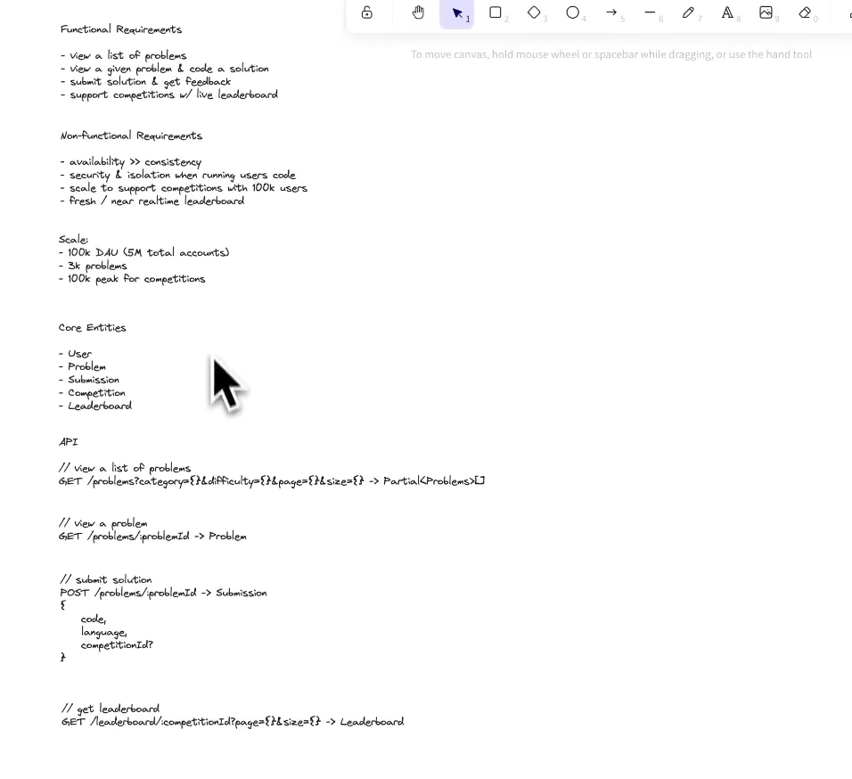
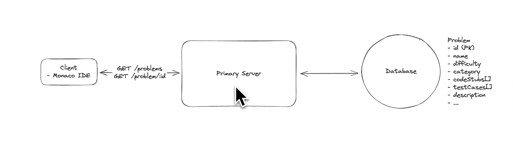
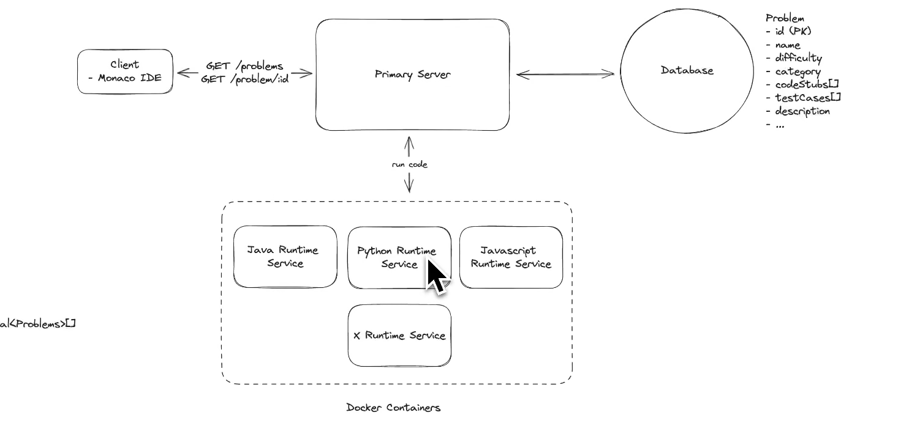
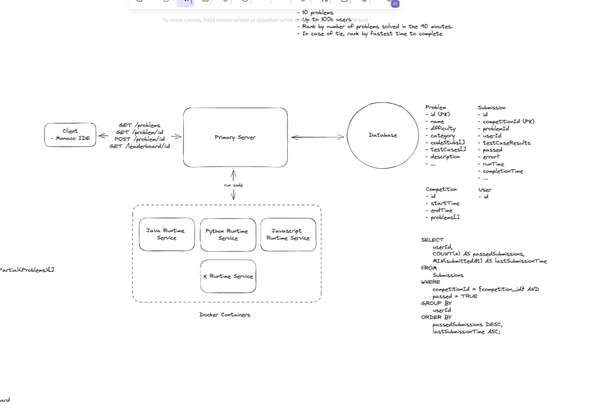
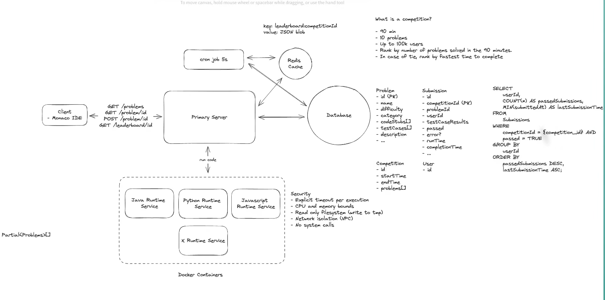
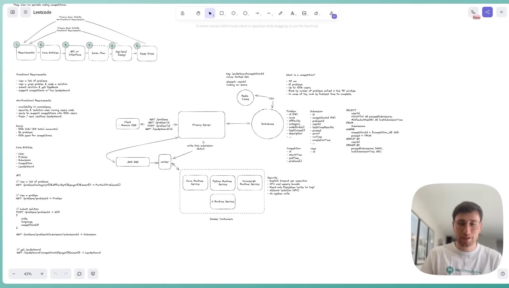

- we should not directly run the code in our server right because users can run some malicious code and it can be very serious for our system so we need some ISOLATION here to run the users code.

- We can use VMs here but the problem is Vms can be very heavy that too when we are talking about 100k users because they come with their own OS right.
- So we will go with containers.



- we can go with containers or we can take lambda functions also which I think we can invoke by using some http call and they will handle this can return the result but the problem is they take sometime for the first bootup. Because they will download all the dependecies first and then only it will start.



- this is fine but pretty expensive query.

- we can go with redis with some ttl of may be 10 sec but after 10 sec whoever will first come he has to wait that we do not want right. And we can face cashe stamped issue also.
- So we have introduced a cron-job that will run after may be 5 sec to update the cashe.
- but this also has a issue because what if cron is down then we will not be able to update the redis and everyone will hit database that will break things.

- One more thing we will add two calls one to get like top 100 candidates score and one call will be me call that will give only my score and rank along with some 10-20 left right from me.

# LeetCode System Design - Code Submission Flow & Leaderboard Update

---

# Overview

When a user submits code during a coding contest, the system needs to:

1. Execute the code securely.
2. Judge the submission.
3. Store the submission.
4. Update the contestant's score.
5. Refresh the leaderboard with minimal latency.

The entire flow should be scalable, fault tolerant, and capable of supporting hundreds of thousands of concurrent users.

---

# High Level Flow

```text
                User
                  |
          Click "Submit"
                  |
                  ▼
          Primary Server
                  |
                  ▼
      Runtime/Judging Service
                  |
       Execute User Code
                  |
                  ▼
         Return Execution Result
                  |
                  ▼
      Update PostgreSQL Database
   (Submission + Contest Score)
                  |
        --------------------------
        |                        |
        |                        |
        ▼                        ▼
 Option 1                 Option 2
 Direct Redis         CDC → Kafka → Redis
```

---

# Step 1 - User Clicks Submit

The frontend sends the code to the backend.

```http
POST /submit
```

Example Request

```json
{
    "contestId": 101,
    "problemId": 5,
    "language": "Java",
    "code": "public class Solution { ... }"
}
```

The request reaches the **Primary Server**.

---

# Step 2 - Primary Server Validates the Request

The Primary Server performs basic validations before executing the code.

Typical validations include:

- User authentication
- Contest is active
- Problem belongs to the contest
- Supported programming language
- Code size validation
- Submission rate limiting

If validation succeeds, the code is forwarded to the Runtime Service.

---

# Step 3 - Execute Code in an Isolated Environment

Never execute user code directly on the application server.

Instead, forward it to dedicated Runtime Services.

Example

```text
Primary Server
      |
      +-------> Java Runtime Service

      +-------> Python Runtime Service

      +-------> C++ Runtime Service

      +-------> JavaScript Runtime Service
```

Each runtime executes code inside an isolated sandbox.

Possible technologies:

- Docker Containers
- Firecracker MicroVMs (preferred for production)
- Kubernetes Pods

---

# Why Isolation is Important

Executing arbitrary user code is dangerous.

A malicious user might attempt to:

- Delete system files
- Consume excessive CPU
- Consume excessive memory
- Launch infinite loops
- Perform network attacks
- Escape the host machine

Therefore every execution environment should enforce:

- CPU limits
- Memory limits
- Execution timeout
- Read-only filesystem
- No internet access
- No privileged system calls
- Process isolation

Example

```text
CPU Limit       : 2 Seconds
Memory Limit    : 512 MB
Filesystem      : Read Only
Network Access  : Disabled
```

---

# Step 4 - Judge the Submission

The Runtime Service compiles the code and executes it against all test cases.

Example

```text
Test Case 1  ✔ Passed

Test Case 2  ✔ Passed

Test Case 3  ✔ Passed

Test Case 4  ✘ Failed
```

The Runtime Service returns the verdict.

Example

```json
{
    "status": "Accepted",
    "runtime": "120ms",
    "memory": "32MB",
    "passedTestCases": 120
}
```

---

# Step 5 - Update PostgreSQL

Once the execution result is received, the Primary Server updates PostgreSQL.

Normally two tables are updated.

---

## Submission Table

Stores every submission.

```text
submission

id
contest_id
problem_id
user_id
language
status
runtime
memory
submitted_at
```

Every attempt is preserved for history.

---

## Contest Score Table

Stores the latest contest state of every participant.

```text
contest_score

contest_id
user_id
problems_solved
penalty_time
last_accepted_time
updated_at
```

This table is the source for leaderboard updates.

**Never compute the leaderboard by scanning millions of submission rows.**

Instead maintain this aggregated table incrementally.

---

# Step 6 - Update the Leaderboard

Once PostgreSQL is updated successfully, Redis should also be updated.

There are two common approaches.

---

# Option 1 - Update Redis Directly

Flow

```text
User

↓

Primary Server

↓

Runtime Service

↓

Update PostgreSQL

↓

Update Redis

↓

Return Response
```

Redis command

```redis
ZADD leaderboard:<contestId> score userId
```

Example

```redis
ZADD leaderboard:101 79996542 42
```

Where

```
42 → User ID

79996542 → Encoded Score
```

Redis automatically updates the ranking.

---

## Advantages

- Extremely fast
- Leaderboard updates almost instantly
- Best user experience

Typical latency

```
10-50 ms
```

---

## Disadvantages

Suppose this happens

```text
Database Updated Successfully

↓

Redis Crashes

↓

Redis Update Fails
```

Now

```
Database

Alice → 8 Solved
```

Redis

```
Alice → 7 Solved
```

The leaderboard becomes inconsistent.

To recover, we need:

- Retry
- Background Worker
- CDC
- Outbox Pattern
- Reconciliation Service

---

# Option 2 - Update Redis using CDC (Recommended)

Instead of letting the Primary Server update Redis directly, allow PostgreSQL to publish every committed change.

Flow

```text
User

↓

Primary Server

↓

Update PostgreSQL

↓

Commit Transaction

↓

PostgreSQL WAL

↓

Debezium CDC

↓

Kafka

↓

Leaderboard Consumer

↓

Redis Sorted Set
```

Here,

The Primary Server never communicates with Redis.

---

# Why Kafka is Added

Do **not** connect CDC directly to Redis.

Instead

```text
PostgreSQL

↓

CDC

↓

Kafka

↓

Leaderboard Consumer

↓

Redis
```

Kafka provides several benefits.

- Reliable event storage
- Replay capability
- Multiple consumers
- Backpressure handling
- Fault tolerance

If Redis is down,

Kafka keeps storing events.

No leaderboard updates are lost.

---

# Advantages

- PostgreSQL is the single source of truth.
- No dual-write problem.
- Redis can be rebuilt anytime.
- Easy disaster recovery.
- Multiple downstream consumers can use the same events.

---

# Disadvantages

Leaderboard updates are slightly delayed.

Typical latency

```
100-300 ms
```

For coding competitions, this delay is generally acceptable.

---

# Redis Leaderboard Structure

Leaderboard is stored as a Redis Sorted Set.

Key

```text
leaderboard:<contestId>
```

Example

```text
leaderboard:101
```

Member

```text
userId
```

Score

```text
Encoded Score
```

Example

```text
User 42 → 79996542

User 78 → 69999521

User 81 → 59999876
```

Redis automatically keeps members sorted.

---

# How Do We Rank Using Multiple Fields?

Competition ranking rules

1. Problems Solved (Higher is Better)
2. Completion Time (Lower is Better)

Redis Sorted Set supports only one numeric score.

Therefore we encode both values.

Formula

```text
Encoded Score

=

ProblemsSolved × 10,000,000

− CompletionTime
```

Example

```
Problems Solved = 8

Completion Time = 3421 seconds

Encoded Score

=

8 × 10,000,000

−3421

=

79,996,579
```

Now Redis automatically sorts correctly.

Priority becomes

1. More problems solved
2. Lower completion time

---

# Recovery After Redis Failure

Suppose Redis crashes.

With CDC architecture

```text
Update Database

↓

CDC

↓

Kafka
```

Kafka safely stores every leaderboard update.

When Redis comes back

```text
Restart Redis

↓

Rebuild Leaderboard

↓

Resume Kafka Consumer

↓

Apply Remaining Events
```

No leaderboard updates are lost.

---

# Direct Redis Update vs CDC

| Feature | Direct Redis Update | CDC → Kafka → Redis |
|----------|---------------------|---------------------|
| Latency | ⭐ Very Low (10–50 ms) | ⭐⭐ Low (100–300 ms) |
| Reliability | Medium | High |
| Recovery | Complex | Simple |
| Dual Writes | Yes | No |
| Source of Truth | DB + Redis | PostgreSQL |
| Event Replay | No | Yes |
| Recommended | Small Systems | Large Production Systems |

---

# Hybrid Approach (Best of Both Worlds)

Many large-scale systems combine both approaches.

```text
                 User
                   |
                   ▼
             Primary Server
                   |
          -------------------
          |                 |
          ▼                 ▼
    Update Redis      Update PostgreSQL
                              |
                           WAL / CDC
                              |
                           Debezium
                              |
                            Kafka
                              |
                    Reconciliation Worker
                              |
                     Verify / Repair Redis
```

## How It Works

- The Primary Server updates Redis immediately for the fastest possible leaderboard.
- PostgreSQL remains the source of truth.
- CDC captures every committed database change.
- Kafka stores all score updates.
- A reconciliation worker verifies Redis and repairs any missed updates.

This approach provides:

- Near real-time leaderboard updates
- High reliability
- Automatic recovery after failures

The trade-off is increased implementation complexity.

---

# Final Interview Recommendation

For a system design interview, present the solution in two phases.

## Phase 1 (Base Design)

```text
User

↓

Primary Server

↓

Runtime Service

↓

Update Submission Table

↓

Update Contest Score Table

↓

CDC

↓

Kafka

↓

Leaderboard Consumer

↓

Redis Sorted Set
```

Explain that:

- PostgreSQL is the source of truth.
- CDC captures committed changes.
- Kafka guarantees durability.
- Redis serves low-latency leaderboard reads.

---

## Phase 2 (Optimization)

If the interviewer asks how to reduce leaderboard latency even further, explain the Hybrid approach.

```text
Primary Server

↓

Update PostgreSQL

↓

Immediately Update Redis

↓

CDC → Kafka

↓

Reconciliation Worker
```

This achieves:

- Leaderboard refresh in a few milliseconds.
- CDC acts as a safety net.
- Any missed Redis updates are repaired automatically.

---

# Key Takeaways

- Never execute user code on the application server.
- Always run code inside isolated containers or microVMs.
- Store every submission in the Submission table.
- Maintain a separate Contest Score table for efficient leaderboard updates.
- Use Redis Sorted Sets for fast ranking.
- Prefer PostgreSQL as the single source of truth.
- Use CDC + Kafka for reliable leaderboard synchronization.
- Use a Hybrid approach only when ultra-low latency is a strict requirement.
- Design for eventual consistency rather than strong consistency, since a leaderboard can tolerate slight delays while users expect high availability and fast reads.

# LeetCode System Design - Contest Score Calculation & Leaderboard Update

---

# Overview

One of the most important components of a coding contest platform is the **Contest Score Service**.

Its responsibilities are:

- Track every submission
- Calculate each user's contest score
- Handle duplicate accepted submissions
- Calculate penalties
- Update the leaderboard efficiently
- Avoid scanning millions of submissions repeatedly

The biggest design principle is:

> **Never calculate the leaderboard from the Submission table after every submission.**

Instead, maintain an aggregated contest state that can be updated in **O(1)** time.

---

# Why Can't We Calculate Scores from the Submission Table?

Suppose a contest has:

- 300,000 participants
- 5 million submissions

A naive implementation would execute:

```sql
SELECT
    COUNT(*),
    SUM(...),
    MIN(...)
FROM submission
WHERE contest_id = 101
GROUP BY user_id;
```

after every accepted submission.

Problems:

- Full table scan
- Heavy aggregation
- Millions of rows
- Poor scalability

Instead, maintain incremental aggregates.

---

# Recommended Database Tables

## 1. Submission Table

Stores every submission made by the user.

```text
submission

id
contest_id
problem_id
user_id
language
status
runtime
memory
submitted_at
```

Example

```text
--------------------------------------------------------------
ID | User | Problem | Status | Runtime | Submitted At
--------------------------------------------------------------
1  | 101  | P1      | WA     | 80 ms   | 10:02
2  | 101  | P1      | AC     | 70 ms   | 10:05
3  | 101  | P2      | AC     | 60 ms   | 10:10
```

Purpose

- Complete submission history
- Rejudge support
- Analytics
- User history

This table should **never** be queried for leaderboard generation.

---

## 2. Contest Problem State Table

This table stores the latest state of every problem for every contestant.

```text
contest_problem_state

contest_id
user_id
problem_id
status
wrong_attempts
accepted_at
best_runtime
best_memory
```

Example

```text
Contest : 101

User : 25

Problem : P3

--------------------------------

Status = Accepted

Wrong Attempts = 2

Accepted At = 10:25 AM

Best Runtime = 52 ms
```

### Why is this table needed?

Suppose a user solves a problem.

```text
P1 → Accepted
```

Later the same user submits again.

```text
P1 → Accepted
```

Should the leaderboard increase?

**No.**

Without this table, the system cannot determine whether the problem was already solved.

This table prevents duplicate score increments.

---

## 3. Contest Score Table

Stores the aggregated contest score for every participant.

```text
contest_score

contest_id
user_id
problems_solved
penalty_time
last_accepted_time
updated_at
```

Example

```text
Contest = 101

User = 25

Problems Solved = 4

Penalty = 7450 sec

Last Accepted = 10:40 AM
```

This table is updated incrementally after every accepted submission.

---

# Example Contest

Suppose the contest contains:

```text
Problem 1

Problem 2

Problem 3

Problem 4
```

Initially

```text
Problems Solved = 0

Penalty = 0
```

---

# Submission Walkthrough

---

## Submission 1

```text
Problem 1

Wrong Answer
```

### Submission Table

```text
Status = WA
```

### Contest Problem State

```text
Wrong Attempts = 1

Status = Pending
```

### Contest Score

```text
Problems Solved = 0
```

### Redis Leaderboard

No update.

---

## Submission 2

```text
Problem 1

Accepted
```

Submission Table

```text
Status = AC
```

Contest Problem State

```text
Status = Accepted

Wrong Attempts = 1

Accepted At = 5 Minutes
```

Contest Score

```text
Problems Solved = 1

Penalty =
300 sec

+

Wrong Attempt Penalty
```

Redis

Leaderboard updated.

---

## Submission 3

```text
Problem 2

Accepted
```

Contest Score

```text
Problems Solved = 2
```

Redis updated.

---

## Submission 4

```text
Problem 1

Accepted Again
```

Since Problem 1 is already solved,

Contest Score remains unchanged.

Redis is **not** updated.

---

## Submission 5

```text
Problem 3

Accepted
```

Contest Score

```text
Problems Solved = 3
```

Redis updated.

---

# Important Observation

Suppose a user made

```text
5 submissions
```

Only

```text
3
```

actually changed the leaderboard.

Therefore,

**Redis should only be updated when the Contest Score changes.**

---

# Score Update Algorithm

Whenever the Runtime Service returns:

```text
Accepted
```

the Primary Server performs the following steps.

---

## Step 1

Insert a new row into the Submission table.

```text
Submission Table

↓

Insert Submission
```

---

## Step 2

Check Contest Problem State.

```text
Already Accepted?
```

If

```text
YES
```

Stop.

Do not update the leaderboard.

---

If

```text
NO
```

Continue.

---

## Step 3

Update Contest Problem State.

```text
Status = Accepted

Accepted Time = Current Time
```

---

## Step 4

Update Contest Score.

Increment

```text
Problems Solved += 1
```

Calculate Penalty

```text
Penalty

=

Previous Penalty

+

Time Since Contest Started

+

Wrong Attempts × Penalty Factor
```

Example

Previous Score

```text
Solved = 2

Penalty = 4200 sec
```

User solves another problem

```text
Time Since Contest Started = 900 sec

Wrong Attempts = 1

Penalty Factor = 1200 sec
```

New Score

```text
Solved = 3

Penalty

=

4200

+

900

+

1200

=

6300 sec
```

This is an **incremental O(1) update**.

No historical submissions need to be scanned.

---

## Step 5

Publish Score Updated Event

Example

```json
{
    "contestId": 101,
    "userId": 25,
    "problemsSolved": 3,
    "penalty": 6300
}
```

The event is published using:

- CDC → Kafka

or

- Directly by the Primary Server

---

## Step 6

Leaderboard Consumer Updates Redis

The consumer receives

```text
ScoreUpdated Event
```

Calculates the Redis score.

Then executes

```redis
ZADD leaderboard:101 encodedScore userId
```

Leaderboard updated.

---

# How Is the Redis Score Calculated?

Contest ranking rules

1. More Problems Solved
2. Lower Penalty

Redis Sorted Set supports only one numeric score.

Therefore,

encode both values.

Formula

```text
Encoded Score

=

ProblemsSolved × 100000000

− Penalty
```

Example

```text
Problems Solved = 3

Penalty = 6300
```

Encoded Score

```text
3 × 100000000

−6300

=

299993700
```

Redis stores

```text
leaderboard:101

-----------------------------------

User25

299993700
```

Redis automatically sorts users correctly.

---

# What Happens If Runtime Improves?

Suppose the user already solved a problem.

Later

```text
Old Runtime = 80 ms

New Runtime = 55 ms
```

Should the leaderboard change?

**No.**

Runtime and memory are displayed for statistics,

not for contest ranking.

Therefore

```text
Update Submission Table

↓

Update Best Runtime

↓

Do NOT Update Contest Score

↓

Do NOT Update Redis
```

---

# Complete Score Update Flow

```text
                User Submits Code
                         │
                         ▼
                 Runtime Service
                         │
                  Verdict Returned
                         │
                         ▼
          Insert Into Submission Table
                         │
                         ▼
         Check Contest Problem State
                         │
         ┌───────────────┴───────────────┐
         │                               │
 Already Accepted?                 First Accepted?
         │                               │
         ▼                               ▼
      Stop                   Update Contest Problem State
                                         │
                                         ▼
                             Update Contest Score
                                         │
                                         ▼
                          Publish ScoreUpdated Event
                                         │
                                         ▼
                           Leaderboard Consumer
                                         │
                                         ▼
                          Calculate Encoded Score
                                         │
                                         ▼
                        Redis Sorted Set (ZADD)
```

---

# Time Complexity

| Operation | Complexity |
|------------|------------|
| Insert Submission | O(1) |
| Lookup Contest Problem State | O(1) |
| Update Contest Problem State | O(1) |
| Update Contest Score | O(1) |
| Publish Event | O(1) |
| Redis ZADD | O(log N) |

No expensive aggregation queries are executed.

---

# Design Principles

- Store every submission for history and auditing.
- Never compute the leaderboard by scanning the Submission table.
- Maintain a separate Contest Problem State table to prevent duplicate scoring.
- Maintain a Contest Score table as an incrementally updated aggregate.
- Only update the leaderboard when the Contest Score changes.
- Use Redis Sorted Sets for fast ranking.
- Encode multiple ranking criteria (Problems Solved + Penalty) into a single numeric score.
- Runtime and memory statistics should not affect contest ranking.
- Prefer O(1) incremental updates over repeated aggregation queries.

---

# Interview Tips

When discussing score calculation in a system design interview, emphasize these points:

- **Submission Table** stores every attempt and is not used for leaderboard calculations.
- **Contest Problem State** ensures each problem contributes to the score only once.
- **Contest Score** acts as a precomputed aggregate that is updated incrementally.
- **Redis Sorted Set** stores the live leaderboard for fast reads.
- **Leaderboard updates occur only when the Contest Score changes**, significantly reducing unnecessary Redis writes.
- This design scales efficiently because every accepted submission results in only constant-time database updates and a logarithmic-time Redis update, regardless of the total number of historical submissions.

# LeetCode System Design - Runtime Execution Service (Docker Containers at Scale)

---

# Overview

One of the most critical components of an online coding platform is the **Runtime Execution Service**.

Its responsibilities include:

- Securely executing untrusted user code
- Supporting multiple programming languages
- Scaling to hundreds of thousands of submissions
- Isolating every user's execution
- Preventing malicious code from affecting the platform
- Returning execution results with minimal latency

A common misconception is that the Primary Server executes the submitted code.

**It never should.**

Instead, code execution is delegated to dedicated Runtime Services running inside isolated containers or microVMs.

---

# High-Level Architecture

```text
                   User
                     |
               Click Submit
                     |
                     ▼
              Primary Server
                     |
          Store Submission Metadata
                     |
                     ▼
             Publish to Kafka Queue
                     |
        -----------------------------
        |                           |
        ▼                           ▼
  Judge Worker 1             Judge Worker N
        |                           |
        ▼                           ▼
          Runtime Manager (Scheduler)
                     |
        -----------------------------
        |             |             |
        ▼             ▼             ▼
    Java Pool     Python Pool    C++ Pool
        |             |             |
        ▼             ▼             ▼
  Docker Pool   Docker Pool   Docker Pool
```

Notice that the **Primary Server never communicates directly with Docker**.

Instead:

- Primary Server → Kafka
- Kafka → Judge Workers
- Judge Workers → Runtime Manager
- Runtime Manager → Execution Containers

This decouples request handling from code execution.

---

# Why Don't We Execute Code on the Primary Server?

Suppose a malicious user submits:

```cpp
while(true)
{

}
```

or

```python
import os
os.remove("/")
```

or

```cpp
while(true)
{
    fork();
}
```

If executed on the application server:

- CPU can become fully utilized
- Memory may be exhausted
- Files may be deleted
- Other users may be affected
- The server may crash

Therefore user code **must always run inside isolated execution environments.**

---

# Runtime Service

The Runtime Service is responsible for:

- Compiling code
- Executing code
- Running test cases
- Capturing output
- Returning execution statistics

Example

```text
Primary Server

↓

Runtime Service

↓

Compile

↓

Execute

↓

Return Verdict
```

---

# Supporting Multiple Languages

Instead of one giant execution environment,

maintain one image per language.

Example

```text
leetcode-java

leetcode-python

leetcode-cpp

leetcode-go

leetcode-rust

leetcode-javascript
```

Each image contains only:

- Compiler
- Runtime
- Required libraries

Nothing more.

This keeps images lightweight and easy to maintain.

---

# Why Not Create a Docker Container for Every Submission?

A naive implementation is:

```text
Submission

↓

docker run

↓

Compile

↓

Execute

↓

docker rm
```

Problems

Creating a new container involves:

- Pulling image (if not cached)
- Initializing filesystem
- Starting namespaces
- Starting cgroups
- Starting runtime

Even if images are cached, container startup introduces additional latency.

At scale,

Suppose

```
100,000 submissions/minute
```

creating a new container for every submission wastes significant CPU and increases response time.

---

# Warm Container Pool

Instead of creating containers on demand,

maintain a pool of already-running containers.

```text
              Runtime Manager

                     |

-------------------------------------------------

|       |       |       |       |       |

READY   READY   READY   READY   READY
```

Submission arrives

↓

Allocate one READY container

↓

Execute code

↓

Clean container

↓

Return container to READY state

No container creation occurs during request processing.

---

# Container Lifecycle

Every container transitions through these states.

```text
READY

↓

RUNNING

↓

CLEANING

↓

READY
```

Example

```text
Container #25

READY

↓

Executing Java Submission

↓

Delete Temporary Files

↓

Reset Working Directory

↓

READY
```

This greatly reduces execution latency.

---

# Runtime Manager

The Runtime Manager is responsible for managing execution environments.

Responsibilities

- Maintain warm container pools
- Allocate free containers
- Track busy containers
- Kill timed-out executions
- Restart unhealthy containers
- Scale pools
- Perform health checks

Think of it as a **connection pool manager**, but for execution environments.

---

# Judge Worker Flow

When a submission arrives,

the Judge Worker performs the following steps.

```text
Read Kafka Event

↓

Request Container

↓

Receive Available Container

↓

Copy Source Code

↓

Compile

↓

Execute

↓

Collect Result

↓

Release Container
```

---

# How Is Source Code Copied?

Suppose the user submits

```java
class Solution
{

}
```

The Judge Worker creates

```text
/tmp/job-123/
```

Writes

```text
Solution.java
```

Then either

### Option 1

Use

```bash
docker cp
```

or

### Option 2 (Preferred)

Mount a temporary shared volume.

```text
Host Directory

↓

Shared Volume

↓

Container
```

The Runtime Service then executes

```bash
javac Solution.java

java Solution
```

Finally returns

```text
Accepted
```

---

# Handling Multiple Test Cases

The Runtime Service executes the program against every test case.

```text
Compile

↓

Test Case 1

↓

Test Case 2

↓

Test Case 3

↓

Test Case N

↓

Return Verdict
```

Example

```text
Test Case 1 ✔

Test Case 2 ✔

Test Case 3 ✘

Result

Wrong Answer
```

---

# Container Allocation Example

Suppose

```text
Java Pool

100 Containers
```

Current state

```text
80 Busy

20 Ready
```

Submission arrives

↓

Runtime Manager returns

```text
Java Container #81
```

Container state changes

```text
READY

↓

BUSY

↓

READY
```

---

# What Happens When Every Container Is Busy?

Suppose

```text
100 Java Containers

100 Busy
```

New submissions continue arriving.

There are several possible approaches.

---

## Option 1 (Recommended)

Use Kafka as a waiting queue.

```text
Submission

↓

Kafka

↓

Judge Worker waits

↓

Container becomes available

↓

Execute
```

Advantages

- Simple
- Reliable
- Durable
- Naturally handles bursts

---

## Option 2

Auto-scale the container pool.

Example

```text
CPU > 70%

↓

Launch 20 More Containers
```

Works well on Kubernetes.

---

## Option 3

Maintain an internal waiting queue inside the Runtime Manager.

Generally unnecessary because Kafka already provides durable queuing.

---

# Handling Infinite Loops

Suppose a user submits

```cpp
while(true)
{

}
```

The Runtime Manager starts a timer.

```text
Execution Timeout

2 Seconds
```

If execution exceeds the limit,

terminate the container.

```bash
docker kill
```

Result

```text
Time Limit Exceeded
```

The killed container is discarded.

A fresh container replaces it.

---

# Memory Limits

Suppose user allocates excessive memory.

```cpp
new int[100000000000];
```

Start container with

```bash
--memory=512m
```

Linux automatically terminates the process.

Return

```text
Memory Limit Exceeded
```

---

# CPU Limits

Limit CPU usage.

Example

```bash
--cpus=1
```

One submission cannot consume the entire machine.

---

# Network Isolation

User code should never access the internet.

Disable networking completely.

```text
Docker

↓

No Network
```

If the submitted program executes

```python
requests.get(...)
```

Execution fails.

---

# File System Isolation

The execution environment should expose only a temporary working directory.

Example

```text
/tmp/job-123/
```

Everything else is mounted as read-only.

After execution,

delete the working directory.

Nothing persists between submissions.

---

# Cleaning Containers

After execution,

remove:

- Temporary source files
- Compiled binaries
- Output files
- Logs

Reset the working directory.

Only then return the container to the READY pool.

---

# Kubernetes at Production Scale

At production scale,

do not manage Docker manually.

Instead,

use Kubernetes.

Architecture

```text
Judge Worker

↓

Runtime Manager

↓

Kubernetes

↓

Pods

↓

Container Runtime
```

Kubernetes automatically provides:

- Scheduling
- Auto-scaling
- Self-healing
- Node failover
- Rolling updates

---

# Multiple Judge Workers

Instead of a single worker,

deploy many workers.

Example

```text
Judge Worker 1

Judge Worker 2

Judge Worker 3

...

Judge Worker 100
```

Every worker:

- Consumes Kafka
- Requests containers
- Executes submissions
- Updates database

Workers operate completely independently.

---

# Complete Runtime Execution Flow

```text
               User Clicks Submit
                        │
                        ▼
                Primary Server
                        │
          Store Submission Metadata
                        │
                        ▼
              Publish Kafka Event
                        │
                        ▼
             Judge Worker Consumes
                        │
                        ▼
          Request Runtime Container
                        │
                        ▼
        Runtime Manager Allocates
             Warm Container
                        │
                        ▼
       Copy Source Code to Container
                        │
                        ▼
           Compile Source Code
                        │
                        ▼
       Execute Against Test Cases
                        │
                        ▼
        Collect Output & Statistics
                        │
                        ▼
         Clean Working Directory
                        │
                        ▼
       Return Container to Pool
                        │
                        ▼
          Return Verdict to Worker
                        │
                        ▼
     Update Submission & Contest Score
                        │
                        ▼
        Publish Score Updated Event
                        │
                        ▼
         Update Redis Leaderboard
```

---

# Production Optimization - Ephemeral Sandboxes

Although warm container pools are excellent for reducing startup latency, many large-scale coding platforms use **ephemeral execution environments**.

Instead of permanently reusing the same container:

```text
Pre-Warmed Sandbox

↓

Assign Submission

↓

Execute Code

↓

Destroy Sandbox

↓

Create New Warm Sandbox
```

Advantages

- Stronger isolation
- No leftover files
- No leaked processes
- Cleaner security model
- Predictable environment for every submission

Trade-off

- Slightly higher infrastructure cost
- More frequent container creation in the background

Many production systems use **pre-warmed ephemeral Firecracker microVMs** because they provide stronger isolation than Docker while still offering fast startup times.

---

# Design Principles

- Never execute user code on the Primary Server.
- Execute all user code inside isolated sandboxes.
- Maintain dedicated runtime images for every programming language.
- Use Kafka to decouple submission ingestion from execution.
- Use warm container pools to reduce startup latency.
- Use a Runtime Manager to allocate and monitor execution environments.
- Apply CPU, memory, timeout, filesystem, and network isolation to every execution.
- Destroy unhealthy containers immediately.
- Prefer Kubernetes for orchestration and auto-scaling.
- Consider pre-warmed ephemeral containers or Firecracker microVMs for maximum security in large-scale production systems.

---

# Interview Tips

During a system design interview, emphasize the following:

- The **Primary Server never executes user code**.
- **Judge Workers** are stateless and horizontally scalable.
- **Runtime Manager** is responsible for container allocation, health, and lifecycle management.
- **Warm container pools** minimize execution latency.
- **Kafka** absorbs traffic spikes and decouples execution from request handling.
- **Isolation is mandatory** because users execute arbitrary, potentially malicious code.
- At very large scale, **ephemeral Firecracker microVMs** provide better isolation than reusable Docker containers while still delivering low startup latency.

# LeetCode System Design - Complete Contest Flow (Submission → Judging → Leaderboard → Live Updates)

---

# Overview

During a coding contest, multiple services work together to process submissions, calculate scores, update leaderboards, and notify users in real time.

The system should support:

- Millions of submissions
- Near real-time leaderboard updates
- Horizontal scalability
- Fault tolerance
- Reliable score calculation
- Live leaderboard updates

The overall architecture follows an **event-driven architecture** where PostgreSQL remains the **Source of Truth**, Redis is used for **fast leaderboard queries**, Kafka decouples services, and WebSockets push live updates.

---

# High Level Architecture

```text
                                    Browser
                                       |
                               Submit Code
                                       |
                                       ▼
                          Submission Service
                                       |
                 Save Submission(Status = QUEUED)
                                       |
                                       ▼
                                  PostgreSQL
                                       |
                                       ▼
                         Publish SubmissionCreated
                                       |
                                       ▼
                              Kafka Submission Topic
                                       |
                        --------------------------------
                        |                              |
                        ▼                              ▼
                  Judge Worker 1                Judge Worker N
                        |
                        ▼
                 Runtime Manager
                        |
        --------------------------------------
        |                 |                  |
        ▼                 ▼                  ▼
   Java Runtime      Python Runtime      C++ Runtime
        |
        ▼
Docker / Firecracker Execution Environment
        |
Compile → Execute → Judge
        |
        ▼
Update PostgreSQL
        |
Publish ScoreUpdated Event
        |
        ▼
Kafka ScoreUpdated Topic
        |
        ▼
Leaderboard Service
        |
Update Redis Sorted Set
        |
        ▼
WebSocket Gateway
        |
        ▼
Browser
```

---

# Responsibilities of Each Service

---

## Submission Service

Responsibilities

- Authenticate user
- Validate contest
- Validate programming language
- Create submission
- Publish submission event
- Return Submission ID immediately

The Submission Service **never executes user code**.

---

## Judge Service

Responsibilities

- Consume submission events
- Request execution environment
- Execute all test cases
- Calculate verdict
- Update database
- Publish ScoreUpdated event

Judge Service is completely stateless.

---

## Runtime Manager

Responsibilities

- Maintain warm execution pools
- Allocate execution environments
- Monitor containers
- Kill timed-out executions
- Restart unhealthy containers
- Scale execution environments

---

## Leaderboard Service

Responsibilities

- Consume ScoreUpdated events
- Calculate leaderboard score
- Update Redis
- Calculate rankings
- Push leaderboard updates

Leaderboard Service is the **only service allowed to modify Redis.**

---

## WebSocket Gateway

Responsibilities

- Maintain persistent client connections
- Push submission updates
- Push leaderboard updates
- Push rank changes

---

# Complete Submission Flow

---

## Step 1 - User Clicks Submit

The browser sends

```http
POST /submit
```

Example

```json
{
    "contestId":101,
    "problemId":3,
    "language":"java",
    "code":"..."
}
```

The request reaches the Submission Service.

---

## Step 2 - Validate Request

Submission Service validates

- User authentication
- Contest is active
- Problem belongs to contest
- Language supported
- Submission limits

If validation succeeds,

processing continues.

---

## Step 3 - Create Submission

Insert into Submission table.

Initially

```text
submission

--------------------------------

SubmissionId = 9001

Status = QUEUED
```

At this point

the submission has not been executed.

---

## Step 4 - Publish Submission Event

Submission Service publishes

```json
{
    "submissionId":9001,
    "contestId":101,
    "problemId":3,
    "userId":42,
    "language":"java",
    "code":"..."
}
```

to

```
Submission Topic
```

Kafka stores the event.

Submission Service immediately returns

```json
{
    "submissionId":9001,
    "status":"Queued"
}
```

The user does not wait for execution.

---

# Code Execution Flow

---

## Step 5 - Judge Service Consumes Event

Judge Worker reads

```
SubmissionCreated
```

from Kafka.

It requests

```
Java Runtime
```

from Runtime Manager.

---

## Step 6 - Runtime Manager Allocates Container

Runtime Manager finds

```
READY Java Container
```

Example

```
Container #25
```

Marks it

```
READY

↓

BUSY
```

Judge Worker copies the source code.

---

## Step 7 - Execute Code

Inside the execution environment

```
Compile

↓

Execute

↓

Run Test Cases

↓

Generate Verdict
```

Example

```
Accepted

Runtime = 82 ms

Memory = 26 MB
```

The Runtime Service returns the verdict.

---

# Database Update Flow

After execution,

Judge Service starts a database transaction.

Everything below happens inside one transaction.

---

## Update Submission Table

Before

```text
Status = QUEUED
```

After

```text
Status = ACCEPTED

Runtime = 82 ms

Memory = 26 MB
```

---

## Update Contest Problem State

Judge Service checks

```
Already Accepted?
```

If

```
YES
```

Stop.

Leaderboard will not change.

If

```
NO
```

Update

```text
Status = ACCEPTED

Wrong Attempts = 2

Accepted Time = 10:25 AM
```

---

## Update Contest Score

Before

```text
Solved = 2

Penalty = 4200
```

After

```text
Solved = 3

Penalty = 6300
```

Commit transaction.

PostgreSQL becomes the source of truth.

---

# Score Update Flow

Once the transaction commits successfully,

Judge Service publishes

```
ScoreUpdated
```

Example

```json
{
    "contestId":101,
    "userId":42,
    "problemsSolved":3,
    "penalty":6300
}
```

This event is published to

```
Kafka ScoreUpdated Topic
```

---

# Why Publish a Business Event Instead of Updating Redis Directly?

Reasons

- Keeps Judge Service independent of Redis.
- Redis becomes owned only by Leaderboard Service.
- Easy to add new consumers later.
- Better separation of responsibilities.
- Better scalability.

---

# Leaderboard Update Flow

Leaderboard Service consumes

```
ScoreUpdated
```

event.

It calculates

```
Redis Score
```

Formula

```text
Encoded Score

=

ProblemsSolved × 100000000

− Penalty
```

Example

```
Problems Solved = 3

Penalty = 6300

Redis Score

=

299993700
```

Redis command

```redis
ZADD leaderboard:101 299993700 42
```

Redis automatically updates the ranking.

---

# Calculating User Rank

Leaderboard Service queries Redis.

```redis
ZREVRANK leaderboard:101 42
```

Returns

```
56
```

Actual Rank

```
57
```

---

# Updating Top 100 Leaderboard

Leaderboard Service retrieves

```redis
ZREVRANGE leaderboard:101 0 99 WITHSCORES
```

Instead of sending the complete leaderboard every time,

only the changed rows are pushed.

Example

```json
{
    "userId":42,
    "oldRank":58,
    "newRank":57
}
```

This minimizes bandwidth.

---

# Live Updates Using WebSockets

Browser establishes a WebSocket connection.

Flow

```text
Browser

↓

WebSocket Connected

↓

Leaderboard Updated

↓

Push Event

↓

Browser Refreshes UI
```

The user sees:

- Updated rank
- Updated score
- Live leaderboard movement

No polling is required.

---

# What Happens for Wrong Answers?

Suppose the submission result is

```
Wrong Answer
```

Database updates

Submission Table

```
Status = WRONG_ANSWER
```

Contest Problem State

```
Wrong Attempts += 1
```

Contest Score

No Update

Redis

No Update

WebSocket

No Leaderboard Update

Only accepted submissions that change the contest score generate leaderboard updates.

---

# Redis Failure Recovery

Suppose Redis crashes.

PostgreSQL still contains

```
Contest Score
```

Redis is rebuilt.

Flow

```text
Redis Restart

↓

Read Contest Score Table

↓

Calculate Redis Score

↓

Bulk ZADD

↓

Leaderboard Restored
```

After rebuilding,

Leaderboard Service resumes consuming Kafka.

No data is lost.

---

# Table Updates

## Accepted Submission

| Table | Updated |
|----------|----------|
| Submission | ✅ |
| Contest Problem State | ✅ |
| Contest Score | ✅ |
| Redis Leaderboard | ✅ |
| WebSocket Clients | ✅ |

---

## Wrong Answer

| Table | Updated |
|----------|----------|
| Submission | ✅ |
| Contest Problem State | ✅ |
| Contest Score | ❌ |
| Redis Leaderboard | ❌ |
| WebSocket Clients | ❌ |

This optimization significantly reduces unnecessary leaderboard updates.

---

# End-to-End Sequence Diagram

```text
User
 │
 │ Submit Code
 ▼
Submission Service
 │
 ├── Validate Request
 ├── Insert Submission(Status = QUEUED)
 └── Publish SubmissionCreated
 │
 ▼
Kafka (Submission Topic)
 │
 ▼
Judge Service
 │
 ├── Request Runtime
 ▼
Runtime Manager
 │
 ├── Allocate Warm Container
 ▼
Execution Environment
 │
 ├── Compile Code
 ├── Execute Test Cases
 ├── Generate Verdict
 └── Return Result
 ▼
Judge Service
 │
 ├── Begin Database Transaction
 ├── Update Submission
 ├── Update Contest Problem State
 ├── Update Contest Score
 └── Commit Transaction
 │
 ├── Publish ScoreUpdated Event
 ▼
Kafka (ScoreUpdated Topic)
 │
 ▼
Leaderboard Service
 │
 ├── Calculate Redis Score
 ├── Update Redis Sorted Set
 ├── Calculate User Rank
 └── Publish LeaderboardChanged
 ▼
WebSocket Gateway
 │
 ▼
Browser
 │
 ├── Submission Status Updated
 ├── User Rank Updated
 └── Leaderboard Updated
```

---

# Why Use Business Events Instead of CDC for Leaderboard Updates?

Two approaches exist.

## Option 1 - CDC

```text
PostgreSQL

↓

CDC

↓

Kafka

↓

Leaderboard Service
```

Advantages

- Reliable
- Automatic
- Great for recovery

Disadvantages

- Slightly higher latency
- Leaderboard Service depends on database schema

---

## Option 2 - Business Events (Recommended)

```text
Judge Service

↓

ScoreUpdated Event

↓

Kafka

↓

Leaderboard Service
```

Advantages

- Lower latency
- Clear business intent
- Independent of database schema
- Easier versioning
- Cleaner service boundaries

---

# Recommended Production Approach

Use **both**.

Primary Flow

```text
Judge Service

↓

Publish ScoreUpdated

↓

Leaderboard Service

↓

Redis
```

Recovery Flow

```text
PostgreSQL

↓

CDC

↓

Kafka

↓

Reconciliation Worker

↓

Repair Redis
```

This combines:

- Fast leaderboard updates
- High reliability
- Easy recovery
- No data loss

---

# Design Principles

- PostgreSQL is the single source of truth.
- Submission Service only accepts submissions and publishes events.
- Judge Service owns execution and score calculation.
- Runtime Manager owns execution environments.
- Leaderboard Service is the only service that updates Redis.
- Redis stores only derived leaderboard data.
- Kafka decouples all services and absorbs traffic spikes.
- WebSockets provide instant user updates.
- Only accepted submissions that change the contest score update Redis.
- Business events should drive leaderboard updates, while CDC should be used as a recovery and reconciliation mechanism.

---

# Interview Summary

A production-grade LeetCode contest system should follow an **event-driven architecture**:

- **Submission Service** accepts the submission and publishes a `SubmissionCreated` event.
- **Judge Service** consumes the event, executes the code through the **Runtime Manager**, and updates PostgreSQL.
- After a successful transaction, the Judge Service publishes a **`ScoreUpdated`** business event.
- **Leaderboard Service** consumes this event, updates the Redis Sorted Set, calculates the user's latest rank, and pushes changes to connected users through a **WebSocket Gateway**.
- **CDC** is used as a background recovery and reconciliation mechanism, ensuring Redis can always be rebuilt if events are missed or Redis fails.

This architecture is highly scalable, fault tolerant, and provides near real-time leaderboard updates while keeping each microservice focused on a single responsibility.

