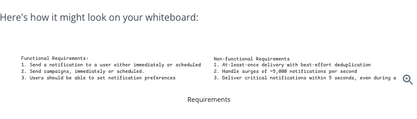
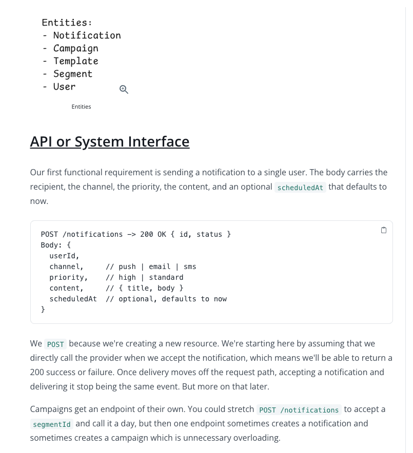
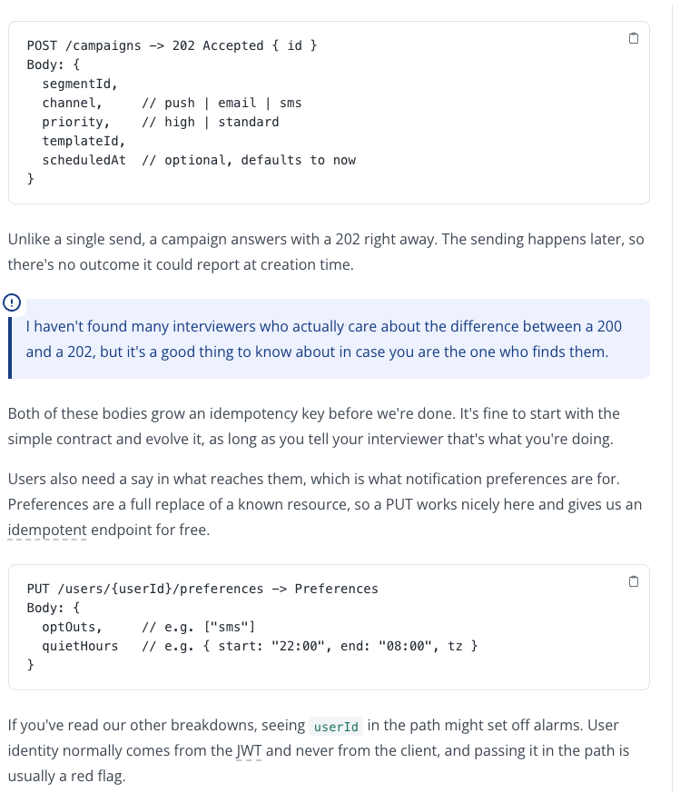
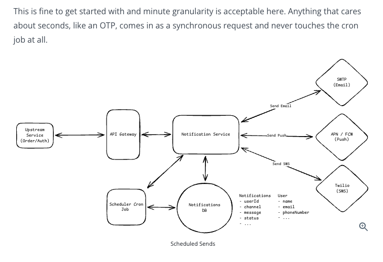
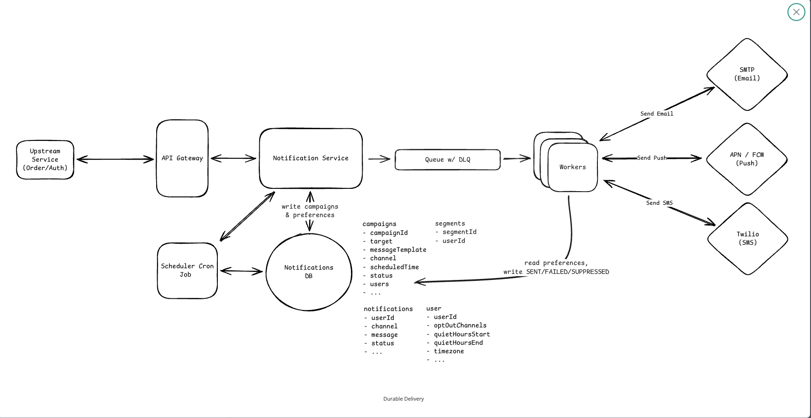
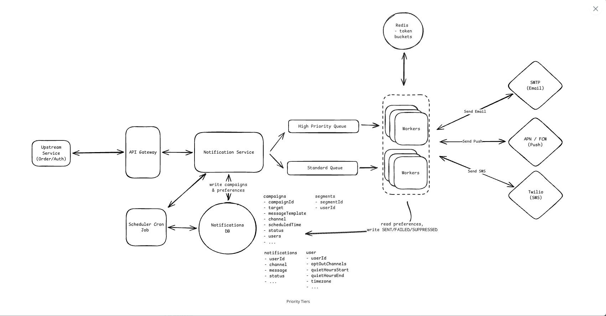

# Notification System — Durable Delivery

## 1. Guarantee Accepted Notification Is Not Dropped

**Problem:**
Don't call Email/SMS/Push provider synchronously during the API request. If the service crashes midway, the notification can be lost or its state can become inconsistent.

**Solution:** Use a **durable message queue**.

```text
Upstream
   ↓
Notification Service
   ↓
Kafka
   ↓
Consumers / Workers
   ↓
Email / Push / SMS
```

* Notification Service publishes the notification to Kafka.
* Return `202 Accepted` **only after Kafka acknowledges the message**.
* Delivery happens asynchronously.
* Postgres stores notification status/history, not the queue.

---

## 2. Workers = Consumers

Workers are essentially **Kafka consumers**.

```text
Kafka Topic
    ↓
Consumer Group
    ├── Consumer 1
    ├── Consumer 2
    └── Consumer 3
```

Consumers:

1. Read notification
2. Check user preferences
3. Call provider
4. Update notification status
5. Commit Kafka offset

---

## 3. Kafka Failure Handling

Kafka does **not** use visibility timeout.

Instead, it uses **offsets**.

```text
Read message
     ↓
Process
     ↓
Success → Commit offset
     ↓
Failure/Crash → Don't commit
     ↓
Message can be processed again
```

Therefore Kafka generally provides **at-least-once processing**.

---

## 4. SQS Visibility Timeout

For comparison:

```text
Worker receives message
        ↓
Message becomes temporarily invisible
        ↓
Worker processes it
        ↓
Success → Delete message
Failure/Crash → Visibility timeout expires
              ↓
           Message visible again
```

**Visibility timeout = temporary lease given to a worker to process a message.**

---

## 5. Retry + DLQ

Provider failure:

```text
Consumer
   ↓
Provider ❌
   ↓
Retry with exponential backoff
   ↓
Repeated failures
   ↓
Retry Topic / DLQ
```

DLQ = place for messages that repeatedly fail and need investigation.

---

## 6. Important: Exactly Once

Kafka/SQS does **not automatically guarantee exactly-once notification delivery**.

A consumer can:

```text
Call provider → SUCCESS
       ↓
Consumer crashes before offset commit
       ↓
Message processed again
       ↓
Duplicate notification possible
```

Therefore use **idempotency** wherever possible.

> Durable queue guarantees the notification won't silently disappear, but it does not guarantee the user receives exactly one notification.

---

## 7. Kafka vs SQS

| Kafka                                     | SQS                                  |
| ----------------------------------------- | ------------------------------------ |
| Topic + partitions                        | Queue                                |
| Consumer commits offset                   | Worker deletes message               |
| No visibility timeout                     | Visibility timeout                   |
| Replay is easy                            | Replay is not the main use case      |
| Consumer groups                           | Simple queue consumers               |
| Great for high-throughput/event streaming | Great for background task processing |

### Interview Choice

Kafka is completely valid for this system.

Use:

> **Kafka + Consumer Groups + Offset Commit + Retry Topics/DLQ + Idempotency**

### One-line interview answer

> "I'll publish accepted notifications to a durable Kafka topic and return 202 only after Kafka acknowledges the message. Consumers process notifications asynchronously, commit offsets only after successful processing, retry transient failures with backoff, and move repeatedly failing messages to a retry topic or DLQ."



# Notification System — Priority Tiers

## Problem

A large campaign can create **1M+ notifications** and consume all worker/provider capacity.

If an OTP enters the same queue:

```text
Campaign × 1M
      ↓
   Queue
      ↓
     OTP ← stuck behind campaign
```

The OTP may take minutes instead of the required **<5 seconds**.

---

## Solution: Isolate Priority Traffic

Use **3 levels of isolation**:

### 1. Separate Queues

```text
Notification Service
      ├── High Priority Queue
      └── Standard Queue
```

* OTP / fraud alerts → High Priority
* Campaigns / marketing → Standard
* High-priority messages don't wait behind campaign messages.

### 2. Separate Worker Pools

```text
High Priority Queue → High Priority Workers
Standard Queue      → Standard Workers
```

Dedicated workers ensure campaign traffic cannot consume all compute capacity.

### 3. Provider Rate Limits

Providers have limits:

```text
Twilio = 1000 SMS/sec
```

Reserve capacity:

```text
High Priority → 100/sec reserved
Standard      → 900/sec
```

Standard traffic cannot consume the reserved 100.

---

## Redis Token Bucket

Use Redis as a **shared rate limiter**.

```text
Worker
   ↓
Redis Token Bucket
   ↓
Token available?
   ├── YES → Call Provider
   └── NO  → Wait/Retry
```

* 1 token ≈ permission for 1 provider request.
* Tokens are replenished at the allowed rate.
* Redis is shared across all workers, so the global provider limit is respected.

---

## Example

Campaign:

```text
1M notifications
      ↓
Standard Queue
      ↓
Standard Workers
      ↓
900 SMS/sec
```

OTP arrives:

```text
Auth Service
     ↓
High Priority Queue
     ↓
High Priority Worker
     ↓
Redis → reserved token
     ↓
Twilio
     ↓
OTP delivered quickly
```

Campaign traffic cannot starve the OTP.

---

## Important Trade-off

High-priority workers may be **underutilized** most of the time.

That's intentional.

We sacrifice some resource efficiency to guarantee capacity for critical notifications.

---

## Interview Answer

> "To guarantee high-priority notifications within 5 seconds during campaign bursts, I'd isolate priority traffic using separate queues and dedicated worker pools. I'd also use a shared Redis token bucket to enforce provider rate limits and reserve a portion of the provider capacity for high-priority traffic. This prevents bulk campaigns from starving critical notifications such as OTPs and fraud alerts."

### Remember

**Isolation → Dedicated Capacity → Rate Limiting**

- We are adding rate limiters actually so that we can limit the number of requests standard queue can send.
