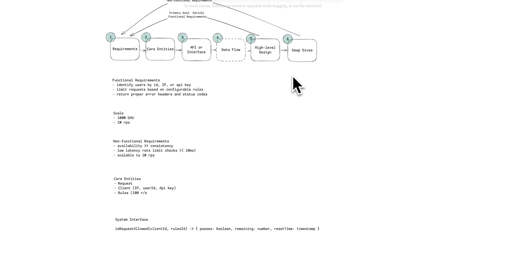
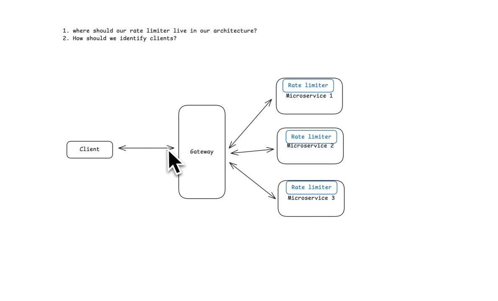
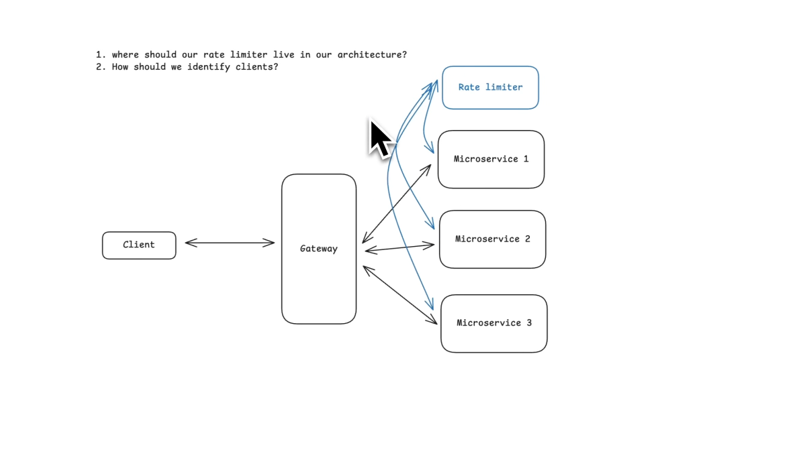
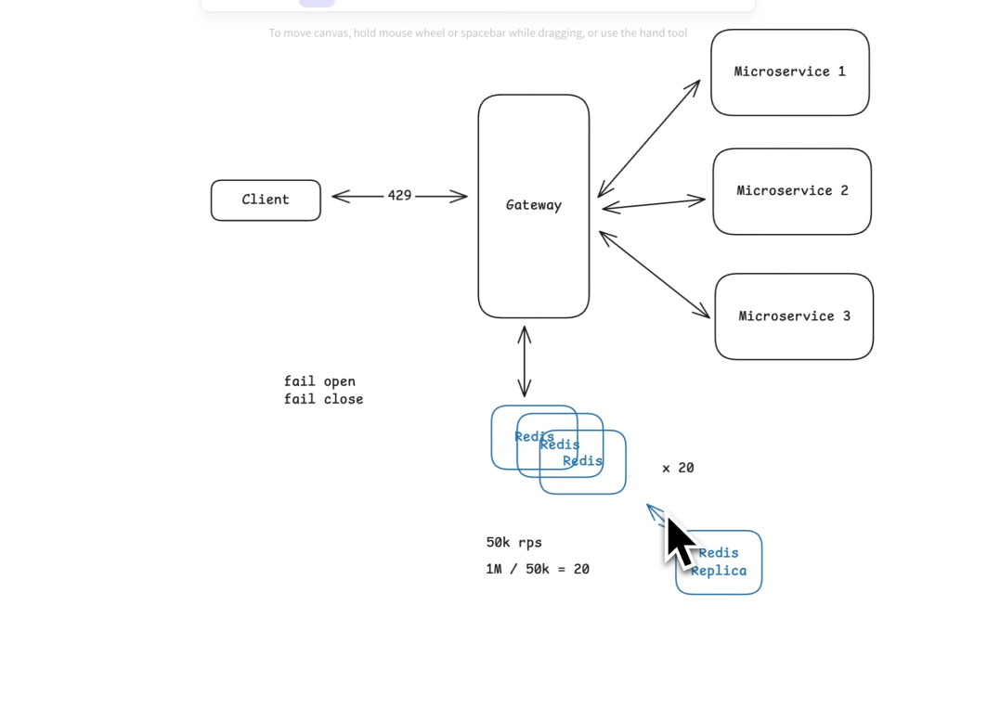

there are 4-5 different algos for rate limiter we need to read those also



- before we start we need to understand where we will place our rate limiter in our architecture and second one is how should we identify clients.




# Rate Limiter HLD Notes -- Placement & Client Identification

## Before Choosing an Algorithm

Before discussing Token Bucket, Sliding Window, or any other algorithm,
answer two architectural questions:

1.  **Where should the rate limiter be placed?**
2.  **How should clients be identified?**

These decisions determine scalability, correctness, and performance.

------------------------------------------------------------------------

# 1. Where Should We Place the Rate Limiter?

## Option 1: Inside Every Application Server

``` text
            Internet
                |
          Load Balancer
                |
      ---------------------
      |         |         |
    API-1     API-2     API-3
      |         |         |
 RateLimiter RateLimiter RateLimiter
```

### How it works

Each server maintains its own counters or token buckets.

### Problem

Suppose the limit is **100 requests/minute/user**.

If the load balancer distributes requests across three servers:

-   API-1 allows 100
-   API-2 allows 100
-   API-3 allows 100

The same client may successfully send **300 requests** instead of 100.

### Can Sticky Sessions Solve This?

Sticky sessions force one user to always hit the same server.

Problems:

-   Doesn't survive server failures.
-   Makes scaling difficult.
-   Uneven load distribution.
-   Counter is lost when the server restarts.

### Verdict

❌ Suitable only for simple deployments.

------------------------------------------------------------------------

# Option 2: Dedicated Rate Limiter Service

``` text
              Internet
                  |
           Load Balancer
                  |
        -------------------
        |       |        |
      API1    API2     API3
          \     |      /
           \    |     /
        Rate Limiter Service
                 |
               Redis
```

### Flow

1.  API receives request.
2.  API calls Rate Limiter.
3.  Rate Limiter checks Redis.
4.  Returns Allow / Reject.
5.  API proceeds only if allowed.

### Advantages

-   Single source of truth.
-   Consistent across servers.
-   Centralized configuration.

### Disadvantages

-   Additional network hop.
-   Higher latency.
-   Rate limiter becomes a critical service.
-   Requires high availability.

------------------------------------------------------------------------

# Option 3: API Gateway (Most Common)

``` text
Internet
    |
API Gateway
(Rate Limiter)
    |
Load Balancer
    |
Application Servers
```

### Flow

1.  Request reaches Gateway.
2.  Gateway performs rate-limit check.
3.  If allowed, forwards to backend.
4.  Otherwise returns HTTP 429.

### Why This Is Preferred

Rejected requests never reach backend servers.

Benefits:

-   Saves CPU.
-   Saves memory.
-   Reduces database traffic.
-   Protects downstream services.

Common products:

-   AWS API Gateway
-   Kong
-   Envoy
-   NGINX
-   Traefik

### Verdict

✅ Most common production architecture.

------------------------------------------------------------------------

# Option 4: CDN / Edge

``` text
User
  |
Cloudflare / CDN
  |
API Gateway
  |
Application Servers
```

Useful for:

-   DDoS protection
-   Bot detection
-   Geo restrictions
-   Basic IP rate limiting

Requests can be blocked before entering your infrastructure.

------------------------------------------------------------------------

# Recommended Architecture

``` text
Internet
   |
CDN (Optional)
   |
API Gateway
   |
Rate Limiter
   |
Load Balancer
   |
Application Servers
```

The gateway stores rate-limit state in a shared datastore such as Redis.

------------------------------------------------------------------------

# 2. How Should We Identify Clients?

The limit must apply to **something**.

Examples:

-   100 requests/minute per IP
-   100 requests/minute per User
-   100 requests/minute per API Key

The identifier is commonly called the **Rate Limiting Key**.

------------------------------------------------------------------------

## Option 1: IP Address

Key:

``` text
192.168.1.10
```

### Advantages

-   Very simple.
-   Works before authentication.
-   Good for anonymous APIs.

### Problems

#### NAT

Many users may share one public IP.

One user can consume the entire quota.

#### Carrier-Grade NAT

Thousands of mobile users may share one IP.

#### VPN / Proxy Rotation

Attackers can frequently change IPs.

### Best For

-   Public APIs
-   Anonymous endpoints
-   Initial abuse prevention

------------------------------------------------------------------------

## Option 2: User ID

After authentication:

``` text
JWT
   |
Extract User ID
   |
Rate Limit Key
```

Example:

``` text
user:12345
```

### Advantages

-   Fair
-   Stable
-   Independent of IP changes

### Best For

Authenticated applications.

------------------------------------------------------------------------

## Option 3: API Key

Example:

``` text
apiKey:abc123
```

Common in:

-   Public APIs
-   Server-to-server integrations
-   SaaS platforms

Advantages:

-   Easy customer isolation.
-   Different plans can have different limits.

------------------------------------------------------------------------

## Option 4: OAuth Client ID

Useful when third-party applications integrate with your platform.

Example:

``` text
clientId:spotify-app
```

The application receives its own quota.

------------------------------------------------------------------------

## Option 5: Tenant ID

For multi-tenant SaaS products.

Example:

``` text
tenant:companyA
```

Different customers may purchase different rate limits.

------------------------------------------------------------------------

## Option 6: Composite Keys

Production systems often combine multiple identifiers.

Examples:

``` text
tenant123:user456
```

``` text
user123:/payments
```

``` text
tenant123:user456:/login
```

This allows endpoint-specific policies.

Example:

  Endpoint        Limit
  ---------- ----------
  Login           5/min
  Search       1000/min
  Payments       20/min

------------------------------------------------------------------------

# Hierarchical Rate Limiting

Large systems often enforce multiple limits simultaneously.

``` text
Incoming Request
        |
        v
IP Limit
        |
        v
Tenant Limit
        |
        v
User Limit
        |
        v
Endpoint Limit
        |
        v
Allow Request
```

Example:

-   IP → 500 req/min
-   Tenant → 100,000 req/min
-   User → 100 req/min
-   Login API → 5 req/min

The request must satisfy every rule.

------------------------------------------------------------------------

# Interview Summary

## Where to Place the Rate Limiter?

  ------------------------------------------------------------------------------
  Option          Pros          Cons             Recommendation
  --------------- ------------- ---------------- -------------------------------
  Inside App      Simple        Inconsistent     ❌
  Servers                       across servers   

  Dedicated       Centralized   Extra latency    ⚠️
  Service                                        

  API Gateway     Protects      Requires shared  ✅ Best choice
                  backend,      state            
                  centralized                    

  CDN / Edge      Stops attacks Usually          ✅ Good first layer
                  early         coarse-grained   
  ------------------------------------------------------------------------------

------------------------------------------------------------------------

## How to Identify Clients?

  Identifier        Best For               Challenges
  ----------------- ---------------------- -------------------------
  IP Address        Anonymous users        NAT, VPNs
  User ID           Logged-in users        Requires authentication
  API Key           Public APIs            Key management
  OAuth Client ID   Third-party apps       OAuth setup
  Tenant ID         SaaS                   Shared quotas
  Composite Key     Fine-grained control   More complex

------------------------------------------------------------------------

# Key Interview Takeaways

-   Place rate limiting as early as possible, preferably at the API
    Gateway.
-   Use Redis or another distributed store to share state across gateway
    instances.
-   Select the client identifier based on the use case.
-   Production systems frequently apply multiple rate limits
    simultaneously (IP + Tenant + User + Endpoint).
-   These architectural choices should be explained before discussing
    Token Bucket or any other rate-limiting algorithm.

- kaun kitna request krega per unit of time vo hm log decide kr skte hai based upon our rules like if not logged in x, logged in 10x and if premium user may be 1000x.

# Token Bucket Rate Limiter - Bucket Creation, Token Assignment & Storage

# Introduction

One of the most common interview questions after explaining the Token Bucket algorithm is:

> "Where do the buckets come from?"

Many engineers understand the algorithm but cannot explain:

- Who creates the buckets?
- How are buckets assigned?
- Where are buckets stored?
- How do different API servers use the same bucket?
- How are token values decided?

This document answers all of these questions.

---

# First Principle

A bucket is **NOT** created for the entire application.

A bucket belongs to **one Rate Limiting Key**.

Everything starts from deciding the Rate Limiting Key.

Example:

```
Rate Limit Key

↓

User ID
```

Every unique user gets one bucket.

```
User 101
      ↓
 Bucket A

User 102
      ↓
 Bucket B

User 103
      ↓
 Bucket C
```

Similarly,

If we limit by API Key

```
API Key ABC

↓

Bucket A

API Key XYZ

↓

Bucket B
```

If we limit by IP

```
192.168.1.10

↓

Bucket A

192.168.1.11

↓

Bucket B
```

So,

> Bucket = State associated with one unique Rate Limiting Key.

---

# What Exactly Is Inside One Bucket?

A common misconception is that a bucket stores requests.

It does not.

A bucket stores only the current state of the algorithm.

Example

```
Bucket
```

Contains

```
Current Tokens

Last Refill Timestamp
```

Sometimes

```
Capacity

Refill Rate
```

may also be stored.

In JSON

```json
{
   "tokens":45,
   "lastRefill":1722200012
}
```

Notice

There is no request history.

No timestamps of requests.

No logs.

Just enough information to continue the algorithm.

---

# How Are Buckets Assigned?

Buckets are assigned using the Rate Limiting Key.

Suppose we choose

```
User ID
```

Then

```
User 100

↓

bucket:user:100
```

```
User 101

↓

bucket:user:101
```

```
User 102

↓

bucket:user:102
```

Redis keys become

```
bucket:user:100

bucket:user:101

bucket:user:102
```

Similarly,

For API Keys

```
bucket:apikey:abc

bucket:apikey:xyz
```

For IP

```
bucket:ip:192.168.1.10
```

The bucket key is simply generated from the client identifier.

---

# Who Creates the Bucket?

This is one of the most important interview questions.

Many people think

```
When user registers

↓

Create Bucket
```

That is usually incorrect.

Imagine

```
100 Million Users
```

Only

```
5 Million

Active Today
```

Creating buckets for everyone wastes enormous memory.

Instead,

Production systems use

# Lazy Bucket Creation

Suppose User 500 sends the first request.

```
Gateway

↓

Generate Redis Key

↓

bucket:user:500
```

Redis

```
Bucket Exists?

↓

No
```

Now create

```
Tokens = Capacity

LastRefill = Current Time
```

Store

```
bucket:user:500
```

Done.

Only active users consume memory.

This is called

> Lazy Initialization

---

# Why Lazy Initialization?

Advantages

✔ Memory Efficient

✔ No unnecessary buckets

✔ Simple

✔ Automatically scales

---

# Where Are Buckets Stored?

Depends on architecture.

---

# Option 1

## Inside Application Memory

```
Application

↓

HashMap
```

Example

```
HashMap

Key

user123

↓

Value

{
Tokens=60
LastRefill=10:20
}
```

Advantages

- Extremely fast
- No network calls
- O(1)

Problem

Suppose

```
API-1

API-2

API-3
```

Each has its own memory.

User request

```
Request 1

↓

API-1
```

Bucket becomes

```
40 Tokens
```

Next request

```
↓

API-2
```

API-2 still thinks

```
100 Tokens
```

Rate limiting becomes incorrect.

Therefore

In-memory buckets work only on a single server.

---

# Option 2

## Redis (Most Common)

```
Gateway-1

Gateway-2

Gateway-3

↓

Redis
```

Redis stores

```
bucket:user:100

↓

{
 Tokens=74,
 LastRefill=...
}
```

Every gateway reads and updates the same bucket.

Advantages

✔ Shared

✔ Fast

✔ Distributed

✔ Persistent enough

✔ Supports Atomic Operations

This is why Redis is the most common choice.

---

# Why Not Database?

Imagine

```
50,000 Requests/sec
```

Every request

```
↓

Database Read

↓

Database Update
```

Database becomes the bottleneck.

Redis

```
Sub-millisecond

Millions of Operations/sec
```

Perfect for this workload.

---

# How Do We Decide Number of Tokens?

This is another interview favorite.

There is no universal answer.

It depends on the business requirement.

Suppose Product Requirement says

```
100 Requests / Minute
```

Now we choose

## Capacity

and

## Refill Rate

---

# What Is Capacity?

Capacity is

```
Maximum Tokens Bucket Can Hold
```

Example

```
Capacity

100
```

Bucket

```
□□□□□□□□□□

100 Tokens
```

Even if user stays inactive

```
2 Hours
```

Bucket never exceeds

```
100
```

Capacity controls

> Maximum Burst Size

---

# Example

Capacity

```
100
```

User idle

```
5 Hours
```

Still

```
100 Tokens
```

User suddenly sends

```
100 Requests
```

All succeed.

This is why Token Bucket allows bursts.

---

# What Is Refill Rate?

Refill Rate

```
How Fast Tokens Are Generated
```

Suppose

```
100 Requests / Minute
```

Convert

```
100

/

60

=

1.67 Tokens/sec
```

Therefore

```
Refill Rate

1.67/sec
```

Every second

```
Bucket gains

1.67 Tokens
```

Until Capacity.

---

# Different Capacity Choices

Suppose requirement

```
100 Requests / Minute
```

There are multiple implementations.

---

## Strict Traffic

Capacity

```
1
```

Refill

```
1.67/sec
```

Very smooth.

Almost no bursts.

---

## Small Burst

Capacity

```
20
```

Refill

```
1.67/sec
```

User may immediately send

```
20 Requests
```

Then waits for refill.

---

## Large Burst

Capacity

```
100
```

Refill

```
1.67/sec
```

User may immediately send

```
100 Requests
```

Then continues according to refill rate.

---

Capacity controls

```
Burst
```

Refill controls

```
Long-term Throughput
```

This distinction is extremely important.

---

# Can Different Users Have Different Buckets?

Absolutely.

Suppose SaaS plans

```
Free

Premium

Enterprise
```

Configuration

Free

```
Capacity

50

Refill

1/sec
```

Premium

```
Capacity

500

Refill

20/sec
```

Enterprise

```
Capacity

5000

Refill

200/sec
```

Gateway

```
Extract User Plan

↓

Load Configuration

↓

Apply Bucket Rules
```

Same algorithm.

Different configuration.

---

# Complete Request Lifecycle

Suppose

```
User 200

↓

GET /search
```

Step 1

Extract

```
UserID

200
```

---

Step 2

Generate Redis Key

```
bucket:user:200
```

---

Step 3

Lookup Redis

```
Tokens

35

LastRefill

10:20
```

---

Step 4

Calculate elapsed time

Suppose

```
Current Time

10:20:05
```

Elapsed

```
5 sec
```

---

Step 5

Lazy Refill

```
5 sec

×

2 Tokens/sec

=

10 Tokens
```

Bucket

```
35

+

10

=

45
```

Respect Capacity.

---

Step 6

Consume One Token

```
45

↓

44
```

---

Step 7

Store Updated Bucket

```
Tokens

44

LastRefill

10:20:05
```

---

Step 8

Forward Request

```
Gateway

↓

Application
```

---

# Important Design Observation

Notice

The Gateway

**does not own the bucket.**

Redis owns the bucket.

Gateway only performs

```
Read Bucket

↓

Refill

↓

Consume

↓

Update
```

This makes it possible for multiple Gateway instances to use the same bucket.

---

# Production Architecture

```
                    Internet
                         |
                  API Gateway Cluster
            +---------+---------+
            |         |         |
        Gateway1  Gateway2  Gateway3
            \         |         /
             \        |        /
              +----------------+
              |     Redis      |
              |----------------|
              | bucket:user:1  |
              | bucket:user:2  |
              | bucket:user:3  |
              +----------------+
                     |
             Atomic Update
                     |
            Allow / Reject
                     |
             Application Server
```

---

# Key Interview Points

- A bucket belongs to one unique Rate Limiting Key.
- Buckets are created lazily when the first request arrives.
- Every active client gets exactly one bucket.
- Buckets are identified using deterministic Redis keys.
- Redis is the preferred storage because all gateway instances share the same state.
- Capacity determines burst size.
- Refill Rate determines sustained throughput.
- Different users or plans can have different bucket configurations.
- A bucket stores only state (tokens and last refill time), not request history.
- The gateway does not own the bucket; Redis acts as the shared source of truth.

# Token Bucket - Understanding Refill Rate & Last Refill Time

# The Biggest Confusion

Almost everyone understands that:

- Requests consume tokens.
- If tokens become zero, requests are rejected.

But the biggest confusion is:

> If requests keep consuming tokens, who puts the tokens back?

This is exactly why the **Refill Rate** exists.

---

# First, Imagine There Is No Refill Rate

Suppose we have a bucket.

```
Capacity = 10 Tokens

Current Tokens = 10
```

A user sends 10 requests.

```
Request 1

Tokens = 9

Request 2

Tokens = 8

...

Request 10

Tokens = 0
```

Now another request arrives.

```
Current Tokens = 0
```

No token is available.

Reject the request.

Now ask yourself

**How will this bucket ever get tokens again?**

If nothing regenerates tokens,

```
Tokens = 0
```

forever.

The user would never be able to use the API again.

Obviously this is not how rate limiting should work.

Therefore,

we need a mechanism that regenerates tokens.

That mechanism is called

# Refill Rate

---

# What Is Refill Rate?

Refill Rate answers one simple question.

> How many new permissions should the user receive every second?

Remember,

A token is nothing more than

```
Permission to make one request.
```

Refill Rate simply creates new permissions continuously.

Example

```
Refill Rate = 2 Tokens / Second
```

means

Every second

```
+2 New Tokens
```

become available.

---

# Example

Suppose

```
Capacity = 10

Current Tokens = 0

Refill Rate = 2/sec
```

Timeline

```
Time = 0

Tokens = 0
```

After one second

```
Tokens = 2
```

After two seconds

```
Tokens = 4
```

After three seconds

```
Tokens = 6
```

After four seconds

```
Tokens = 8
```

After five seconds

```
Tokens = 10
```

Bucket is now full.

Even if another ten seconds pass,

```
Tokens = 10
```

because the bucket cannot exceed its capacity.

---

# Why Do We Need Refill Rate?

Without refill rate,

users would permanently lose the ability to send requests after consuming all tokens.

Refill Rate guarantees that users slowly regain permission to use the API again.

Think of it as

```
Recovering API Credits
```

over time.

---

# The Next Question

Many people now ask

> Who is adding these tokens every second?

Do we have a background thread?

```
Every Second

↓

Visit Every Bucket

↓

Add Tokens
```

No.

Production systems almost never do this.

---

# Why Not?

Imagine

```
100 Million Users
```

Each user has one bucket.

Would the system wake up every second and update

```
100 Million Buckets
```

even though most users are inactive?

That would waste enormous CPU and memory.

Most buckets belong to users who are not sending requests.

Updating them continuously makes no sense.

---

# Lazy Refill

Instead of continuously adding tokens,

production systems calculate

> How many tokens should have been added since the last request?

Only when another request arrives.

This approach is called

```
Lazy Refill
```

No background jobs.

No timers.

No periodic updates.

Everything is calculated on demand.

---

# Why Do We Need Last Refill Time?

Suppose the bucket currently contains

```
Current Tokens = 4

Refill Rate = 2/sec
```

Now the user disappears.

No requests for

```
5 Seconds
```

When the user returns,

how do we know

whether to add

```
2 Tokens
```

or

```
5 Tokens
```

or

```
10 Tokens
```

We need to know

**how much time has passed.**

That is why every bucket stores

```
Last Refill Time
```

---

# What Is Last Refill Time?

It is simply

```
The last moment when we calculated tokens.
```

Example

```
Current Tokens = 4

Last Refill Time = 10:00:00

Refill Rate = 2/sec
```

User returns at

```
10:00:05
```

Now we know

```
Elapsed Time

=

5 Seconds
```

Therefore

```
New Tokens

=

Elapsed Time

×

Refill Rate

=

5 × 2

=

10 Tokens
```

Current bucket

```
4 + 10 = 14
```

Capacity

```
10
```

Final bucket

```
10 Tokens
```

Now consume one token

```
10

↓

9
```

Save

```
Last Refill Time = 10:00:05
```

Done.

---

# Timeline Example

Suppose

```
Capacity = 10

Refill Rate = 2/sec
```

Initial state

```
10:00:00

Tokens = 10
```

User sends six requests.

```
Tokens = 4
```

Store

```
Last Refill = 10:00:00
```

Now

No requests arrive for

```
5 Seconds
```

Nothing happens.

No timers.

No updates.

No background process.

At

```
10:00:05
```

User sends another request.

System calculates

```
Elapsed Time

=

10:00:05

-

10:00:00

=

5 Seconds
```

New Tokens

```
5 × 2 = 10
```

Current bucket

```
4 + 10 = 14
```

Respect Capacity

```
Min(14,10)

=

10
```

Consume one token

```
10

↓

9
```

Store

```
Last Refill = 10:00:05
```

The request is allowed.

---

# Why Update Last Refill Time?

Suppose we never update

```
Last Refill Time
```

First request

```
10:00:05
```

adds

```
10 Tokens
```

Now another request arrives at

```
10:00:06
```

If

```
Last Refill Time

still

10:00:00
```

Elapsed Time becomes

```
6 Seconds
```

The system would again add

```
12 Tokens
```

even though we already added the previous five seconds.

The same time interval would be counted twice.

That would generate extra tokens.

Therefore,

after every refill calculation,

we immediately update

```
Last Refill Time = Current Time
```

This guarantees

> Every second contributes tokens exactly once.

---

# Why Is This Called Lazy Refill?

Because

Tokens are **not** generated continuously.

Instead,

they are generated only when someone asks for them.

No request

↓

No calculation

↓

No update

↓

No work

Only when a request arrives

↓

Calculate elapsed time

↓

Generate missing tokens

↓

Process request

This makes Token Bucket extremely efficient.

---

# Real Analogy - Mobile Data Recharge

Imagine your mobile plan gives you

```
2 GB per day
```

You use

```
6 GB
```

Now you stop using your phone for

```
3 Days
```

When you open your phone again,

your operator does **not** add data every second while you were sleeping.

Instead,

they calculate

```
3 Days

×

2 GB

=

6 GB Restored
```

To perform that calculation,

they need two pieces of information:

```
Recharge Rate

(2 GB/day)
```

and

```
Last Recharge Time
```

Token Bucket works in exactly the same way.

---

# Key Takeaways

- Tokens represent permission to make requests.
- Refill Rate determines how quickly new permissions are generated.
- Without Refill Rate, the bucket would eventually become empty forever.
- Production systems do not regenerate tokens every second.
- They use **Lazy Refill**, calculating missing tokens only when a request arrives.
- Last Refill Time records the last moment when token calculation was performed.
- Elapsed Time = Current Time − Last Refill Time.
- New Tokens = Elapsed Time × Refill Rate.
- After updating the bucket, Last Refill Time is moved to the current time.
- This ensures every second contributes tokens exactly once and avoids double-counting.
- Lazy Refill makes Token Bucket scalable to millions of users because inactive buckets require no processing.

# Token Bucket in Redis - Atomic Updates Using Lua Scripts

# Introduction

The Token Bucket algorithm itself is relatively simple.

The real challenge begins when multiple API Gateway instances process requests for the same user simultaneously.

The biggest question is:

> How do we ensure that two gateway servers don't consume the same token?

This document explains:

- Why race conditions happen
- Why a simple Redis GET/SET is not enough
- What atomic operations are
- How Redis Lua scripts solve the problem
- Why production systems use Lua scripts for Token Bucket

---

# The Problem

Suppose our architecture looks like this.

```
                 Internet
                      |
             API Gateway Cluster
          +---------+---------+
          |         |         |
      Gateway1  Gateway2  Gateway3
               |
               |
             Redis
```

Every gateway talks to the same Redis.

Redis stores

```
bucket:user:101

Tokens = 5
```

Now imagine User 101 sends

```
10 Requests
```

at exactly the same moment.

The Load Balancer distributes them.

```
Request1 → Gateway1

Request2 → Gateway2

Request3 → Gateway3

Request4 → Gateway1

...
```

Now all gateways start processing simultaneously.

---

# Naive Implementation

Suppose every gateway performs the following logic.

```
Read Bucket

↓

Calculate Tokens

↓

Consume One Token

↓

Update Bucket
```

Looks correct.

But let's simulate.

---

# Step 1

Redis contains

```
Tokens = 5
```

---

Gateway1 performs

```
GET bucket
```

Receives

```
Tokens = 5
```

---

Gateway2 also performs

```
GET bucket
```

Receives

```
Tokens = 5
```

---

Gateway3 also performs

```
GET bucket
```

Receives

```
Tokens = 5
```

Notice something important.

Every gateway believes

```
Tokens = 5
```

---

Gateway1

Consumes one token

Writes

```
Tokens = 4
```

Redis becomes

```
Tokens = 4
```

---

Gateway2

Still believes

```
Tokens = 5
```

Consumes one token

Writes

```
Tokens = 4
```

again.

Gateway1's update is overwritten.

---

Gateway3

Still believes

```
Tokens = 5
```

Consumes one token

Writes

```
Tokens = 4
```

again.

Now

Three requests have succeeded

but

only one token has actually disappeared.

The bucket state is now incorrect.

---

# Another Example

Suppose

```
Tokens = 1
```

Two requests arrive simultaneously.

Gateway1 reads

```
Tokens = 1
```

Gateway2 also reads

```
Tokens = 1
```

Both decide

```
I can allow this request.
```

Both consume one token.

Result

```
2 Requests Allowed

Only 1 Token Existed
```

Rate limiting has failed.

---

# What Is This Problem Called?

This is called

```
Race Condition
```

Definition

```
Multiple processes access and modify the same data at the same time,
causing incorrect results.
```

The Token Bucket algorithm is correct.

The implementation is incorrect because multiple gateways are modifying shared state concurrently.

---

# Why Does This Happen?

Because the operation

```
GET

↓

Calculate

↓

SET
```

is **not atomic**.

Between

```
GET
```

and

```
SET
```

another gateway can modify the same bucket.

The read value becomes stale.

---

# What Does Atomic Mean?

Atomic means

```
The entire operation happens as one indivisible unit.
```

Nobody can interrupt it.

Nobody can observe intermediate state.

Think of it as

```
Start

↓

Everything Executes

↓

Finish
```

Nothing can happen in between.

---

# Banking Analogy

Imagine your bank account contains

```
$100
```

Two ATMs attempt to withdraw

```
$80
```

simultaneously.

ATM1

```
Reads

$100
```

ATM2

```
Reads

$100
```

Both believe

```
Enough money exists.
```

Both withdraw.

Now

```
$160

withdrawn

from

$100
```

Impossible.

Banks solve this using atomic transactions.

Token Bucket requires the same concept.

---

# Can We Use Locks?

One solution could be

```
Acquire Lock

↓

Read Bucket

↓

Update Bucket

↓

Release Lock
```

This works.

But has several problems.

- High latency
- Lock contention
- Deadlocks
- Lock expiration
- Poor scalability

Imagine

```
200,000 Requests/sec
```

Every request waiting for a lock.

Performance drops significantly.

---

# Redis Gives Us Something Better

Redis is

```
Single Threaded
```

This is a very important property.

Redis executes commands

```
Command1

↓

Command2

↓

Command3
```

One after another.

Never simultaneously.

However

Our logic is

```
GET

↓

Calculate

↓

SET
```

These are three independent commands.

Another client may execute commands between them.

Therefore

Simple GET/SET is still unsafe.

---

# Redis Lua Scripts

Redis provides

```
Lua Scripts
```

A Lua Script contains multiple Redis commands.

Example

```
GET

Calculate

SET
```

Redis treats the entire script as

```
One Atomic Operation
```

No other command executes until the script finishes.

Think of it as

```
One Giant Redis Command
```

instead of three separate commands.

---

# Without Lua Script

Gateway performs

```
GET

↓

Calculate

↓

SET
```

Three network calls.

Three separate Redis commands.

Another gateway may interrupt between them.

Race conditions occur.

---

# With Lua Script

Gateway sends

```
Entire Token Bucket Algorithm
```

to Redis.

Redis executes

```
Read Bucket

↓

Calculate Refill

↓

Consume Token

↓

Update Bucket

↓

Return Result
```

without interruption.

No other gateway can access that bucket during execution.

---

# Redis Execution Timeline

Without Lua

```
Gateway1

GET

---------------

Gateway2

GET

---------------

Gateway1

SET

---------------

Gateway2

SET
```

Notice

Operations overlap.

Race condition.

---

With Lua

```
Gateway1

Entire Script

-----------------------------

Gateway2

Entire Script

-----------------------------
```

Redis completes Script1 before Script2 starts.

No overlap.

No race condition.

---

# Inside the Lua Script

Suppose Redis contains

```
Tokens = 5

LastRefill = 10:00:00
```

Gateway sends

```
Current Time

10:00:05

Capacity

10

Refill Rate

2/sec
```

Lua Script executes

### Step 1

Read bucket

```
Tokens = 5
```

---

### Step 2

Calculate elapsed time

```
Current Time

-

Last Refill

=

5 Seconds
```

---

### Step 3

Calculate regenerated tokens

```
5 Seconds

×

2 Tokens/sec

=

10 Tokens
```

---

### Step 4

Update bucket

```
5 + 10 = 15
```

Respect capacity

```
Min(15,10)

=

10
```

---

### Step 5

Consume one token

```
10

↓

9
```

---

### Step 6

Update bucket

```
Tokens = 9

LastRefill = 10:00:05
```

---

### Step 7

Return

```
ALLOW
```

Entire sequence executes atomically.

---

# What Happens to Another Gateway?

Suppose Gateway2 arrives while Gateway1's script is running.

Redis simply waits.

```
Gateway1 Script

↓

Finish

↓

Gateway2 Script

↓

Finish
```

Gateway2 now reads

```
Tokens = 9
```

instead of

```
Tokens = 10
```

It always sees the latest state.

No stale reads.

---

# Why Doesn't the Gateway Perform the Calculation?

Suppose the gateway performs

```
Read

↓

Calculate

↓

Write
```

The calculation happens outside Redis.

Multiple gateways calculate simultaneously.

The shared bucket becomes inconsistent.

Instead

The gateway sends

```
Execute Token Bucket Script
```

Redis performs

everything

locally.

Only the final answer is returned.

---

# Network Calls Comparison

Without Lua

```
Gateway

↓

GET

↓

Receive Bucket

↓

Calculate

↓

SET

↓

Receive Success
```

Multiple network round trips.

---

With Lua

```
Gateway

↓

Execute Lua Script

↓

Receive Allow/Reject
```

Only one network round trip.

Lower latency.

Higher throughput.

---

# Production Request Flow

```
User Request

↓

API Gateway

↓

Generate Bucket Key

↓

Execute Redis Lua Script

↓

Redis

Read Bucket

↓

Refill Tokens

↓

Consume Token

↓

Update Bucket

↓

Return Result

↓

Gateway

↓

ALLOW

or

REJECT

↓

Application Server
```

---

# Benefits of Lua Scripts

- Prevent race conditions.
- Guarantee atomic updates.
- Eliminate stale reads.
- Reduce network round trips.
- Improve performance.
- Simplify gateway logic.
- Ensure all gateway instances observe consistent bucket state.

---

# Key Interview Takeaways

- The Token Bucket algorithm itself is simple; concurrency is the real challenge.
- A sequence of `GET → Calculate → SET` is unsafe because multiple gateways can read the same state concurrently.
- Redis executes Lua scripts atomically because Redis processes one command (or one script) at a time.
- The gateway should send the entire Token Bucket algorithm to Redis instead of performing calculations locally.
- The Lua script performs **Read → Refill → Consume → Update** as one indivisible operation.
- This prevents lost updates and ensures that no two requests consume the same token.
- Lua scripts also reduce Redis network round trips from multiple commands to a single request.

---

# Final Mental Model

Think of the API Gateway as asking Redis a single question:

```
"Given the current bucket state and the current time,
should this request be allowed?"
```

Redis does **all** the work:

- Read the bucket.
- Calculate elapsed time.
- Refill tokens.
- Respect capacity.
- Consume one token if available.
- Update the bucket.
- Return ALLOW or REJECT.

Because all of this happens atomically inside Redis, every gateway sees a consistent bucket state, even when thousands of requests arrive simultaneously.



# Scaling Redis for a Distributed Token Bucket Rate Limiter

# Introduction

After designing the Token Bucket algorithm and implementing it using Redis Lua scripts, one important question still remains.

> How do we scale Redis when millions of requests per second are hitting the rate limiter?

At first glance, Redis becomes the central component of the architecture.

```
                Internet
                     |
             API Gateway Cluster
          +------+------+------+
          |      |      |      |
        GW1    GW2    GW3    GW4
                 |
                 |
               Redis
```

Every request executes a Lua script on Redis.

If millions of requests arrive every second, a single Redis instance will eventually become the bottleneck.

This document explains how production systems solve this problem.

---

# Why Does Redis Become the Bottleneck?

Suppose our application receives

```
2 Million Requests / Second
```

Every request performs the following operations.

```
Read Bucket

↓

Calculate Refill

↓

Consume Token

↓

Update Bucket
```

Since every request modifies the bucket,

every request must execute on Redis.

Eventually Redis reaches its limits because of

- CPU
- Memory
- Network Bandwidth
- Single-threaded execution

Although Redis is extremely fast,

one machine cannot scale forever.

---

# Can We Use Redis Replicas?

The first idea many people have is

```
             Primary

            /       \

      Replica1   Replica2
```

Can Gateway1 use Replica1?

Can Gateway2 use Replica2?

The answer is

```
No
```

Why?

Because Token Bucket is not a read-heavy workload.

Every request modifies the bucket.

Example

Primary

```
Tokens = 8
```

Replica

```
Tokens = 10
```

because replication is slightly delayed.

A gateway reading from the replica would believe

```
Two Extra Tokens Exist
```

Those requests would be incorrectly allowed.

Therefore

Rate limiting decisions must always use the primary copy of the bucket.

Replicas are useful for

- High Availability
- Disaster Recovery
- Failover

but not for processing Token Bucket updates.

---

# Horizontal Scaling

Instead of using one Redis,

we use many Redis servers.

```
           Redis Cluster

+-----------+-----------+-----------+

| Redis-1   | Redis-2   | Redis-3   |

+-----------+-----------+-----------+
```

Now the question becomes

> Which bucket belongs to which Redis?

---

# Sharding

Every bucket is completely independent.

```
User 100

↓

Bucket A
```

has nothing to do with

```
User 200

↓

Bucket B
```

Therefore buckets can be distributed across different Redis servers.

Example

```
bucket:user:100

↓

Redis-1
```

```
bucket:user:101

↓

Redis-2
```

```
bucket:user:102

↓

Redis-3
```

Each Redis stores only a subset of all buckets.

This technique is called

```
Sharding
```

or

```
Partitioning
```

---

# How Is the Correct Redis Chosen?

We do not manually assign buckets.

Instead,

the bucket key is hashed.

Example

```
bucket:user:12345
```

↓

```
Hash(bucket:user:12345)
```

Suppose

```
18476381
```

Now

```
18476381 % 3 = 2
```

Therefore

```
Redis-2
```

owns this bucket.

Every request for

```
bucket:user:12345
```

always goes to

```
Redis-2
```

This guarantees

Only one Redis owns a bucket.

---

# Problem with Simple Hashing

Suppose we initially have

```
3 Redis Servers
```

Every key uses

```
Hash % 3
```

Now we add another Redis.

```
4 Redis Servers
```

The calculation becomes

```
Hash % 4
```

Almost every bucket moves to another Redis.

Millions of buckets must migrate.

This causes

- Massive data movement
- Cache misses
- Temporary performance degradation

Clearly,

simple hashing is not ideal.

---

# Consistent Hashing

Instead of modulo hashing,

production systems use

```
Consistent Hashing
```

Consistent Hashing has one major advantage.

When a new Redis node is added,

only a small percentage of buckets move.

The majority of buckets remain on the same Redis server.

Benefits

- Easy scaling
- Minimal bucket migration
- Stable distribution

---

# Redis Cluster

Redis Cluster already implements distributed sharding.

Instead of using modulo,

Redis divides the key space into

```
16,384 Hash Slots
```

Every bucket belongs to exactly one slot.

Example

```
bucket:user:100

↓

Slot 8021

↓

Redis-2
```

Another bucket

```
bucket:user:500

↓

Slot 1420

↓

Redis-1
```

When another Redis node is added,

Redis moves only some hash slots.

Not every bucket.

This makes scaling much easier.

---

# Does the Gateway Know Where Buckets Live?

No.

The Gateway simply executes

```
Execute Lua Script

Bucket Key
```

The Redis Client Library

calculates

```
Hash Slot
```

and automatically routes the request to the correct Redis node.

The gateway does not care

which Redis owns the bucket.

---

# Can Two Redis Servers Own the Same Bucket?

No.

Every bucket belongs to exactly one Redis node.

Example

```
bucket:user:101
```

always belongs to

```
Redis-2
```

Every Gateway

```
Gateway1

Gateway2

Gateway3
```

must send requests for

```
bucket:user:101
```

to

```
Redis-2
```

Therefore

all Lua scripts for that bucket execute on the same Redis instance.

Atomicity is preserved.

---

# Scaling Example

Suppose

```
10 Million Active Users
```

Each user has one bucket.

Instead of

```
1 Redis
```

use

```
10 Redis Nodes
```

Each node stores approximately

```
1 Million Buckets
```

Traffic also spreads.

Instead of

```
2 Million Requests/sec

↓

One Redis
```

We get

```
200,000 Requests/sec

↓

Each Redis
```

This significantly increases overall system throughput.

---

# What Happens If One Redis Server Fails?

Suppose

```
Redis-2
```

crashes.

Redis Cluster maintains replicas.

```
Primary

↓

Replica
```

If the primary fails,

the replica is promoted automatically.

The client reconnects to the new primary.

During failover,

a few requests may fail or be retried,

but the system quickly recovers.

---

# Hot Key Problem

Even with sharding,

one problem still exists.

Suppose one API Key receives

```
500,000 Requests/sec
```

That bucket belongs to

```
Redis-2
```

Every request for that API Key still goes to the same Redis server.

This is called

```
Hot Key
```

One bucket receives disproportionate traffic compared to others.

---

# Solutions for Hot Keys

## Option 1

Accept It

Many APIs never reach traffic levels that make one bucket a bottleneck.

This is often sufficient.

---

## Option 2

Hierarchical Rate Limiting

Instead of limiting only

```
API Key
```

Create more granular buckets.

Example

```
Tenant + User
```

or

```
User + Endpoint
```

Instead of one extremely hot bucket,

traffic is spread across multiple buckets.

---

## Option 3

Local Token Cache

Instead of asking Redis for every request,

Redis grants

```
100 Tokens
```

to Gateway1.

Gateway1 stores those tokens locally.

```
Redis

↓

100 Tokens

↓

Gateway Local Bucket
```

Gateway processes requests locally.

Only when the local bucket becomes empty

does it ask Redis for another batch.

Instead of

```
100 Requests

↓

100 Redis Calls
```

we get

```
100 Requests

↓

1 Redis Call
```

This dramatically reduces Redis load.

Trade-off

Small loss of accuracy.

Multiple gateways may temporarily hold local tokens simultaneously.

Many production systems accept this trade-off in exchange for much higher throughput.

---

# Final Production Architecture

```
                   Internet
                        |
                 Load Balancer
                        |
        +-------+-------+-------+-------+
        |       |       |       |       |
      GW1     GW2     GW3     GW4     GW5
        |       |       |       |       |
        +-------+-------+-------+-------+
                        |
                  Redis Cluster
        +-----------+-----------+-----------+
        | Primary 1 | Primary 2 | Primary 3 |
        +-----------+-----------+-----------+
              |            |            |
          Replica      Replica      Replica
```

Request Flow

```
User Request

↓

Gateway

↓

Generate Bucket Key

↓

Redis Client

↓

Calculate Hash Slot

↓

Correct Redis Node

↓

Execute Lua Script

↓

ALLOW / REJECT

↓

Application Server
```

---

# Key Interview Takeaways

- A single Redis instance eventually becomes the bottleneck at very high request volumes.
- Redis replicas cannot be used for Token Bucket updates because replication is asynchronous and may serve stale data.
- Redis is horizontally scaled using sharding.
- Every bucket belongs to exactly one Redis node.
- Production systems typically rely on Redis Cluster, which distributes keys using 16,384 hash slots.
- The Redis client automatically routes requests to the correct Redis node.
- Lua scripts continue to execute atomically because all requests for a bucket always reach the same Redis instance.
- Hot keys remain a challenge even in a sharded system.
- Local token caching can significantly reduce Redis traffic by allocating batches of tokens to gateways, trading a small amount of accuracy for much higher throughput.
- Redis replicas are primarily used for failover and high availability rather than for serving Token Bucket operations.

---

# Final Mental Model

Think of Redis Cluster as a collection of independent Token Bucket managers.

```
User 100

↓

Redis-1

↓

Atomic Lua Script
```

```
User 200

↓

Redis-2

↓

Atomic Lua Script
```

```
User 300

↓

Redis-3

↓

Atomic Lua Script
```

Each Redis is responsible for only the buckets assigned to it.

This allows the system to scale horizontally while still guaranteeing that every bucket is updated atomically and consistently.