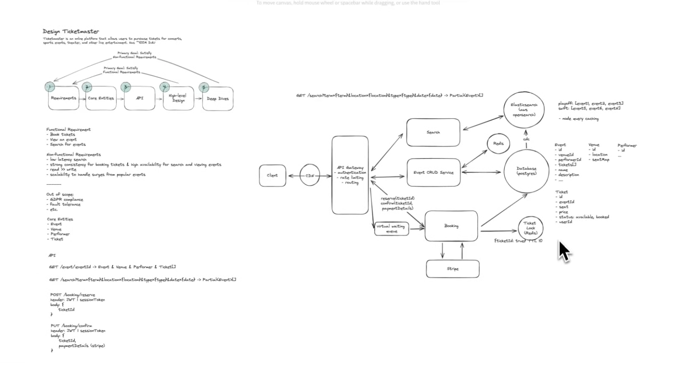
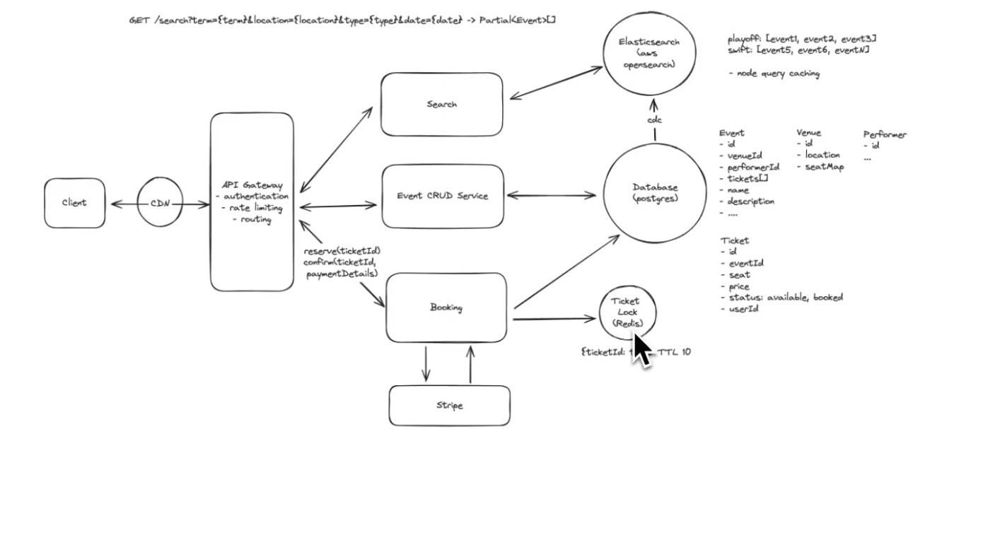
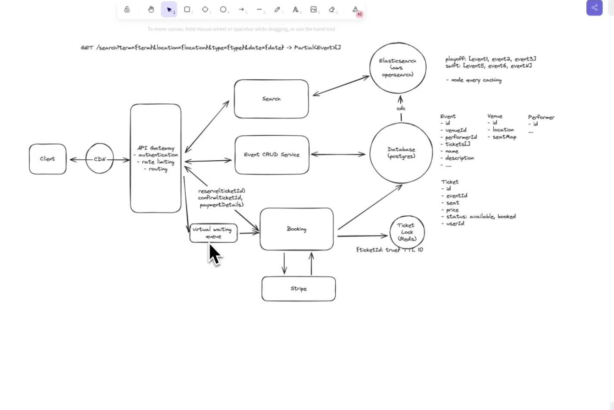

# ticket master sytem design



# Problem with the Basic Reservation Flow

Our current booking flow works like this:

```text
User selects seat
        │
        ▼
Booking Service
        │
        ▼
Seat Status = RESERVED
        │
        ▼
User proceeds to payment
        │
        ▼
Payment Service sends confirmation
        │
        ▼
Booking Service updates status = BOOKED
```

This approach looks correct initially, but it has one major problem.

---

# The Problem

Ticket booking applications usually have a **multi-step booking process**.

For example:

1. User searches for an event.
2. User selects one or more seats.
3. The selected seats are marked as **RESERVED** so that no other user can book them.
4. User proceeds to the payment page.
5. After successful payment, the Payment Service notifies the Booking Service.
6. Booking Service changes the seat status from **RESERVED** to **BOOKED**.

Everything works fine if the user completes the payment.

---

# What if the user never completes the payment?

Consider the following scenario:

- User selects Seat A1.
- Booking Service marks Seat A1 as **RESERVED**.
- User reaches the payment page.
- Instead of paying, the user:
  - closes the browser,
  - loses internet connection,
  - switches off the phone,
  - or simply decides not to continue.

Since no payment confirmation is received, the Booking Service never updates the seat status to **BOOKED**.

The seat remains in the **RESERVED** state indefinitely.

---

# Why is this a Problem?

If the seat remains reserved forever:

- Other users cannot book that seat.
- The seat is not actually sold.
- The event may appear to have fewer available seats than it really does.
- The system starts losing potential bookings and revenue.

In other words, the seat becomes **blocked permanently**, even though nobody purchased it.

---

# Summary

The issue with this design is that **a reservation is created immediately when the user selects a seat**, but **there is no mechanism to handle users who abandon the booking before completing the payment**.

As a result, seats can remain in the **RESERVED** state forever, making them unavailable for other users even though they were never actually booked.


- kuch issue ho sakta hai na cron-job ke sath ki job run nhi hua to thodi der ke liye we will see less tickets as some will be still there in Reservered state right.




                Event CRUD
                     |
                     v
               PostgreSQL (Source of Truth)
                     |
          CDC / Kafka / Event Bus
                     |
             Search Indexer Service
                     |
              Elasticsearch Cluster
             (Shards + Replicas)
                     |
              Search Service API
                     |
          +------------------------+
          |                        |
     Redis Hot Cache         Elasticsearch
          |                        |
          +-----------+------------+
                      |
                   API Gateway
                      |
                     CDN
                      |
                    Client

 - talk about personal recommendation system also that if it comes into picture then cashing will not work efficiently right.

 

 # Ticket Booking System Design Notes

## 1. Problem: Stale Ticket Availability

### Scenario

-   Search results show seats as **Available**.
-   User A reserves Seat A1.
-   Users B and C are still looking at an old response and also click
    A1.
-   Redis prevents double booking, but users still experience "Seat
    unavailable".

### Key Insight

Redis distributed locks solve **consistency**, not **stale UI**.

### Production Solutions

1.  Elasticsearch is used only for **event discovery**.
2.  Seat availability comes from the **Booking Service (Redis +
    PostgreSQL)**.
3.  Push updates using **WebSockets/SSE** whenever a seat changes.
4.  Use a **short reservation TTL (2--5 minutes)**.
5.  Periodically refresh the seat map or refresh on reconnect.
6.  For mega events, place users in a **virtual waiting room**.

------------------------------------------------------------------------

## 2. How Does the Waiting Queue Work?

### Common Misconception

Users **do not select seats before entering the queue**.

### Actual Flow

    Users
       |
    Waiting Room
       |
    Admitted (10,000 users)
       |
    Load Seat Map
       |
    Select Seat
       |
    Reserve (Redis)
       |
    Payment
       |
    Booked

### Example

-   3,000,000 users arrive.
-   Waiting room admits only 10,000 users.
-   Remaining users only see:

```{=html}
<!-- -->
```
    Queue Position: 18,543
    Estimated Wait: 15 minutes

They **cannot see or select seats** until admitted.

### Why?

If users selected seats before entering the queue:

    1,000,000 users
          |
    Everyone selects A1
          |
    Wait 30 minutes

By the time many users enter, A1 would already be sold.

------------------------------------------------------------------------

## 3. What Happens When 10,000 Users Click the Same Seat?

### Scenario

-   Waiting room admits 10,000 users.
-   Every user clicks Seat A1 at exactly the same time.

```{=html}
<!-- -->
```
    10,000 Requests
           |
     Booking Service
           |
     Redis

### Booking Service

Each request executes something like:

``` text
SET seat:A1 userId NX EX 300
```

where: - NX = Set only if key does not exist. - EX 300 = Expire after 5
minutes.

### Why Only One User Wins?

Redis is **single-threaded**.

Although 10,000 requests arrive almost simultaneously, Redis executes
commands one at a time.

Internally:

    Request 532
    Request 81
    Request 900
    ...
    Request 10000

### First Request

    SET seat:A1 user532 NX EX 300

    Result:
    OK

Seat reserved.

### Remaining Requests

    SET seat:A1 user81 NX EX 300

    Result:
    nil

Every remaining request gets the same response because the key already
exists.

### Final Result

    10,000 Requests

    ↓

    Redis

    ↓

    1 Success

    9,999 Fail

### API Responses

Winner:

    HTTP 200

    Seat Reserved

    Proceed to Payment

Others:

    HTTP 409

    Seat Already Reserved

------------------------------------------------------------------------

## 4. How Can the User Experience Be Improved?

Instead of returning:

    Seat unavailable

The Booking Service can immediately suggest nearby seats.

Example response:

``` json
{
  "status": "SeatUnavailable",
  "suggestedSeats": [
    "A2",
    "A3",
    "A5"
  ]
}
```

The frontend can instantly highlight these seats.

------------------------------------------------------------------------

## 5. Why Doesn't Redis Become the Bottleneck?

Redis is extremely fast.

A simple command like:

``` text
SET key NX EX
```

takes only microseconds.

A single Redis instance can process hundreds of thousands (and often
over a million) simple operations per second depending on hardware.

Therefore:

-   Redis is usually **not** the bottleneck.
-   Database writes, payment processing, and network latency are
    typically much slower.

Redis is chosen because it provides: - Atomic operations - High
throughput - Very low latency

------------------------------------------------------------------------

# Final Architecture

    Users
       |
    Waiting Room
       |
    10,000 Active Users
       |
    Booking Service
       |
    +----------------------+
    | Redis (Reservation)  |
    | PostgreSQL           |
    +----------------------+
       |
    Seat Reserved Event
       |
    Kafka / Redis PubSub
       |
    WebSocket Server
       |
    Update all connected clients

## Key Takeaways

-   Waiting room limits the number of active users.
-   Users choose seats **only after** entering the booking flow.
-   Redis guarantees only one reservation for a seat.
-   WebSockets keep active users' seat maps synchronized.
-   Elasticsearch is for search, not real-time seat availability.
-   Short reservation TTLs prevent inventory from being locked
    unnecessarily.
-   Returning alternative seat suggestions significantly improves user
    experience.
