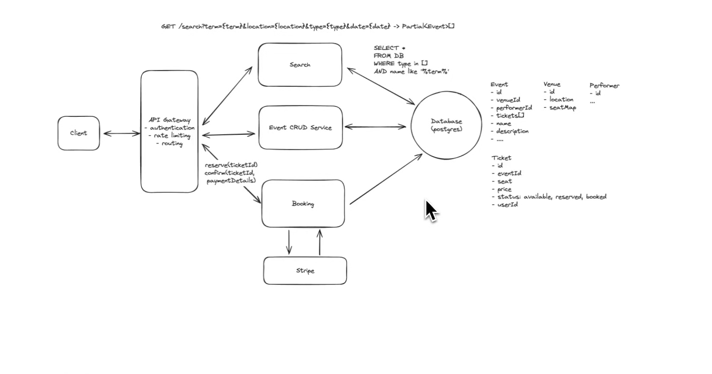
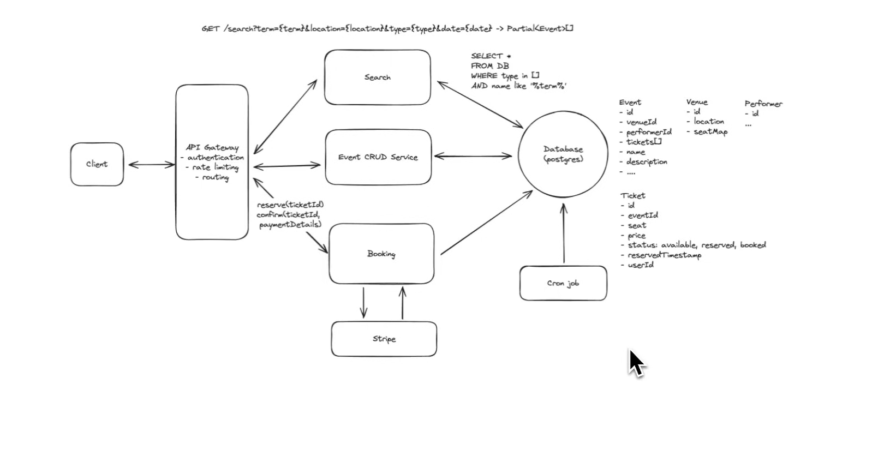
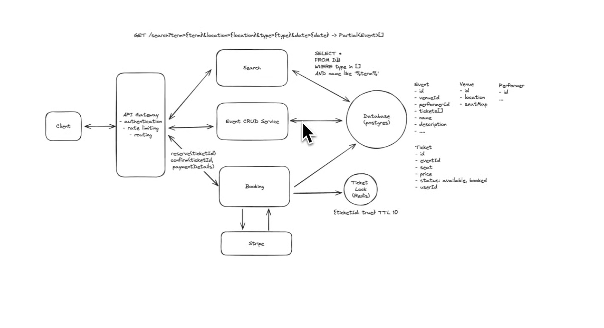

# ticket master sytem design



# Problem with the Basic Reservation Flow

Our current booking flow works like this:

```text
User selects seat
        │
        ▼
Booking Service
        │
        ▼
Seat Status = RESERVED
        │
        ▼
User proceeds to payment
        │
        ▼
Payment Service sends confirmation
        │
        ▼
Booking Service updates status = BOOKED
```

This approach looks correct initially, but it has one major problem.

---

# The Problem

Ticket booking applications usually have a **multi-step booking process**.

For example:

1. User searches for an event.
2. User selects one or more seats.
3. The selected seats are marked as **RESERVED** so that no other user can book them.
4. User proceeds to the payment page.
5. After successful payment, the Payment Service notifies the Booking Service.
6. Booking Service changes the seat status from **RESERVED** to **BOOKED**.

Everything works fine if the user completes the payment.

---

# What if the user never completes the payment?

Consider the following scenario:

- User selects Seat A1.
- Booking Service marks Seat A1 as **RESERVED**.
- User reaches the payment page.
- Instead of paying, the user:
  - closes the browser,
  - loses internet connection,
  - switches off the phone,
  - or simply decides not to continue.

Since no payment confirmation is received, the Booking Service never updates the seat status to **BOOKED**.

The seat remains in the **RESERVED** state indefinitely.

---

# Why is this a Problem?

If the seat remains reserved forever:

- Other users cannot book that seat.
- The seat is not actually sold.
- The event may appear to have fewer available seats than it really does.
- The system starts losing potential bookings and revenue.

In other words, the seat becomes **blocked permanently**, even though nobody purchased it.

---

# Summary

The issue with this design is that **a reservation is created immediately when the user selects a seat**, but **there is no mechanism to handle users who abandon the booking before completing the payment**.

As a result, seats can remain in the **RESERVED** state forever, making them unavailable for other users even though they were never actually booked.



- kuch issue ho sakta hai na cron-job ke sath ki job run nhi hua to thodi der ke liye we will see less tickets as some will be still there in Reservered state right.

