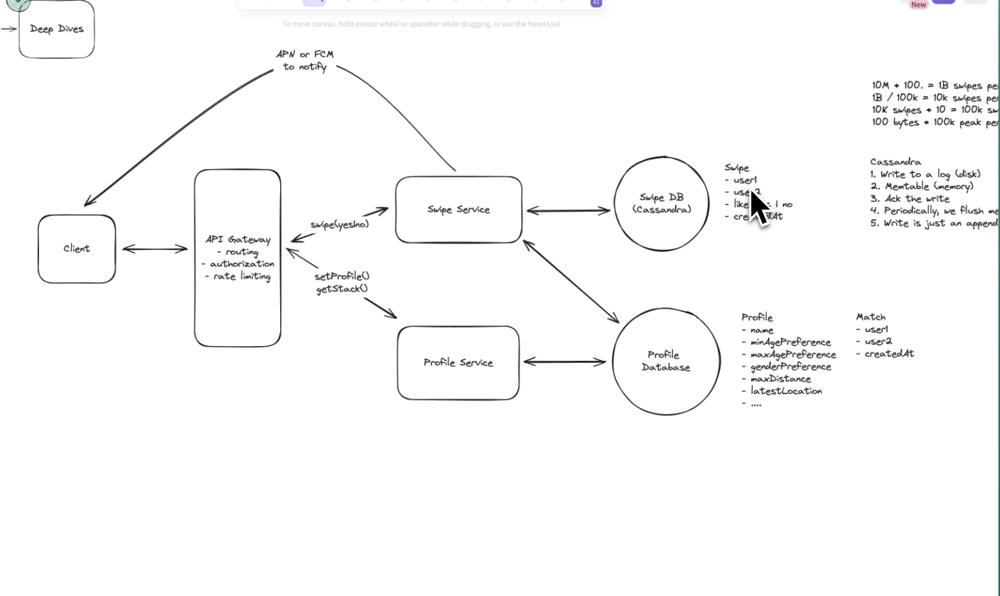
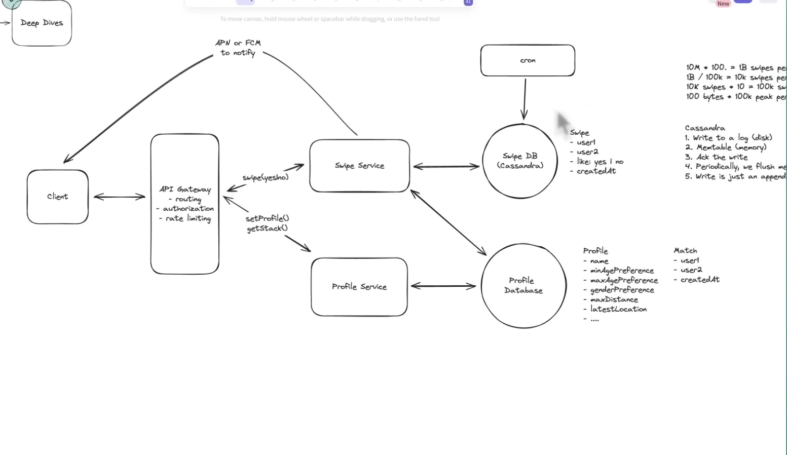
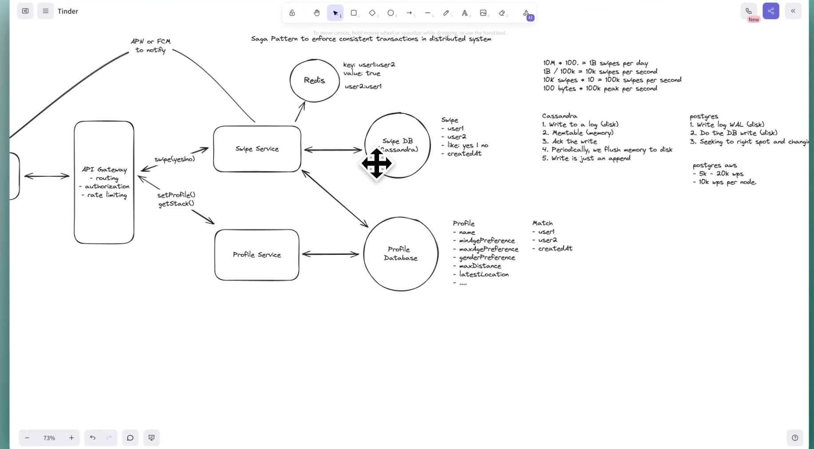

There are many questions un-answered here... need to read this again.


- this is the first screenshot and if you see our non-functional requirement we want consistency for swipes right but cassandra is known for its eventual consistency.... So it is possible that if two users swipes right at the sametime no one will ever know that they swiped eachother.

- Instead of using cassandra we could have used postgres-sql also right? that will give you consistency but cost will be so much because you need to run multiple instances.

- but with cassandra in place we have some ways in which we can handle this consistency issue:
- 1: use a reconsiliation process (cronjob) that may run every hour to see if we have missed any swipes... So both the users will think like their profile has been swiped now only.



- other solution will be to use redis to store swipes and then we will check in-memory and then update cassandra.
- but this can also introduce one scenario where you have written in redis but cassandra write has failed.So for this we can use SAGA pattern.

# Redis Capacity Planning for a Tinder-like Swipe System

# Table of Contents

1. Problem Statement
2. Initial Design
3. Traffic Estimation
4. Peak Traffic Analysis
5. Redis Operations Per Swipe
6. Can Redis Handle This Traffic?
7. Memory Estimation
8. Why Storing Every Swipe in Redis is a Bad Idea
9. Better Redis Data Structure
10. Redis TTL Strategy
11. Redis Cluster
12. Production Architecture
13. Interview Discussion
14. Key Takeaways

---

# 1. Problem Statement

Suppose we are designing a Tinder-like application.

Assume:

- Total Users = **10 Million**
- Each user performs **100 swipes/day**

Our system stores every swipe permanently inside **Cassandra** because Cassandra is excellent for high write throughput.

However, before creating a match, we need to answer this question immediately:

> **Has the other user already swiped right on me?**

Reading Cassandra for every swipe is not ideal because:

- Cassandra is optimized for writes.
- Reads are more expensive than Redis.
- Cassandra may exhibit eventual consistency depending on consistency level.
- We need sub-millisecond lookups.

Therefore, we introduce Redis as a **hot data store**.

Redis is **not** the source of truth.

Its only responsibility is to answer:

> **Has this user already liked me?**

---

# 2. Initial Architecture

```text
                    Client
                       │
                       ▼
                Swipe Service
                       │
          ┌────────────┴─────────────┐
          ▼                          ▼
     Cassandra                  Redis
 (Permanent Store)         (Recent Swipes)

```

Flow:

1. User swipes right.
2. Store swipe in Cassandra.
3. Store swipe in Redis.
4. Check opposite swipe in Redis.
5. If found → Create Match.

---

# 3. Traffic Estimation

Users

```
10 Million
```

Swipes per user

```
100/day
```

Total swipes

```
10,000,000 × 100

=

1,000,000,000 swipes/day
```

**One Billion swipes every day**

---

# 4. Average Writes Per Second

One day has

```
24 × 60 × 60

=

86400 seconds
```

Average writes

```
1,000,000,000

÷

86400

≈

11,574 writes/sec
```

Approximately

```
12,000 writes/sec
```

---

## But Average Traffic Doesn't Matter

Real systems experience traffic spikes.

Suppose

70% of users are active between

```
7 PM - 9 PM
```

Total swipes during peak

```
700 Million
```

Time

```
7200 seconds
```

Peak traffic

```
700,000,000

÷

7200

≈

97,000 writes/sec
```

Approximately

```
100K swipes/sec
```

Always design for **Peak Traffic**, not Average Traffic.

---

# 5. Redis Operations Per Swipe

Suppose every swipe is stored as

```
swipe:userA:userB = true
```

For every swipe Redis performs:

### Operation 1

```
SET swipe:A:B
```

### Operation 2

```
GET swipe:B:A
```

Therefore

Each swipe generates

```
1 Write

+

1 Read
```

Peak traffic

```
100K swipes/sec
```

Redis workload

```
100K SET

+

100K GET

=

200K Operations/sec
```

---

# 6. Can Redis Handle This?

Yes.

A modern Redis instance can process roughly

```
500K+

simple operations/sec
```

Production systems usually operate around

```
100K - 300K ops/sec
```

to leave enough headroom for:

- Replication
- Failover
- Network latency
- Traffic spikes

Therefore

```
200K operations/sec
```

is completely manageable with a small Redis Cluster.

---

# 7. The Real Problem Isn't Throughput

Most people worry about throughput.

That is usually **not** the bottleneck.

The real bottleneck is

> **Memory**

Let's calculate.

---

# 8. Memory Estimation

Suppose every swipe becomes one Redis key.

Example

```
swipe:12345:67890 = true
```

A Redis key consumes approximately

```
80-150 Bytes
```

We'll assume

```
100 Bytes
```

Total keys/day

```
1 Billion
```

Memory

```
1 Billion

×

100 Bytes

=

100 GB
```

After one day

```
100 GB
```

After one week

```
700 GB
```

After one month

```
3 TB
```

Clearly impossible for a single Redis node.

---

# 9. Why This Design Is Wrong

Redis is an

> **In-Memory Database**

RAM is expensive.

Redis is designed for

- Cache
- Hot data
- Session management
- Temporary coordination

It is **not** meant to become another permanent database.

Permanent storage already exists

```
Cassandra
```

Redis should only contain

```
Hot Data
```

---

# 10. Better Data Structure

Instead of storing

```
swipe:A:B

swipe:A:C

swipe:A:D

swipe:A:E
```

Create one Redis Set

```
likes:A

{

B

C

D

E

}
```

Now one user has

```
One Redis Key
```

instead of

```
Hundreds of Keys
```

---

## Checking Mutual Likes

When A likes B

```
SADD likes:A B
```

Then check

```
SISMEMBER likes:B A
```

If

```
true
```

Create Match.

This approach dramatically reduces memory usage.

---

# 11. Memory Comparison

## Bad Design

```
One Redis Key

Per Swipe
```

Total

```
1 Billion Keys
```

Memory

```
100+ GB/day
```

---

## Better Design

```
One Redis Key

Per User
```

Members

```
Liked Users
```

Total keys

```
10 Million
```

Relationships

```
1 Billion
```

Memory usage is significantly smaller because Redis Sets store members much more efficiently than individual keys.

---

# 12. Store Only Active Users

Do we really need Redis for every user?

No.

Suppose only

```
2 Million
```

users are active today.

Each user performs

```
100 Swipes
```

Relationships

```
200 Million
```

Assuming

```
32 Bytes/member
```

Memory

```
200 Million

×

32 Bytes

≈

6.4 GB
```

This is very manageable.

Inactive users simply won't occupy Redis memory.

---

# 13. TTL Strategy

Redis data should expire automatically.

Instead of

```
SET swipe:A:B true
```

Use

```
SET swipe:A:B true EX 604800
```

Where

```
604800 seconds

=

7 Days
```

After seven days

Redis automatically removes the key.

Benefits

- Memory remains bounded.
- No manual cleanup required.
- Cassandra still contains permanent history.

---

# 14. Redis Cluster

Even if Redis stores only hot data,

one machine should not hold everything.

Redis Cluster shards data automatically.

Example

```text
                Redis Cluster

        +-----------------------+
        | Node 1                |
        | likes:A               |
        | likes:B               |
        +-----------------------+

        +-----------------------+
        | Node 2                |
        | likes:C               |
        | likes:D               |
        +-----------------------+

        +-----------------------+
        | Node 3                |
        | likes:E               |
        | likes:F               |
        +-----------------------+
```

Each user hashes to a node.

Adding more nodes automatically increases

- Capacity
- Throughput
- Fault tolerance

---

# 15. Why Redis Is Still Needed

Someone may ask:

> "If Cassandra stores every swipe permanently, why do we need Redis?"

Because Cassandra is optimized for

- Durability
- High write throughput
- Horizontal scalability

Redis provides

- Sub-millisecond lookups
- Immediate visibility of writes
- Atomic operations
- Real-time coordination

Redis solves the

> **Hot Path Consistency Problem**

---

# 16. Production Architecture

```text
                      Client
                         │
                         ▼
                  Swipe Service
                         │
          ┌──────────────┴──────────────┐
          ▼                             ▼
     Cassandra                      Redis
(Permanent Storage)            (Recent Likes)

          │
          ▼
    Match Detection

          │
          ▼
    Match Database

          │
          ▼
 Notification Service

          │
          ▼
      APNs / FCM
```

---

# 17. Important Interview Discussion

### Interviewer

Can Redis store one billion swipe records?

### Wrong Answer

"No."

### Better Answer

Technically,

**Yes**, if enough RAM and Redis Cluster nodes are provisioned.

However,

it is **architecturally incorrect**.

Redis should never become the permanent database.

Instead

- Cassandra stores all swipe history.
- Redis stores only recent hot data.
- Redis data expires automatically.
- Redis is horizontally scaled.

This keeps Redis

- Fast
- Small
- Cost-effective

---

# 18. Design Decisions

## Cassandra

Stores

- Every swipe
- Permanent history
- Analytics
- Recovery

---

## Redis

Stores

- Recent likes
- Active users
- Mutual-like detection
- Hot data

---

## Match Database

Stores

- Successful matches
- Match timestamp
- Chat metadata

---

# 19. Key Takeaways

### Traffic

```
10M Users

×

100 Swipes

=

1 Billion Swipes/Day
```

Average

```
12K Swipes/sec
```

Peak

```
100K+ Swipes/sec
```

---

### Redis Throughput

Each swipe

```
SET

+

GET
```

Peak

```
200K Operations/sec
```

Well within Redis capabilities.

---

### Memory

Storing every swipe individually

```
100+ GB/day
```

Not scalable.

---

### Better Design

Use

```
Redis Sets

likes:<userId>
```

instead of

```
One Key Per Swipe
```

---

### Store Only Hot Data

Redis should contain

- Active users
- Recent likes
- Temporary coordination

Everything else belongs in Cassandra.

---

### Expiration

Always configure

```
TTL
```

Old swipe information should disappear automatically.

---

### Scalability

Use

```
Redis Cluster
```

to shard users across multiple machines.

---

### Golden Rule

> **Cassandra is the Source of Truth.**
>
> **Redis is the Real-Time Coordination Layer.**

Never confuse the responsibilities of these two systems.

# Handling Redis Failure During Peak Traffic in a Tinder-like System

# Table of Contents

1. Problem Statement
2. The Naive Architecture
3. What Happens When Redis Crashes?
4. Why This is a Bad Design
5. Design Principle
6. Better Architecture
7. Will We Lose Matches?
8. Recovery Using Cassandra
9. Better Recovery Using Kafka
10. Rebuilding Redis
11. Graceful Degradation
12. Production Architecture
13. Component Responsibilities
14. Failure Scenarios
15. Interview Questions & Answers
16. Key Takeaways

---

# 1. Problem Statement

Assume we have built a Tinder-like application.

Current Scale

- 10 Million Users
- Peak Traffic = 100K+ Swipes/sec

Architecture

```text
                Client
                   │
                   ▼
             Swipe Service
                   │
        ┌──────────┴──────────┐
        ▼                     ▼
   Cassandra              Redis
```

Redis is responsible for

- Storing recent likes
- Detecting mutual likes
- Creating matches instantly

Now imagine the worst possible scenario.

It is **Friday evening (peak traffic)**.

Everyone is swiping.

Suddenly...

**Entire Redis Cluster crashes.**

What happens now?

---

# 2. The Naive Architecture

Suppose the Swipe API performs

```text
1. Save swipe in Cassandra
2. Save swipe in Redis
3. Check Redis
4. Create Match
```

Architecture

```text
Client
   │
   ▼
Swipe API
   │
   ├── Cassandra
   │
   └── Redis
```

Now Redis crashes.

---

# 3. What Happens?

If Redis is mandatory for every swipe

```text
User Swipe

↓

Redis Unavailable

↓

Cannot Check Match

↓

Request Fails
```

Which means

- User cannot swipe.
- Matches cannot be created.
- Application becomes unusable.

Even though Cassandra is perfectly healthy.

---

# 4. Why This is a Bad Design

Redis is

- Fast
- In-memory
- Temporary

Redis is **not** the source of truth.

Therefore

> **Redis should never become a Single Point of Failure (SPOF).**

A cache should never determine whether the core business operation succeeds.

In Tinder,

the core business operation is

```
Recording a Swipe
```

NOT

```
Creating an Instant Match
```

---

# 5. Design Principle

A fundamental distributed systems principle is

> **Critical operations must not depend on cache availability.**

For Tinder

Critical Operation

```
Save Swipe
```

Non-Critical Operation

```
Instant Match Detection
```

Therefore

Even if Redis crashes

Users should still be able to swipe.

---

# 6. Better Architecture

Instead of

```text
Swipe

↓

Redis

↓

Success
```

Do

```text
Swipe

↓

Save to Cassandra

↓

Try Redis

↓

If Redis Fails

↓

Ignore

↓

Return Success
```

Pseudo-code

```java
saveSwipeToCassandra();

try {

    saveSwipeToRedis();

    detectMatch();

}
catch(Exception e){

    log.error(e);

}

return SUCCESS;
```

Result

Redis failure does not affect user experience.

---

# 7. What Happens to Matches?

Suppose

```
Redis is Down
```

Timeline

```
10:00

Redis Crashes
```

```
10:01

A Likes B
```

```
10:02

B Likes A
```

Since Redis is unavailable

Neither request detects

```
Mutual Like
```

Does that mean

The Match is Lost?

**No.**

Because Cassandra already contains

```
A → B

B → A
```

The data is completely safe.

Only

```
Real-Time Match Detection
```

failed.

---

# 8. Recovery Using Cassandra

Once Redis comes back

A Background Worker scans recent swipes.

Architecture

```text
               Cassandra

       A → B

       B → A

             │
             ▼

      Recovery Worker

             │
             ▼

      Detect Match

             │
             ▼

      Notify Users
```

Instead of receiving

```
Instant Notification
```

Users receive

```
Delayed Notification
```

Maybe

```
5 Seconds Later
```

or

```
30 Seconds Later
```

This is much better than losing data.

---

# 9. Better Recovery Using Kafka

Production systems usually introduce Kafka.

Architecture

```text
                    Swipe API

                       │

         ┌─────────────┴─────────────┐

         ▼                           ▼

    Cassandra                     Kafka

(Source of Truth)            (Event Log)
```

Every swipe is

- Stored permanently
- Published as an event

Now Redis crashes.

The API still performs

```text
Save Cassandra

↓

Publish Kafka Event

↓

Return Success
```

Redis is no longer required for the request.

---

# 10. What Happens While Redis is Down?

Suppose Redis is unavailable.

Kafka continues storing events.

Timeline

```
10:00

Redis Down
```

```
10:01

A → B
```

```
10:02

B → A
```

```
10:03

C → D
```

```
10:04

D → C
```

Kafka stores everything.

```text
Swipe Events

A → B

B → A

C → D

D → C
```

Nothing is lost.

---

# 11. Redis Comes Back

Redis restarts.

The Match Engine resumes consuming Kafka.

```text
Kafka

↓

Match Engine

↓

Redis

↓

Create Match

↓

Notify Users
```

Matches

```
A ↔ B

C ↔ D
```

are detected automatically.

Users receive delayed notifications.

---

# 12. Why Kafka is Powerful

Kafka behaves like a DVR.

Imagine

```text
Producer

↓

Kafka

↓

Consumer
```

If the consumer crashes

Kafka keeps storing events.

Example

```text
Swipe API

↓

Kafka

↓

Match Engine

(Stopped)
```

After the Match Engine restarts

Kafka sends every missed event.

No swipe is lost.

---

# 13. What If Redis Loses All Data?

Redis stores everything in memory.

Suppose

Entire Redis Cluster crashes.

Memory becomes

```
Empty
```

Is the system broken?

No.

Redis is only

```
Hot Cache
```

The permanent source of truth is

```
Cassandra
```

Redis can be rebuilt.

---

# 14. Rebuilding Redis

Option 1

Read recent swipes from Cassandra.

Example

```sql
SELECT *

FROM Swipes

WHERE created_at >

NOW() - INTERVAL '7 DAYS';
```

For every swipe

```
A → B
```

Populate

```
likes:A

{

B

}
```

Continue until Redis becomes warm.

---

# 15. Better Rebuild Using Kafka

Instead of scanning Cassandra

Replay Kafka.

```text
Kafka

↓

Match Engine

↓

Redis
```

Since Kafka retains messages for several days

The Match Engine simply starts reading from an earlier offset.

Advantages

- Faster
- Sequential
- No expensive database scan
- Automatically rebuilds Redis

---

# 16. Graceful Degradation

A well-designed distributed system should degrade gracefully.

Instead of

```
System Down
```

the application experiences

```
Reduced Functionality
```

Example

| Feature | During Redis Failure |
|----------|----------------------|
| Swipe | ✅ Works |
| Save Swipe | ✅ Works |
| Analytics | ✅ Works |
| Match Notification | ⚠ Delayed |
| Chat (Existing Matches) | ✅ Works |
| User Login | ✅ Works |

Users may not even notice.

---

# 17. Production Architecture

```text
                         Client

                            │

                            ▼

                      Swipe Service

                            │

          ┌─────────────────┴─────────────────┐

          ▼                                   ▼

     Cassandra                            Kafka

(Source of Truth)                    (Durable Event Log)

                                             │

                                             ▼

                                      Match Engine

                                             │

                                ┌────────────┴────────────┐

                                ▼                         ▼

                             Redis                   Match DB

                       (Hot Cache)            (Persistent Matches)

                                             │

                                             ▼

                                    Notification Service

                                             │

                                             ▼

                                         APNs / FCM
```

---

# 18. Component Responsibilities

## Cassandra

Stores

- Every swipe
- Permanent history
- Analytics
- Recovery

---

## Kafka

Stores

- Every swipe event
- Replay capability
- Event buffering
- Recovery source

---

## Redis

Stores

- Recent likes
- Hot data
- Fast lookups
- Temporary state

Redis can always be rebuilt.

---

## Match Database

Stores

- Successful matches
- Match timestamp
- Chat relationship
- Permanent match history

---

# 19. Failure Scenarios

## Scenario 1

Redis crashes.

Result

```
Swipes Continue

Matches Delayed
```

---

## Scenario 2

Redis loses all memory.

Result

```
Replay Kafka

↓

Rebuild Redis
```

---

## Scenario 3

Match Engine crashes.

Result

```
Kafka Buffers Events

↓

Restart Consumer

↓

Resume Processing
```

---

## Scenario 4

Kafka crashes

(assuming proper replication)

Kafka leader fails.

Follower becomes new leader.

No data loss.

---

## Scenario 5

Cassandra crashes

Replication ensures

Another replica serves requests.

Swipes continue.

---

# 20. Interview Questions

## Q1

Redis crashed during peak traffic.

Should users still be able to swipe?

**Answer**

Yes.

Saving a swipe is the core business operation.

Redis is only an optimization.

---

## Q2

Will matches be lost?

No.

Cassandra already contains

```
A → B

B → A
```

The match can be detected later.

---

## Q3

How are missed matches recovered?

Either

- Replay Kafka events

or

- Scan recent swipes from Cassandra

---

## Q4

Why use Kafka?

Kafka provides

- Durable event storage
- Replay capability
- Back-pressure handling
- Failure recovery

---

## Q5

Can Redis be rebuilt?

Yes.

Redis is considered

```
Disposable State
```

It can always be reconstructed from Kafka or Cassandra.

---

# 21. Key Takeaways

### Golden Rule #1

**Redis is never the Source of Truth.**

---

### Golden Rule #2

**A cache should never become a Single Point of Failure.**

---

### Golden Rule #3

Critical Business Operations

```
Save Swipe
```

must always succeed.

---

### Golden Rule #4

Real-time Match Detection

is an optimization.

If necessary,

it can happen a few seconds later.

---

### Golden Rule #5

Kafka makes the system resilient.

Even if

- Redis crashes
- Match Engine crashes
- Consumers stop

every swipe event remains safely stored.

---

### Golden Rule #6

Redis is Disposable.

If Redis loses everything,

rebuild it.

Never panic.

---

# Final Architecture Philosophy

```
                Cassandra
          (Source of Truth)

                     │

                     ▼

                  Kafka
            (Durable Event Log)

                     │

                     ▼

              Match Engine

                     │

                     ▼

                  Redis
          (Fast Temporary Cache)

                     │

                     ▼

              Match Database

                     │

                     ▼

           Notification Service
```

## Remember

- **Cassandra owns the data.**
- **Kafka owns the event history.**
- **Redis owns speed.**
- **Match Database owns successful matches.**

If Redis disappears, the application becomes slower, **not incorrect**. That is the hallmark of a well-designed distributed system.


