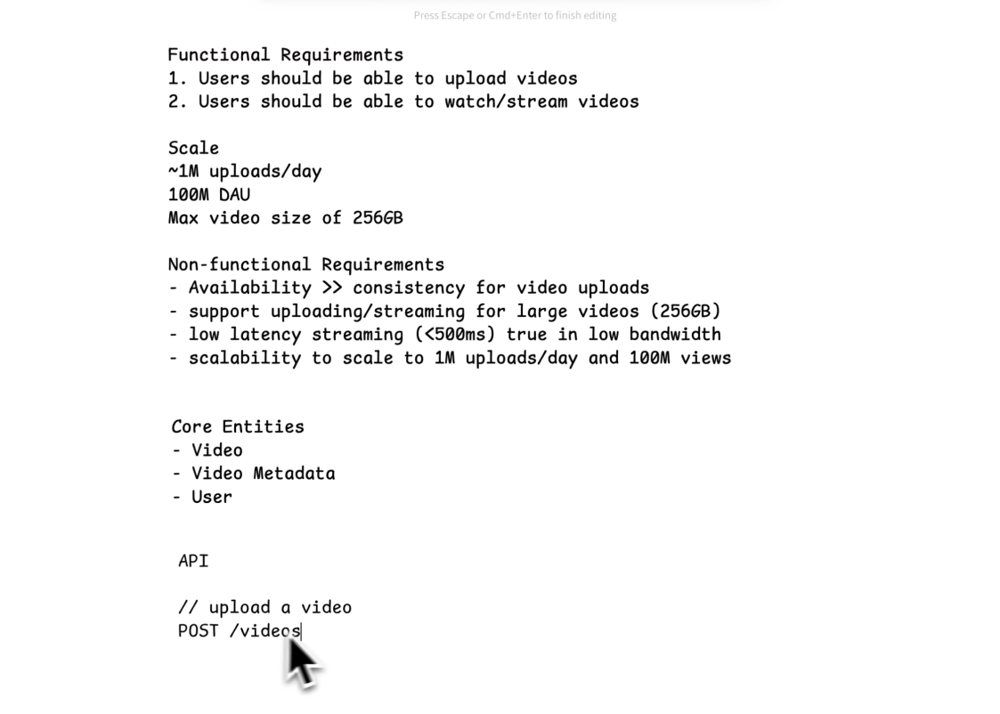
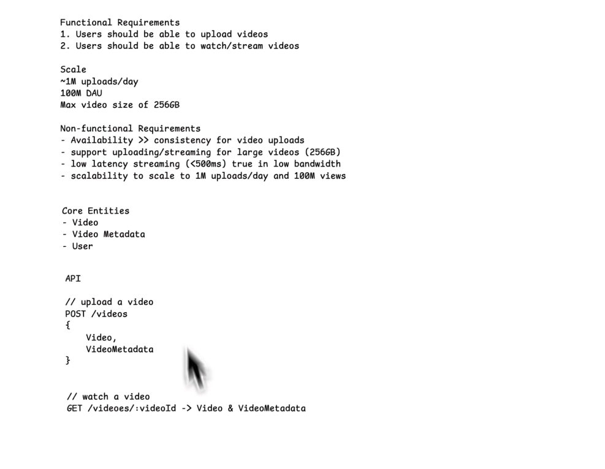
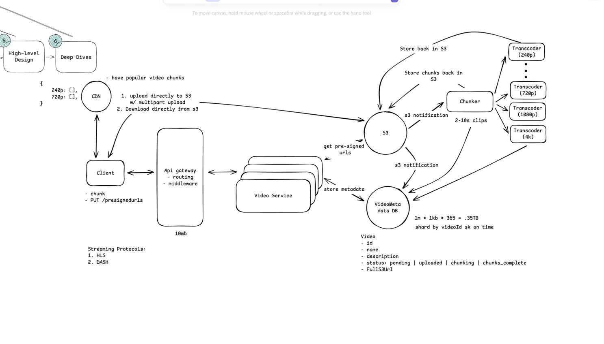

# YouTube Duplicate Video Handling

## Overview

One common question in large-scale video systems is:

> **If two users upload the exact same video, does YouTube store it only once?**

The answer is:

> **No (at least not in any publicly documented way).**

YouTube allows multiple users to upload the same video. Instead of preventing duplicate uploads using file hashes like SHA-256, YouTube focuses on **copyright detection** using **Content ID**, which is a completely different problem.

---

# Storage Deduplication vs Content Deduplication

These two concepts are often confused.

## 1. Storage Deduplication

Storage deduplication tries to save storage space.

Example:

```
User A uploads:

IronMan.mp4
```

```
SHA256(file) = ABC123
```

Store object in S3.

Later

```
User B uploads

IronMan.mp4
```

Again

```
SHA256(file) = ABC123
```

Since the hash already exists:

```
Do not upload again.
```

Instead

```
video_user_mapping

userA -> object_123

userB -> object_123
```

Now only one copy exists in storage.

### Benefits

- Huge storage savings
- Faster duplicate uploads
- Lower S3 cost

### Problems

Only works if

```
Every single byte is identical.
```

---

# Why SHA-256 Is Not Enough

Consider these two videos.

```
Video A

IronMan.mp4
```

and

```
Video B

IronMan.mp4
```

To a human they look identical.

But maybe someone:

- changed metadata
- changed title
- re-encoded video
- changed bitrate
- converted MKV → MP4
- trimmed one second
- changed audio volume
- added subtitles
- added watermark

Now

```
SHA256(Video A)

AAAAA
```

```
SHA256(Video B)

BBBBB
```

Different hashes.

Although visually they are the same movie.

This is because

> SHA-256 hashes bytes, not visual content.

---

# Example

Suppose

```
Movie.mp4

Size = 5 GB
```

Someone opens FFmpeg

```
ffmpeg -i movie.mp4 -c:v libx264 newmovie.mp4
```

Nothing changed visually.

But

Old file

```
SHA256

ABCDEF
```

New file

```
SHA256

XYZ123
```

Completely different.

Storage deduplication fails.

---

# Why YouTube Doesn't Depend on SHA-256

YouTube is solving a different problem.

The goal is not

```
"Have I seen these bytes?"
```

The goal is

```
"Is this the same copyrighted content?"
```

These are completely different questions.

---

# What YouTube Uses Instead

YouTube uses **Content ID**.

Content ID is a fingerprinting system.

Instead of hashing raw bytes, it analyzes the actual media.

---

# Simplified Upload Pipeline

```
User Upload
      │
      ▼
Store Original Upload
      │
      ▼
Decode Video
      │
      ▼
Extract Frames
      │
      ▼
Extract Audio
      │
      ▼
Generate Fingerprints
      │
      ▼
Compare Against Reference Library
      │
      ▼
Match Found?
      │
 ┌────┴────┐
 │         │
No        Yes
 │         │
Publish   Apply Copyright Policy
```

---

# What Is a Fingerprint?

A fingerprint is not SHA-256.

It is a mathematical representation of

- visual patterns
- frame sequences
- audio characteristics
- frequency analysis
- motion vectors
- key frames

Even after

- changing resolution
- changing bitrate
- changing codec
- changing container

the fingerprint remains very similar.

---

# Example

Original

```
IronMan.mp4
```

Someone uploads

```
IronMan_720P.mp4
```

Someone uploads

```
IronMan_Remastered.mp4
```

Someone uploads

```
IronMan_WithLogo.mp4
```

SHA-256

```
Different

Different

Different
```

Content Fingerprint

```
Very Similar

Very Similar

Very Similar
```

Therefore

```
Content ID detects them as copies.
```

---

# What Happens After Detection?

When Content ID finds a match, the copyright owner's configured policy is applied.

Possible actions include:

### Block

```
Do not publish.
```

---

### Monetize

Ads run.

Revenue goes to copyright owner.

---

### Track

Video stays online.

Analytics are sent to owner.

---

# Does YouTube Reject Duplicate Uploads?

Generally

No.

Suppose

```
User A uploads

Avengers.mp4
```

Later

```
User B uploads

Avengers.mp4
```

YouTube accepts the upload.

Then

Content ID runs.

If Disney owns that content,

Disney's policy decides

- Block
- Monetize
- Track

---

# Does YouTube Store Multiple Copies?

Google has never publicly disclosed the internal storage implementation.

However, based on public engineering talks and observable behavior, each upload is treated as an independent asset.

Simplified architecture

```
Upload
   │
   ▼
Original Video
   │
   ▼
Transcoding Pipeline
   │
   ├── 360p
   ├── 480p
   ├── 720p
   ├── 1080p
   ├── 1440p
   └── 4K
```

Every uploaded video receives its own processing pipeline.

There is no public evidence that YouTube skips storing an upload simply because another identical upload already exists.

---

# Why Doesn't YouTube Perform Global Storage Deduplication?

Imagine

```
Movie = 40 GB
```

1000 people upload it.

Storage saving

```
40 TB
```

Sounds good.

But YouTube stores **Exabytes** of data.

Compared to that,

40 TB is relatively small.

Meanwhile, storage deduplication introduces significant complexity.

Challenges include:

- Massive global hash index
- Hash lookup at enormous scale
- Race conditions during simultaneous uploads
- Reference counting
- Object lifecycle management
- Deletion safety
- Replication complexity
- Multi-region consistency
- Legal ownership tracking

For YouTube, these complexities often outweigh the storage savings.

---

# What About Browser Hashing?

Suppose the user uploads a

```
256 GB
```

video.

If the browser first computes SHA-256

```
Read Entire File
      │
      ▼
Compute SHA256
      │
      ▼
Start Upload
```

Problems

- Several minutes of delay before upload starts
- Poor user experience
- High disk usage

Instead

```
Upload Chunk
      │
      ▼
Update SHA256
      │
      ▼
Next Chunk
```

Hashing happens while data is already flowing.

Practically no extra delay.

---

# Storage Deduplication vs Content Fingerprinting

| Feature | SHA-256 Deduplication | Content Fingerprinting |
|----------|----------------------|------------------------|
| Detects exact bytes | ✅ Yes | ❌ No |
| Detects re-encoded video | ❌ No | ✅ Yes |
| Detects bitrate changes | ❌ No | ✅ Yes |
| Detects metadata changes | ❌ No | ✅ Yes |
| Detects codec changes | ❌ No | ✅ Yes |
| Storage saving | ✅ Yes | ❌ No |
| Copyright detection | ❌ No | ✅ Yes |

---

# If Designing a YouTube-Like System

A practical upload architecture would be:

```
Client
    │
    ▼
Multipart Upload
    │
    ▼
S3
    │
    ▼
Compute SHA-256 While Uploading
    │
    ▼
Verify File Integrity
    │
    ▼
Persist Metadata in PostgreSQL
    │
    ▼
Transcoding Pipeline
    │
    ▼
Fingerprint Generation
    │
    ▼
Duplicate / Copyright Detection
```

Here:

- SHA-256 is used for **integrity verification** and optional **exact-file deduplication**.
- Content fingerprinting is used for **duplicate content detection** and **copyright enforcement**.
- Every upload is still treated as a separate logical video owned by its uploader.

---

# Key Takeaways

- SHA-256 identifies **identical files**, not identical videos.
- Small changes (metadata, bitrate, codec, subtitles, watermark) completely change the SHA-256 hash.
- YouTube publicly relies on **Content ID** for identifying copyrighted or substantially identical content.
- Multiple users can upload the same video; uploads are generally accepted before copyright policies are applied.
- There is no public evidence that YouTube globally deduplicates uploaded files using SHA-256.
- In a YouTube-like architecture, use **streaming SHA-256** for integrity and **fingerprinting** for content matching. These solve different problems and complement each other.

# System Design: Resilient 256 GB Video Upload Architecture
**Stack:** Direct-to-S3 Multipart Uploads, PostgreSQL Metadata Tracking, Browser IndexedDB, AWS SQS  
**Use Case:** Large-scale video platform (e.g., YouTube-like service) supporting up to 256 GB uploads with crash resilience and seamless resuming.

---

## Question 1: How do we design a video upload system that supports up to 256 GB uploads with crash-resilient resuming using S3 and PostgreSQL?

### Answer:
To support **256 GB file uploads**, video byte streams must **never pass through application backend servers**. Srouting large payloads through API workers exhausts network bandwidth, causes memory spikes, and blocks CPU worker threads.

Instead, the system utilizes a **Direct-to-S3 Multipart Upload Architecture** with **PostgreSQL metadata management** and **IndexedDB browser persistence**.

### 1. High-Level Architecture Flow

```
[ Browser / Client ] ──────── (1) Request Presigned Part URLs ─────► [ API Server ]
         │                                                              │
         │ (3) Direct PUT Chunks (64 MB)                               (2) Track Upload Session
         ▼                                                                  & ETags
   [ AWS S3 ] ───────────────────────────────────────────────────────► [ PostgreSQL ]
```

1. **Initiate:** The client sends file metadata to the backend API to initialize an S3 Multipart Upload.
2. **Chunk & Upload:** The client slices the 256 GB file in the browser into 64 MB chunks and uploads them directly to S3 via Presigned URLs.
3. **Persist State:** S3 returns an `ETag` header for each chunk. The client sends this `ETag` to PostgreSQL and caches state in browser `IndexedDB`.
4. **Finalize:** Once all chunks are uploaded, the backend issues S3's `CompleteMultipartUpload`.

---

### 2. PostgreSQL Schema Design

PostgreSQL acts as the ground truth for authorization, session lifecycle, and completed part verification.

```sql
-- 1. Master Video Table
CREATE TABLE videos (
    id UUID PRIMARY KEY DEFAULT gen_random_uuid(),
    user_id UUID NOT NULL,
    title VARCHAR(255) NOT NULL,
    total_bytes BIGINT NOT NULL,
    file_fingerprint VARCHAR(128) NOT NULL, -- Hash of (file_name + total_bytes + first_10MB_hash)
    status VARCHAR(32) DEFAULT 'pending', -- pending, uploading, processing, ready, failed
    created_at TIMESTAMP WITH TIME ZONE DEFAULT NOW()
);

-- 2. Active Upload Sessions
CREATE TABLE upload_sessions (
    id UUID PRIMARY KEY DEFAULT gen_random_uuid(),
    video_id UUID REFERENCES videos(id) ON DELETE CASCADE,
    s3_key VARCHAR(512) NOT NULL,
    s3_upload_id VARCHAR(255) NOT NULL, -- S3 Multipart UploadId
    chunk_size_bytes INT NOT NULL,
    total_parts INT NOT NULL,
    status VARCHAR(32) DEFAULT 'active', -- active, completed, aborted
    expires_at TIMESTAMP WITH TIME ZONE NOT NULL,
    created_at TIMESTAMP WITH TIME ZONE DEFAULT NOW()
);

-- 3. Uploaded Chunks Ledger
CREATE TABLE upload_parts (
    id BIGSERIAL PRIMARY KEY,
    session_id UUID REFERENCES upload_sessions(id) ON DELETE CASCADE,
    part_number INT NOT NULL,
    etag VARCHAR(255) NOT NULL,
    size_bytes INT NOT NULL,
    uploaded_at TIMESTAMP WITH TIME ZONE DEFAULT NOW(),
    CONSTRAINT unique_part_per_session UNIQUE (session_id, part_number)
);

-- Optimization Indexes
CREATE INDEX idx_upload_parts_session_part ON upload_parts(session_id, part_number);
CREATE INDEX idx_videos_fingerprint ON videos(user_id, file_fingerprint);
```

---

### 3. S3 Limits & Dynamic Chunk Size Strategy

AWS S3 Multipart Upload Constraints:
* **Max Parts Allowed:** 10,000 parts
* **Min Part Size:** 5 MB (except final chunk)
* **Max Part Size:** 5 GB

#### Dynamic Chunk Formula:
$$\text{Chunk Size} = \max\left(10\text{ MB}, \left\lceil \frac{\text{Total File Size}}{10,000} \right\rceil\right)$$

* For a **256 GB** file:
  * Default 5 MB chunks = ~51,200 parts (**Fails: Exceeds S3 limit**).
  * **Optimal Dynamic Chunk Size:** **64 MB**
  * **Total Parts:** ~4,000 parts (Well within the 10,000-part limit).

---

### 4. Browser Crash Recovery Strategy

| Layer | Component | Role |
| :--- | :--- | :--- |
| **Local Storage** | Browser `IndexedDB` | Remembers `video_id`, `s3_upload_id`, and `file_fingerprint` locally. |
| **Database** | Postgres `upload_parts` | Tracks permanently acknowledged ETags verified by S3. |
| **Cloud Storage** | AWS S3 `ListParts` API | Backup verification to catch unrecorded chunks uploaded right before a crash. |

#### Client Fingerprinting:
When re-opening a file, generate a lightweight hash without reading the entire 256 GB file into RAM:
```javascript
const fingerprint = sha256(`${file.name}-${file.size}-${file.lastModified}-${first10MBHash}`);
```

---

## Question 2: Once a video is uploaded, how do we inform PostgreSQL to update the status reliably without trusting the client?

### Answer:
The client must **never** directly control final state transitions or trigger `CompleteMultipartUpload` on S3. Production architectures use a **Server-Gated Handshake** combined with an **AWS S3 Event Notification Safety Net**.

### Architecture:
```
[ Browser ] ─── (1) "Finished chunks" ───► [ Backend API ]
                                                 │
                                (2) Validate & s3.completeMultipartUpload()
                                                 │
                                                 ▼
                                             [ AWS S3 ]
                                                 │
                                (3) Event: s3:ObjectCreated
                                                 │
                                                 ▼
                                             [ AWS SQS ] ──► [ Background Worker ]
                                                                     │
                                                       (4) Atomic Status Sync
                                                                     │
                                                                     ▼
                                                               [ PostgreSQL ]
```

1. **Server-Gated Handshake (Primary Path):**
   * Client calls `POST /api/upload/complete`.
   * Backend queries PostgreSQL for all 4,000 `ETags` ordered by `part_number`.
   * Backend invokes `s3.completeMultipartUpload()`.
   * Upon S3 confirmation (`200 OK`), backend atomically updates PostgreSQL:
     ```sql
     UPDATE videos SET status = 'uploaded' WHERE id = $1;
     UPDATE upload_sessions SET status = 'completed' WHERE id = $2;
     ```

2. **S3 Event Notifications (Safety Net Path):**
   * S3 is configured to publish `s3:ObjectCreated:CompleteMultipartUpload` events to an **AWS SQS Queue**.
   * A background worker service listens to SQS.
   * When an event arrives, the worker performs an **idempotent update** in PostgreSQL:
     ```sql
     UPDATE videos SET status = 'uploaded' WHERE id = $1 AND status != 'uploaded';
     ```

---

## Question 3: If the browser crashes on the last upload, S3 won't know it's the last part. How does the system handle this?

### Answer:
S3 treats every chunk upload as an isolated blob. It has no internal concept of how many total parts a client intends to send and will **never** automatically complete a multipart upload.

### The Solution: Server-Side Reaper (Cron Job)
Even if the browser crashes 1ms after uploading part 4,000, **PostgreSQL already recorded part 4,000's ETag**.

A server-side worker runs every 5–10 minutes to auto-heal abandoned uploads:

```sql
-- Query to identify uploads where all parts exist but status was never set to completed
SELECT 
    s.id AS session_id, 
    s.s3_upload_id, 
    s.s3_key,
    s.video_id
FROM upload_sessions s
JOIN upload_parts p ON p.session_id = s.id
WHERE s.status = 'active'
GROUP BY s.id
HAVING COUNT(p.part_number) = s.total_parts;
```

When found, the reaper worker gathers the ETags, calls `s3.completeMultipartUpload()`, and transitions the video status to `'uploaded'`.

---

## Question 4: Where do we get the ETag (backend or frontend)? What if the browser crashes after uploading to S3 before sending the ETag to PostgreSQL?

### Answer:

### 1. ETag Source
The **Frontend Browser** receives the `ETag` directly from S3 in the HTTP response headers of the `PUT` request.

```
[ Browser ] ─── HTTP PUT Chunk ───► [ S3 Presigned URL ]
            ◄── HTTP 200 OK (Header: ETag) ───┘
```

```javascript
const response = await fetch(presignedUrl, { method: 'PUT', body: chunkBlob });
const etag = response.headers.get('ETag'); // Received directly in frontend

// Record in Postgres via API
await fetch('/api/upload/record-part', {
  method: 'POST',
  headers: { 'Content-Type': 'application/json' },
  body: JSON.stringify({ sessionId, partNumber: 4000, etag })
});
```

*Note: S3 Bucket CORS rules must expose the header:*
```json
"ExposeHeaders": ["ETag"]
```

### 2. Handling Crash Before Saving Last ETag
If the browser crashes after S3 receives Part 4,000 but before saving the ETag to PostgreSQL:
* **S3 Has:** 4,000 parts
* **PostgreSQL Has:** 3,999 parts

#### Reconciliation Strategy (`s3.listParts`):
Whenever a user clicks **Resume** or a background job sweeps stalled uploads, the backend calls AWS SDK `s3.listParts({ Bucket, Key, UploadId })`.

This queries S3 directly for ground truth. The backend discovers Part 4,000 exists on S3, inserts the missing ETag into PostgreSQL, detects all 4,000 parts are present, and triggers completion.

---

## Question 5: What is the exact step-by-step end-to-end flow when a user clicks "Resume Upload" (e.g., 2,000 / 4,000 parts completed)?

### Answer:

### Step-by-Step Resume Flow

1. **File Selection & Fast Fingerprinting:**
   * User re-selects the video file.
   * Web Worker calculates `file_fingerprint` in <100ms using metadata + first 10 MB chunk hash.

2. **Resume Handshake & S3 Reconciliation:**
   * Client sends `POST /api/upload/resume` with `{ fingerprint }`.
   * Backend checks `upload_sessions` in PostgreSQL and calls `s3.listParts()` to reconcile any unrecorded S3 chunks.
   * Postgres identifies completed parts: `[1..2000]`, and missing parts: `[2001..4000]`.

3. **Delta Response & Batch Presigned URL Generation:**
   * Backend responds with `sessionId`, `chunkSize: 64MB`, `nextPartNumber: 2001`, and presigned URLs for parts 2001–2020.

4. **Zero-Copy File Slicing:**
   * The browser skips the uploaded 128 GB in 0ms using native pointer slicing:
     ```javascript
     const startByte = (2001 - 1) * 64 * 1024 * 1024; // Byte 137,438,953,472 (128 GB mark)
     const part2001Blob = file.slice(startByte, startByte + chunkSize);
     ```

5. **Parallel Chunk Streaming Queue:**
   * Browser uploads chunks 2001 through 4000 using a worker pool (3–5 concurrent uploads).
   * For each chunk: `PUT to S3` -> `Extract ETag` -> `POST /api/upload/record-part` to PostgreSQL.

6. **Final Handshake:**
   * Upon Part 4000 completion, client calls `/api/upload/complete`.
   * Backend executes `s3.completeMultipartUpload()`.
   * Video state updates to `uploaded` and triggers downstream video processing pipelines (FFmpeg / AWS MediaConvert for HLS/DASH transcode).

---

## Architectural Key Takeaways
* **Never stream 256 GB through backend servers:** Always use Direct-to-S3 Presigned URLs.
* **Dynamic Chunking:** Calculate part size dynamically to stay under S3's 10,000-part limit (64 MB for 256 GB).
* **Dual-Layer Verification:** Use PostgreSQL for transactional recording and `s3.listParts()` for ground-truth reconciliation.
* **Server-Gated Finalization:** Never let the browser call S3 completion APIs directly. Use server endpoints + S3 SQS event triggers + Background Reapers.

# Video Processing Pipeline for Streaming (YouTube/Netflix Style)

> This document explains what happens **after a video upload completes**. The goal is to understand how platforms like YouTube prepare a video for adaptive streaming by creating multiple resolutions and small playable segments.

---

# Table of Contents

1. Why Processing is Needed
2. The Overall Pipeline
3. Why We Cannot Stream the Original MP4
4. Video Segmentation
5. Multiple Resolutions (Adaptive Bitrate Streaming)
6. HLS Streaming Structure
7. Master Playlist and Variant Playlists
8. Why FFmpeg Does Chunking and Transcoding Together
9. Storage Layout in S3
10. Database Design
11. Complete Processing Workflow
12. Example Walkthrough
13. Why We Don't Store Every Segment in PostgreSQL
14. Real World Considerations
15. Key Takeaways

---

# 1. Why Processing is Needed

Suppose a user uploads

```
ironman.mp4
```

Properties:

```
Size        : 10 GB
Resolution  : 4K
Duration    : 120 minutes
Format      : MP4
```

The upload is complete.

The file is stored in S3.

```
S3

videos/original/ironman.mp4
```

At this stage the video is **NOT ready for streaming**.

The browser cannot efficiently stream this huge MP4 because

- User may jump to the middle
- Internet speed changes continuously
- User changes video quality
- Downloading an entire 10GB file is wasteful

Therefore we need another processing stage.

---

# 2. Overall Processing Pipeline

```
Client Upload

        │

        ▼

Original Video Stored in S3

        │

        ▼

S3 Upload Event

        │

        ▼

Video Processing Service

        │

        ▼

Transcoding Workers

        │

        ▼

Generate Multiple Resolutions

        │

        ▼

Segment Each Resolution

        │

        ▼

Upload Processed Files to S3

        │

        ▼

Generate Playlists

        │

        ▼

Update PostgreSQL

        │

        ▼

Video Ready
```

---

# 3. Why We Cannot Stream Original MP4

Imagine Netflix streaming this

```
10GB MP4
```

When user presses Play

```
↓

Download entire file

↓

Start watching
```

Impossible.

Instead browser should only download

```
First few seconds

↓

Play

↓

Download next few seconds

↓

Play

↓

Continue...
```

This is exactly how streaming works.

---

# 4. Video Segmentation

Instead of one huge video

```
ironman.mp4
```

We divide it into many small pieces.

Example

```
Duration = 120 minutes

Segment Duration = 6 seconds

7200 seconds / 6

=

1200 segments
```

Now instead of

```
ironman.mp4
```

we have

```
segment001

segment002

segment003

...

segment1200
```

Each segment may be around

```
5 MB
```

or

```
8 MB
```

depending upon bitrate.

Now browser only downloads

```
segment001

↓

Play

↓

segment002

↓

Play

↓

segment003
```

This reduces startup latency significantly.

---

# 5. Multiple Resolutions

Original upload

```
4K
```

Not every user has fast internet.

Therefore we generate

```
240p

480p

720p

1080p

4K
```

Now every quality is divided into segments.

Example

```
240/

segment001.ts

segment002.ts

...

segment1200.ts
```

```
720/

segment001.ts

segment002.ts

...

segment1200.ts
```

```
1080/

segment001.ts

segment002.ts

...

segment1200.ts
```

Notice

Timeline remains same.

Only video quality changes.

```
0-6 sec

6-12 sec

12-18 sec

...
```

exists in every resolution.

---

# 6. HLS Streaming Structure

HLS stands for

```
HTTP Live Streaming
```

Instead of one MP4

It produces

```
240/

playlist.m3u8

segment001.ts

segment002.ts

...
```

Similarly

```
720/

playlist.m3u8

segment001.ts

segment002.ts

...
```

Each playlist tells player

```
What segments exist

What order to play them
```

---

# 7. Master Playlist

There is another playlist called

```
master.m3u8
```

This contains

```
240p playlist

480p playlist

720p playlist

1080p playlist

4K playlist
```

Example

```
master.m3u8

↓

240/playlist.m3u8

↓

480/playlist.m3u8

↓

720/playlist.m3u8

↓

1080/playlist.m3u8

↓

4k/playlist.m3u8
```

Player downloads only

```
master.m3u8
```

and then decides

```
Current bandwidth

↓

Best resolution
```

This is called

```
Adaptive Bitrate Streaming (ABR)
```

---

# 8. Why Not Create Chunks First?

Many beginners imagine

```
Original Video

↓

Chunker

↓

1200 chunks

↓

Transcoder
```

Looks reasonable.

But think carefully.

Suppose

```
1200 chunks

×

5 resolutions

=

6000 transcoding jobs
```

Every transcoder now needs

- Read chunk
- Decode
- Resize
- Encode
- Maintain timestamps
- Stitch timing perfectly

This becomes complicated.

---

Instead FFmpeg does everything together.

```
Original Video

↓

Read Frames

↓

Resize

↓

Encode

↓

Every 6 seconds

↓

Write Segment
```

This process continues until video ends.

Therefore

**Segmentation happens while transcoding.**

No separate chunking stage is required.

---

# 9. What FFmpeg Actually Produces

Input

```
ironman.mp4
```

Output

```
processed/

    240/

        playlist.m3u8

        segment001.ts

        segment002.ts

        ...

    480/

        playlist.m3u8

        segment001.ts

        ...

    720/

        playlist.m3u8

        segment001.ts

        ...

    1080/

        playlist.m3u8

        segment001.ts

        ...

    4k/

        playlist.m3u8

        segment001.ts

        ...

    master.m3u8
```

Everything needed for streaming is generated automatically.

---

# 10. Storage Layout in S3

```
videos/

    original/

        video123.mp4

    processed/

        video123/

            master.m3u8

            240/

                playlist.m3u8

                segment001.ts

                segment002.ts

                ...

            480/

                playlist.m3u8

                ...

            720/

                playlist.m3u8

                ...

            1080/

                playlist.m3u8

                ...

            4k/

                playlist.m3u8

                ...
```

Notice

Original file is preserved.

Processed versions are stored separately.

---

# 11. Database Design

Only metadata is stored.

## Video Table

```
Video

id

title

duration

status

originalVideoUrl

masterPlaylistUrl
```

Example

```
id = 101

title = Iron Man

status = READY

originalVideoUrl

masterPlaylistUrl
```

---

## VideoRendition Table

One row per resolution.

```
VideoRendition

id

videoId

resolution

bitrate

codec

playlistUrl

processingStatus
```

Example

| Resolution | Playlist |
|------------|----------|
|240p|.../240/playlist.m3u8|
|480p|.../480/playlist.m3u8|
|720p|.../720/playlist.m3u8|
|1080p|.../1080/playlist.m3u8|
|4K|.../4k/playlist.m3u8|

---

# 12. Complete Processing Workflow

```
User Uploads Video

↓

Store Original Video

↓

S3 Upload Complete Event

↓

Video Processing Service

↓

Create Processing Job

↓

Worker Downloads Original Video

↓

Generate 240p

↓

Generate 480p

↓

Generate 720p

↓

Generate 1080p

↓

Generate 4K

↓

Segment Every Resolution

↓

Upload All Segments

↓

Generate Variant Playlists

↓

Generate Master Playlist

↓

Upload Playlists

↓

Update PostgreSQL

↓

Status = READY
```

---

# 13. Why We Don't Store Every Segment in PostgreSQL

Suppose

```
Movie Duration

120 minutes
```

Segment Size

```
6 seconds
```

Segments

```
1200
```

Resolutions

```
240

480

720

1080

4K
```

Total files

```
1200 × 5

=

6000 segment files
```

Imagine

```
1 Billion Videos
```

Database rows

```
6000 Billion

=

6 Trillion rows
```

Completely unnecessary.

Instead

```
playlist.m3u8
```

already contains

```
segment001

segment002

segment003

...

segment1200
```

Therefore storing every segment in PostgreSQL provides almost no value.

---

# 14. Real World Considerations

Large platforms typically use

- FFmpeg
- AWS Elemental MediaConvert
- Bitmovin
- Wowza
- Google Transcoder API

These systems

- Decode video
- Resize
- Encode
- Segment
- Generate playlists

in one pipeline.

Separate chunking services are rarely used for HLS generation.

---

# 15. Mental Model

Think of a book.

```
Book

↓

Table of Contents

↓

Pages
```

Streaming works exactly the same.

Original Video

↓

Master Playlist

↓

Resolution Playlist

↓

Video Segments

Player first downloads

```
master.m3u8
```

Then chooses

```
720p playlist
```

Then downloads

```
segment001.ts

↓

segment002.ts

↓

segment003.ts
```

only when needed.

This allows

- Fast startup
- Quality switching
- Pause/Resume
- Seeking
- Low bandwidth usage

without downloading the entire video.

---

# Final Architecture

```
                  Upload Complete
                         │
                         ▼
                 Original Video (S3)
                         │
                         ▼
                S3 ObjectCreated Event
                         │
                         ▼
             Video Processing Service
                         │
                         ▼
              Processing Job Queue
                         │
                         ▼
         ┌───────────────────────────────────┐
         │     Transcoding Workers           │
         │-----------------------------------│
         │ 240p + Segment                    │
         │ 480p + Segment                    │
         │ 720p + Segment                    │
         │ 1080p + Segment                   │
         │ 4K + Segment                      │
         └───────────────────────────────────┘
                         │
                         ▼
            Upload Processed Files to S3
                         │
                         ▼
                Generate master.m3u8
                         │
                         ▼
                 Update PostgreSQL
                         │
                         ▼
                     READY
```

---

# Key Takeaways

- Original uploaded MP4 is **never streamed directly**.
- Streaming platforms convert the video into multiple resolutions.
- Every resolution is divided into small 2–10 second segments.
- FFmpeg performs **transcoding and segmentation together** in a single pass.
- Segments and playlists are stored in S3.
- PostgreSQL stores only metadata and playlist locations, **not every segment**.
- The player downloads `master.m3u8`, chooses the best quality based on bandwidth, and streams only the required segments, enabling adaptive bitrate streaming (ABR).

# Video Streaming Delivery Architecture (After Transcoding)

> This document explains what happens **after a video has been transcoded into multiple resolutions and stored in S3**.
>
> The main question answered is:
>
> **How does the browser download thousands of video segments if the S3 bucket is private?**
>
> We'll compare different approaches and understand why companies like YouTube, Netflix, and Prime Video use CDNs instead of generating S3 pre-signed URLs for every segment.

---

# Table of Contents

1. Problem Statement
2. Processed Video Structure
3. Can Browser Access S3 Directly?
4. Option 1 – S3 Pre-signed URLs
5. Problems with Pre-signed URLs
6. Option 2 – Public S3 Bucket
7. Problems with Public Buckets
8. Option 3 – CDN (CloudFront) + Signed Cookies (Industry Standard)
9. Complete Playback Flow
10. How HLS Requests Work
11. Why Signed Cookies Are Better Than Signed URLs
12. Database Design
13. Complete Architecture
14. Real World (YouTube/Netflix)
15. Key Takeaways

---

# 1. Problem Statement

After processing, our video has been converted into

```
240p

480p

720p

1080p

4K
```

Every resolution has

```
playlist.m3u8

segment001.ts

segment002.ts

segment003.ts

...
```

All these files are stored in S3.

Question

> **How will the browser download these files if the S3 bucket is private?**

---

# 2. Processed Video Structure

Suppose the uploaded video is

```
IronMan.mp4
```

After processing

```
videos/

    processed/

        video123/

            master.m3u8

            240/

                playlist.m3u8

                segment001.ts

                segment002.ts

                ...

            480/

                playlist.m3u8

                segment001.ts

                ...

            720/

                playlist.m3u8

                segment001.ts

                ...

            1080/

                playlist.m3u8

                segment001.ts

                ...

            4k/

                playlist.m3u8

                segment001.ts

                ...
```

These files are stored in

```
Private S3 Bucket
```

Browser cannot access them directly.

---

# 3. Can Browser Download Directly from S3?

Suppose browser requests

```
https://mybucket.s3.amazonaws.com/video123/master.m3u8
```

S3 responds

```
403 Forbidden
```

because bucket is private.

So we need a secure way to allow access.

---

# 4. Option 1 — S3 Pre-signed URLs

One approach is

```
Browser

↓

Video Service

↓

Generate Pre-signed URL

↓

Browser

↓

S3
```

Example

Browser asks

```
Give me master.m3u8
```

Backend generates

```
https://bucket.s3.amazonaws.com/master.m3u8?signature=XYZ
```

Browser downloads it.

This works.

---

# 5. Problem with Pre-signed URLs

Now browser reads

```
master.m3u8
```

Inside it

```
720/playlist.m3u8
```

Again browser needs

```
Pre-signed URL
```

Then browser reads

```
playlist.m3u8
```

It contains

```
segment001.ts

segment002.ts

segment003.ts

...

segment1200.ts
```

Now browser must ask backend

```
Generate URL for segment001
```

Again

```
Generate URL for segment002
```

Again

```
Generate URL for segment003
```

Again

```
Generate URL for segment004
```

...

Imagine

```
1200 segments
```

One movie

↓

1200 pre-signed URLs

Now imagine

```
10 million users
```

Total

```
12 Billion

Pre-signed URL Requests
```

This creates enormous unnecessary load on your backend.

---

# 6. Option 2 — Public Bucket

Another approach

Make bucket public.

Now browser directly downloads

```
master.m3u8

↓

playlist.m3u8

↓

segments
```

Very simple.

But

Anyone can copy

```
https://bucket/video123/master.m3u8
```

and share it.

Now everyone can watch the video.

No authorization.

Not acceptable for

- Netflix
- Prime Video
- Disney+
- Paid Courses
- Private Videos

---

# 7. Option 3 — CloudFront CDN + Signed Cookies (Industry Standard)

Instead of exposing S3

```
Browser

↓

CloudFront

↓

Private S3
```

Now browser never accesses S3.

Only CloudFront can access S3.

Architecture

```
Private S3

▲

│

CloudFront

▲

│

Browser
```

This is the most common architecture.

---

# 8. Complete Playback Flow

Suppose user clicks

```
Watch Video
```

Browser sends

```
GET /watch/video123
```

to backend.

Backend performs

```
Authenticate User

↓

Verify Subscription

↓

Verify Permissions
```

If allowed

Backend returns

```
CloudFront Signed Cookie
```

Browser stores cookie.

Now browser requests

```
master.m3u8
```

CloudFront checks cookie.

If valid

↓

Downloads from S3

↓

Returns file.

Browser then automatically requests

```
720/playlist.m3u8
```

CloudFront again checks cookie.

Returns playlist.

Browser requests

```
segment001.ts

↓

segment002.ts

↓

segment003.ts
```

CloudFront serves everything.

Backend is no longer involved.

---

# 9. HLS Playback Sequence

```
Browser

↓

master.m3u8

↓

720/playlist.m3u8

↓

segment001.ts

↓

segment002.ts

↓

segment003.ts

↓

segment004.ts

↓

...
```

Notice

Backend is contacted only once.

Everything else is served by CloudFront.

---

# 10. What Are Signed Cookies?

Instead of signing

```
segment001

segment002

segment003

segment004

...
```

Backend creates

```
CloudFront-Key-Pair-Id

CloudFront-Policy

CloudFront-Signature
```

These are stored as cookies.

Every browser request automatically sends

```
Cookie

↓

CloudFront

↓

Validate

↓

Allow Access
```

This works for

- master playlist
- variant playlist
- every segment

No extra backend requests.

---

# 11. Signed Cookies vs Signed URLs

## Signed URL

```
One Signature

↓

One File
```

Example

```
master.m3u8

↓

One Signature
```

```
segment001.ts

↓

Another Signature
```

```
segment002.ts

↓

Another Signature
```

Very expensive.

---

## Signed Cookie

One cookie authorizes

```
master.m3u8

playlist.m3u8

segment001.ts

segment002.ts

segment003.ts

...

Entire Folder
```

Only one authorization is required.

Much more scalable.

---

# 12. Database Design

Database does NOT store

```
segment001

segment002

segment003

...
```

Instead

Video Table

```
Video

id

title

status

masterPlaylistUrl

originalVideoUrl
```

Example

```
masterPlaylistUrl

videos/video123/master.m3u8
```

Variant Table

```
VideoRendition

videoId

resolution

playlistUrl
```

Example

```
240p

videos/video123/240/playlist.m3u8
```

```
720p

videos/video123/720/playlist.m3u8
```

```
1080p

videos/video123/1080/playlist.m3u8
```

Segments are discovered by reading playlists.

---

# 13. Complete Architecture

```
                    User Clicks Play
                           │
                           ▼
                     API Gateway
                           │
                           ▼
                     Video Service
                           │
            Verify Authentication
            Verify Authorization
                           │
                           ▼
            Generate Signed Cookie
                           │
                           ▼
                        Browser
                           │
                           ▼
                   CloudFront CDN
                           │
              Validate Signed Cookie
                           │
                           ▼
                    Private S3 Bucket
                           │
                           ▼
                  master.m3u8
                           │
                           ▼
                 playlist.m3u8
                           │
                           ▼
          segment001.ts
          segment002.ts
          segment003.ts
                 ...
```

---

# 14. What Happens When Internet Speed Changes?

Suppose playback starts at

```
240p
```

Internet improves.

Browser automatically requests

```
720p playlist
```

Then starts downloading

```
720p segment500
```

instead of

```
240p segment500
```

Notice

Playback continues.

No interruption.

This is called

```
Adaptive Bitrate Streaming (ABR)
```

---

# 15. What Does YouTube Do?

Although YouTube doesn't use AWS S3 or CloudFront, the architecture is conceptually very similar.

They use

- Private distributed storage
- Global CDN
- Manifest files (HLS/DASH)
- Short-lived authorization tokens
- CDN edge caching

The player downloads

```
Manifest

↓

Resolution Playlist

↓

Video Segments
```

directly from the CDN.

The application server is **NOT contacted for every segment request**.

---

# 16. Why CDN Is So Important

Without CDN

```
Browser

↓

S3 (Single Region)
```

Problems

- Higher latency
- Expensive bandwidth
- S3 handles every request
- No edge caching

With CDN

```
Browser

↓

Nearest CloudFront Edge

↓

S3 (only on cache miss)
```

Benefits

- Lower latency
- Faster startup
- Reduced S3 traffic
- Reduced bandwidth cost
- Millions of concurrent viewers
- Global scalability

---

# 17. Mental Model

Imagine Netflix.

Movie consists of

```
Master Playlist

↓

720p Playlist

↓

1200 Video Segments
```

When user presses Play

Backend only says

```
User is allowed to watch.
```

Everything else

```
master.m3u8

↓

playlist.m3u8

↓

segment001

↓

segment002

↓

segment003

↓

...
```

comes directly from the CDN.

The backend is completely removed from the streaming path.

---

# Key Takeaways

- Processed video files are stored in a **private S3 bucket**.
- Browsers should **never access private S3 directly**.
- Using **S3 pre-signed URLs for every HLS segment is not scalable** because a single video can require thousands of URLs.
- Making the bucket **public is insecure** and allows unauthorized sharing.
- The industry-standard architecture is **CloudFront (or another CDN) in front of a private S3 bucket**.
- The backend authenticates the user **once**, then issues a **CloudFront Signed Cookie** (or in some cases a signed URL).
- The browser fetches `master.m3u8`, `playlist.m3u8`, and all `.ts` segments **directly from the CDN**, not from the backend.
- CloudFront validates the cookie, serves cached content from edge locations, and fetches from S3 only on cache misses.
- This architecture scales to millions of concurrent viewers while keeping the application servers out of the high-volume streaming path.

# CloudFront Signed Cookies – Why They Exist and How They Work

> This document explains **why CloudFront Signed Cookies are used instead of S3 pre-signed URLs**, how they are generated, how CloudFront validates them, and why they are the preferred choice for streaming thousands of HLS/DASH video segments.

---

# Table of Contents

1. The Problem
2. Why Authentication Cannot Happen for Every Segment
3. The Idea Behind Signed Cookies
4. Movie Theater Analogy
5. Components of a Signed Cookie
6. What is a Policy?
7. How the Signature is Generated
8. Public Key vs Private Key
9. How CloudFront Validates the Cookie
10. Why Hackers Cannot Modify the Cookie
11. Signed Cookies vs Signed URLs
12. Where JWT Fits In
13. Complete Playback Flow
14. Interview Questions
15. Key Takeaways

---

# 1. The Problem

Suppose a video has already been processed.

```
video123/

    master.m3u8

    240/

        playlist.m3u8

        segment001.ts

        segment002.ts

        ...

    720/

        playlist.m3u8

        segment001.ts

        segment002.ts

        ...

    1080/

        playlist.m3u8

        segment001.ts

        ...
```

All these files are stored in a **private S3 bucket**.

Now the browser wants to watch the video.

Question:

> **How do we securely allow the browser to download thousands of video segments without asking our backend every time?**

---

# 2. Why Authentication Cannot Happen for Every Segment

Suppose the movie duration is

```
120 minutes
```

Segment size

```
6 seconds
```

Total segments

```
1200
```

If we authenticate every request

```
Browser

↓

Backend

↓

CloudFront

↓

S3

↓

segment001.ts
```

Then again

```
Browser

↓

Backend

↓

CloudFront

↓

segment002.ts
```

Again

```
segment003.ts
```

Again

```
segment004.ts
```

...

One movie

```
1200 backend authentication calls
```

Now imagine

```
10 Million Users
```

Backend requests

```
12 Billion Authentication Requests
```

Completely unnecessary.

---

# 3. The Idea Behind Signed Cookies

Instead of authenticating every request,

authenticate only **once**.

Backend verifies

- User is logged in
- Subscription is active
- User owns the content

Once verified,

Backend tells CloudFront

```
"This browser is allowed to access

/video123/*

for the next 2 hours."
```

CloudFront remembers this permission using a **Signed Cookie**.

Now browser can directly download

```
master.m3u8

playlist.m3u8

segment001.ts

segment002.ts

segment003.ts

...
```

without contacting backend again.

---

# 4. Movie Theater Analogy

Imagine entering a movie theater.

You first show your ticket.

```
You

↓

Security Guard

↓

Ticket Verified

↓

Stamp on Your Hand
```

Now you visit

- Popcorn counter
- Washroom
- Auditorium
- Food court

Does every employee ask for your ticket?

No.

They simply check

```
Hand Stamp
```

The hand stamp proves

```
Security already verified you.
```

A **Signed Cookie** is exactly the same thing.

It is a digital permission stamp.

---

# 5. Components of a Signed Cookie

CloudFront signed cookies contain three values.

```
CloudFront-Policy

CloudFront-Signature

CloudFront-Key-Pair-Id
```

Each has a specific purpose.

---

## A. CloudFront Policy

The policy defines

- What resources are allowed
- Until when access is allowed

Example

```json
{
  "Statement": [
    {
      "Resource": "https://cdn.example.com/video123/*",
      "Condition": {
        "DateLessThan": {
          "AWS:EpochTime": 1785600000
        }
      }
    }
  ]
}
```

Meaning

```
User can access

/video123/*

until

Tomorrow 5 PM
```

Notice

```
video123/*
```

covers

```
master.m3u8

playlist.m3u8

segment001.ts

segment002.ts

segment003.ts

...

Everything inside the folder.
```

---

## B. CloudFront Signature

Suppose attacker modifies

```
video123/*
```

to

```
video999/*
```

Now attacker can watch another movie.

To prevent this,

Backend digitally signs the policy.

```
Policy

↓

SHA-256 Hash

↓

Encrypt Hash using Private Key

↓

Signature
```

If policy changes,

signature immediately becomes invalid.

---

## C. CloudFront Key Pair ID

CloudFront stores multiple public keys.

KeyPairId tells CloudFront

```
Use Public Key #5
```

to verify this signature.

---

# 6. How Signature is Generated

Suppose policy is

```
Allow access

/video123/*

until 8 PM
```

Backend computes

```
SHA256(policy)
```

Example

```
Policy

↓

SHA256

↓

9F81A7...

(Hash)
```

Now backend encrypts this hash using

```
Private Key
```

Result

```
Signature
```

Cookie now contains

```
Policy

Signature

KeyPairId
```

---

# 7. Public Key vs Private Key

Backend owns

```
Private Key
```

CloudFront owns

```
Public Key
```

Relationship

```
Private Key

↓

Generate Signature

↓

Public Key

↓

Verify Signature
```

Important

The **Private Key never leaves your backend**.

CloudFront only has the **Public Key**.

---

# 8. How CloudFront Validates the Cookie

Browser requests

```
GET

/video123/720/segment005.ts
```

Browser automatically sends

```
CloudFront-Policy

CloudFront-Signature

CloudFront-Key-Pair-Id
```

CloudFront performs

---

### Step 1

Read

```
KeyPairId
```

---

### Step 2

Find corresponding

```
Public Key
```

---

### Step 3

Compute

```
SHA256(policy)
```

---

### Step 4

Decrypt Signature

using

```
Public Key
```

Result

```
Original Hash
```

---

### Step 5

Compare

```
Computed Hash

==

Decrypted Hash ?
```

If

```
YES
```

Cookie is genuine.

If

```
NO
```

Reject request.

---

Flow

```
Browser

↓

Policy

↓

Signature

↓

CloudFront

↓

Find Public Key

↓

SHA256(Policy)

↓

Decrypt Signature

↓

Compare Hashes

↓

Match ?

↓

YES

↓

Allow Access

↓

Serve Video

↓

NO

↓

403 Forbidden
```

---

# 9. Why Hackers Cannot Modify the Cookie

Suppose attacker changes

```
Expires

Today

↓

Next Year
```

or

```
video123

↓

video999
```

Policy changes.

But signature still corresponds to

```
Old Policy
```

CloudFront computes

```
New Hash
```

Signature decrypts to

```
Old Hash
```

Comparison

```
Old Hash

≠

New Hash
```

Result

```
403 Forbidden
```

Attacker cannot generate a new signature because

they do **not possess the Private Key**.

---

# 10. Signed Cookies vs Signed URLs

## Signed URL

One signature

↓

One file

```
master.m3u8

↓

Signature #1
```

```
playlist.m3u8

↓

Signature #2
```

```
segment001.ts

↓

Signature #3
```

```
segment002.ts

↓

Signature #4
```

...

Movie may have

```
6000 files

↓

6000 signatures
```

Very inefficient.

---

## Signed Cookie

One cookie

↓

Entire folder

```
/video123/*
```

Now browser can access

```
master.m3u8

playlist.m3u8

segment001.ts

segment002.ts

segment003.ts

...

Everything
```

Only one signature.

Much more scalable.

---

# 11. Where JWT Fits In

Many engineers confuse JWT with Signed Cookies.

JWT answers

```
Who is the user?
```

CloudFront doesn't care.

CloudFront only wants to know

```
Can this request access

/video123/* ?
```

Typical flow

```
Browser

↓

JWT

↓

Backend

↓

Verify JWT

↓

Generate CloudFront Signed Cookie

↓

Browser

↓

CloudFront

↓

Access Granted
```

JWT never reaches CloudFront.

---

# 12. Complete Playback Flow

```
User Clicks Play

↓

Browser

↓

Video Service

↓

Authenticate User

↓

Authorize User

↓

Generate Policy

↓

Sign Policy using Private Key

↓

Return Signed Cookie

↓

Browser Stores Cookie

↓

Browser Requests

master.m3u8

↓

CloudFront

↓

Validate Cookie

↓

Fetch from S3

↓

Return master.m3u8

↓

Browser Requests

playlist.m3u8

↓

CloudFront

↓

Validate Cookie

↓

Return Playlist

↓

Browser Requests

segment001.ts

↓

CloudFront

↓

Validate Cookie

↓

Return Segment

↓

Repeat...
```

Notice

Backend is involved only once.

---

# 13. Why This Scales So Well

Without Signed Cookies

```
1200 Segments

↓

1200 Backend Calls

↓

Per User
```

With Signed Cookies

```
1200 Segments

↓

1 Authentication

↓

1199 Direct CDN Requests
```

Massive reduction in backend load.

---

# 14. Common Interview Questions

### Why not use S3 Pre-signed URLs?

Because each HLS/DASH video consists of thousands of files. Generating a pre-signed URL for every file would create unnecessary backend load.

---

### Why not make S3 public?

Anyone could share the URL and bypass your application's authorization checks.

---

### Why does CloudFront need Signed Cookies?

To verify that the backend has already authenticated the user without contacting the backend again.

---

### Why use asymmetric cryptography?

Because CloudFront can verify signatures using the public key while the private key remains securely with your backend. This prevents anyone from forging or modifying permissions.

---

### Why include an expiration time?

If a user cancels a subscription or shares their browser session, access naturally expires after the configured duration. The backend can issue a fresh cookie only after re-validating permissions.

---

# 15. Mental Model

Think of a Signed Cookie as a **digitally signed permission slip**.

```
Backend

↓

"I verified this user.

They may access

/video123/*

until 8 PM."

↓

Digitally Sign It

↓

Browser Stores Cookie

↓

CloudFront Verifies Signature

↓

Serve Video
```

The backend does not stream the video.

The backend only says

```
This user is allowed.
```

CloudFront handles everything else.

---

# Key Takeaways

- Signed Cookies eliminate the need to authenticate every video segment request.
- A Signed Cookie contains:
  - **Policy** → What resources can be accessed and until when.
  - **Signature** → Digital signature proving the policy wasn't modified.
  - **Key Pair ID** → Identifies which public key CloudFront should use.
- The backend signs the policy using its **private key**.
- CloudFront verifies the signature using the corresponding **public key**.
- If the policy is changed, the signature becomes invalid and CloudFront returns **403 Forbidden**.
- JWT authenticates the user to your application; Signed Cookies authorize access to CDN resources.
- One Signed Cookie can authorize access to an entire folder (e.g., `/video123/*`), making it ideal for HLS/DASH streaming where a single video consists of thousands of files.
- This architecture is used because it scales efficiently while keeping the S3 bucket private and the application servers out of the streaming path.