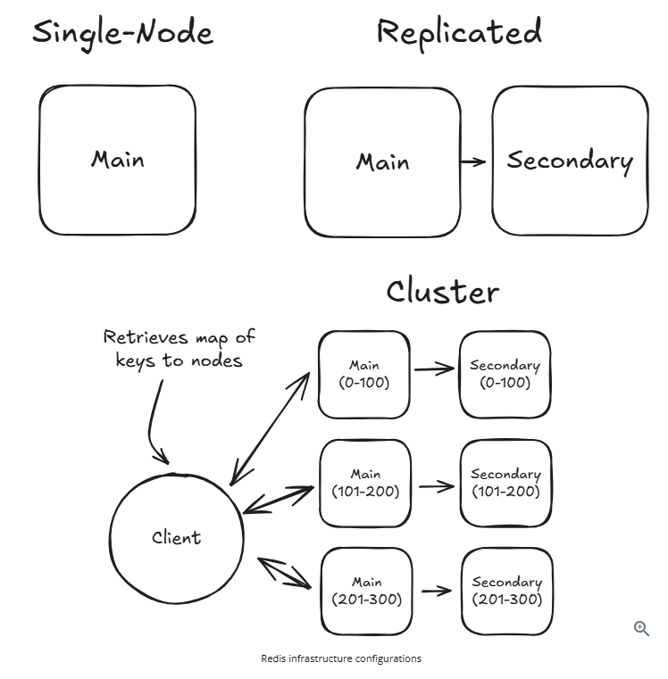

# 📘 Redis Infrastructure Configurations – Revision Notes

---

## 🔹 1. Single Node (Basic Setup)

### 📌 Description
- Single Redis instance
- Handles all reads and writes

### ✅ Pros
- Simple setup
- Very fast (no network overhead)

### ❌ Cons
- Single point of failure
- No scalability

### 🧠 Real-Life Example
A single shop owner managing everything:
- Billing
- Inventory
- Customers

If the shop closes → system goes down.

---

## 🔹 2. Replicated Setup (High Availability)

### 📌 Description
- One **Main (Primary)** node
- One or more **Secondary (Replica)** nodes
- Data is replicated from Main → Secondary

### 🔁 Flow
- Writes → Main
- Reads → Main or Secondary
- Failover → Secondary promoted if Main fails

### ✅ Pros
- High availability
- Read scaling

### ❌ Cons
- Replication lag
- Writes limited to one node

### 🧠 Real-Life Example
Classroom model:
- Teacher = Main
- Students = Replicas

Students copy notes. If teacher leaves → student becomes teacher.

---

## 🔹 3. Redis Cluster (Distributed Setup)

### 📌 Description
- Data is distributed across multiple nodes
- Each node stores part of the dataset

---

## 🔑 Hash Slots Concept

- Total slots = **16384**
- Each key is mapped to a slot
- Each slot is assigned to a node

### 📦 Example

User:1 → Slot 100 → Node A
User:2 → Slot 500 → Node B
Order:1 → Slot 9000 → Node C


---

## 🔹 4. Client-Side Routing

### 📌 How it works
- Client caches slot → node mapping
- Directly connects to the correct node

### 🚀 Benefit
- Avoids extra network calls
- Maintains high performance

### 🔁 Redirection Example

MOVED 100 NodeB


Client retries request on correct node.

---

## 🔹 5. Gossip Protocol

### 📌 Description
- Nodes communicate internally
- Share cluster state

### 🧠 Real-Life Example
Like a WhatsApp group:
- Nodes inform each other about:
  - Failures
  - Slot ownership

---

## 🔹 6. Important Limitation ⚠️

### ❗ Key Rule
> All data required for a request must be on the SAME node

### ❌ Redis does NOT support well:
- Joins across nodes
- Multi-key operations across different slots

---

## 🔹 7. Key Design = Scaling Strategy 🔥

Redis does not automatically handle scaling logic.

👉 You must design keys carefully.

---

### ✅ Good Key Design (Same Slot)

Use hash tags `{}`:

user:{1}:profile
user:{1}:orders


✔ Stored on same node

---

### ❌ Bad Key Design (Different Slots)

user:1:profile
order:1


✖ Likely stored on different nodes

---

## 🔹 8. Real-Life Example (E-commerce)

### ❌ Bad Design


cart:user1
inventory:product1
payment:user1


→ Data spread across nodes

---

### ✅ Good Design

cart:{user1}
payment:{user1}
orders:{user1}


→ All related data on same node

---

## 🔹 9. Summary Table

| Setup        | Scalability | Availability | Complexity |
|-------------|------------|-------------|-----------|
| Single Node | ❌         | ❌          | ✅ Easy   |
| Replicated  | ➖ Reads   | ✅          | ➖ Medium |
| Cluster     | ✅ High    | ✅          | ❌ Complex |

---

## 🔥 Final Takeaways

- Redis is a **performance-first system**
- Cluster is NOT automatic scaling
- **Key design is critical**
- Always aim:
  > Keep related data on the same node

---



# Redis as a Cache – Complete Notes

## 📌 What is Redis Cache?
Redis is an **in-memory data store** used to cache frequently accessed data to improve performance.

- Database → Slow but persistent (source of truth)
- Redis → Fast (stored in RAM)

---

## ⚡ Why Use Redis as Cache?

Without Redis:
User → API → Database → Response (slow)

With Redis:
User → API → Redis → (if miss → DB → Redis → Response)

---

## 🧪 Example

Key:
```
product:123
```

Value:
```json
{
  "name": "iPhone 15",
  "price": 80000,
  "inventoryCount": 25
}
```

---

## 🔄 Cache Flow

1. Request comes for product
2. Check Redis:
   - Hit → Return fast
   - Miss → Fetch from DB → Store in Redis → Return

---

## ⏳ TTL (Time To Live)

TTL = Expiry time of cache

Example:
```
SET product:123 {...} EX 300
```

→ Cache valid for 5 minutes

### Why TTL?
- Prevent stale data
- Manage memory
- Auto cleanup

---

## 🔥 Hot Key Problem

### 📌 Definition
A **hot key** is a key that receives extremely high traffic compared to others.

Example:
```
product:123 → 1M requests/sec
others → 100 requests/sec
```

---

## 🚨 Why is it a Problem?

- Redis distributes by **key**, not traffic
- One key → One node
- That node gets overloaded

### Result:
- High CPU usage
- Increased latency
- Bottleneck

---

## 🧪 Real-World Scenarios

### 1. Flash Sale
```
Key: product:iphone15
```
Millions of users hitting same key

---

### 2. Trending Content
```
Key: movie:trending
```
All users access same key

---

### 3. Celebrity Profile
```
Key: user:celebrity
```
Huge traffic on one key

---

## ⚠️ When Does Hot Key Occur?

- Viral content / flash sales
- Uneven traffic distribution
- Read-heavy systems
- Poor cache design

---

## 🛠️ Solutions to Hot Key Problem

### 1. Key Sharding
Instead of:
```
product:123
```

Use:
```
product:123:1
product:123:2
product:123:3
```

---

### 2. Read Replicas
Use Redis replicas to distribute read load

---

### 3. Local Cache (L1 Cache)
Application-level caching:
```
App Memory → Redis → DB
```

---

### 4. Cache Pre-Warming
Load popular data before traffic spike

---

### 5. Rate Limiting
Limit excessive requests per user/IP

---

### 6. CDN Usage
For public/static data:
```
User → CDN → Redis → DB
```

---

## 🎯 Summary

| Concept | Meaning |
|--------|--------|
| Redis Cache | Fast in-memory storage |
| TTL | Expiry time for cache |
| Hot Key | One key with massive traffic |
| Problem | Node overload |
| Solution | Sharding, replicas, caching |

---

## 💡 Interview Tip

**Hot Key Problem Definition:**

"A hot key occurs when a single key receives disproportionate traffic, causing one Redis node to become a bottleneck because Redis distributes data by key, not by request load."


https://chatgpt.com/c/69d5572f-2340-8321-beb0-2b1ec10c8010